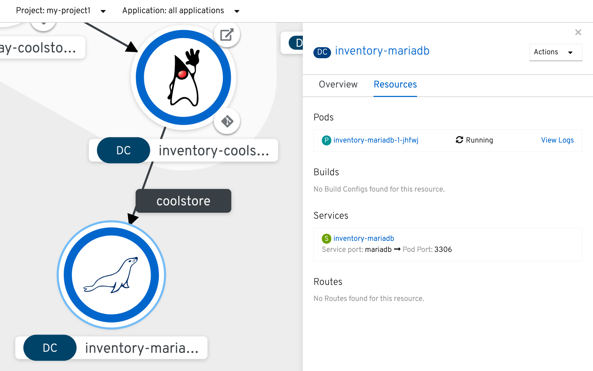
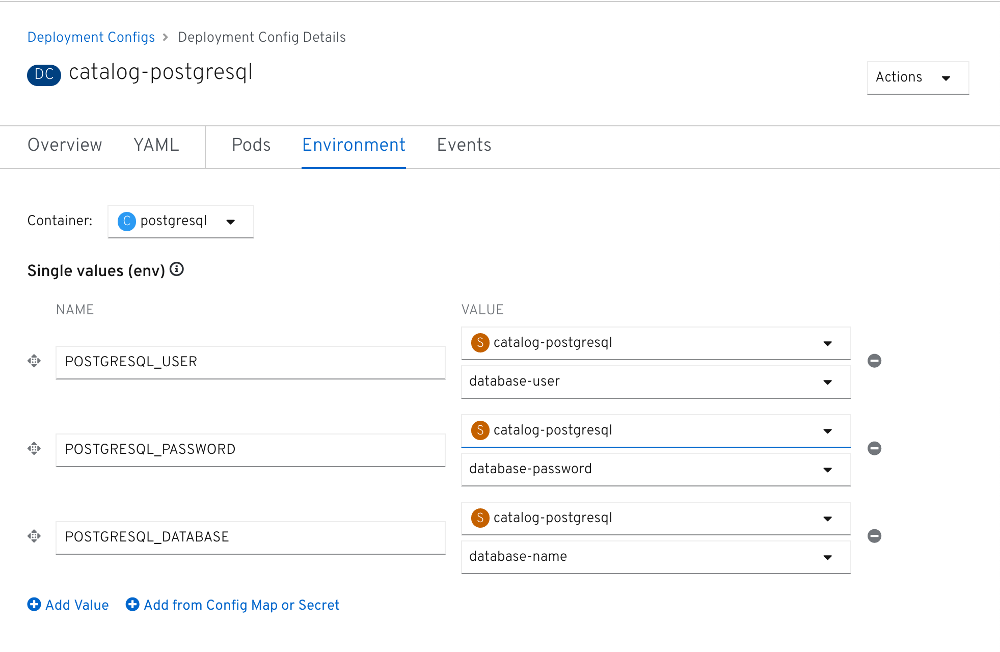

:markup-in-source: verbatim,attributes,quotes
:CHE_URL: %CHE_URL%
:USER_ID: %USER_ID%
:OPENSHIFT_CONSOLE_URL: %OPENSHIFT_CONSOLE_URL%/topology/ns/my-project{USER_ID}

_15 MINUTE EXERCISE_

In this lab you will learn how to manage application configuration and how to provide environment 
specific configuration to the services.

[sidebar]
.ConfigMaps
--
Applications require configuration in order to tweak the application behavior 
or adapt it to a certain environment without the need to write code and repackage 
the application for every change. These configurations are sometimes specific to 
the application itself such as the number of products to be displayed on a product 
page and some other times they are dependent on the environment they are deployed in 
such as the database coordinates for the application.

The most common way to provide configurations to applications is using environment 
variables and external configuration files such as properties, JSON or YAML files, 
configuration files and command line arguments. These configuration artifacts
should be externalized from the application and the container image content in
order to keep the image portable across environments.

OpenShift provides a mechanism called https://docs.openshift.com/container-platform/4.2/welcome/index.html[**ConfigMaps**^] 
in order to externalize configurations 
from the applications deployed within containers and provide them to the containers 
in a unified way as files and environment variables. OpenShift also offers a way to 
provide sensitive configuration data such as certificates, credentials, etc. to the 
application containers in a secure and encrypted mechanism called Secrets.

This allows developers to build the container image for their application only once, 
and reuse that image to deploy the application across various environments with 
different configurations that are provided to the application at runtime.
--

'''

===  Create Databases for Inventory and Catalog

So far Catalog and Inventory services have been using an in-memory H2 database. Although H2 
is a convenient database to run locally on your laptop, it's in no way appropriate for production or 
even integration tests. Since it's strongly recommended to use the same technology stack (operating 
system, JVM, middleware, database, etc.) that is used in production across all environments, you 
should modify Inventory and Catalog services to use PostgreSQL/MariaDB instead of the H2 in-memory database.

Fortunately, OpenShift supports stateful applications such as databases which require access to 
a persistent storage that survives the container itself. You can deploy databases on OpenShift and 
regardless of what happens to the container itself, the data is safe and can be used by the next 
database container.

Let's create a https://docs.openshift.com/container-platform/4.2/welcome/index.html[MariaDB database^] 
for the **Inventory Service** using the MariaDB template that is provided out-of-the-box:

[TIP]
====
https://docs.openshift.com/container-platform/4.2/openshift_images/using-templates.html[OpenShift Templates^] use YAML/JSON to compose 
multiple containers and their configurations as a list of objects to be created and deployed at once, 
making it simple to re-create complex deployments by just deploying a single template. Templates can 
be parameterized to get input for fields like service names and generate values for fields like passwords.
====

In the {OPENSHIFT_CONSOLE_URL}[OpenShift Web Console^], `*click on '+ Add' and select 'Database'*`

image::images/openshift-add-database.png[OpenShift - Add database, 700]

`*Select 'MariaDB (Ephemeral)' and click on 'Instantiate Template'*`

Then, enter the following information:

.Inventory Database
[%header,cols=2*]
|===
|Parameter 
|Value

|Namespace*
|PR my-project{USER_ID}

|Memory Limit*
|512Mi

|Namespace
|openshift

|Database Service Name*
|inventory-mariadb

|MariaDB Connection Username
|inventory

|MariaDB Connection Password
|inventory

|MariaDB root Password
|inventoryadmin

|MariaDB Database Name*
|inventorydb

|Version of MariaDB Image*
|10.2

|===

`*Click on 'Create' button*`

`*Click again on '+ Add' and select 'Database', delect 'PostgreSQL (Ephemeral)' and click on 'Instantiate Template'*` 
to create the Catalog Database as following:

Then, enter the following information:

.Catalog Database
[%header,cols=2*]
|===
|Parameter 
|Value

|Namespace*
|PR my-project{USER_ID}

|Memory Limit*
|512Mi

|Namespace
|openshift

|Database Service Name*
|catalog-postgresql

|PostgreSQL Connection Username
|catalog

|PostgreSQL Connection Password
|catalog

|PostgreSQL Database Name*
|catalogdb

|Version of PostgreSQL Image*
|10

|===

`*Click on 'Create' button*`

image::images/openshift-catalog-postgresql-topology.png[OpenShift - Catalog PostgreSQL, 700]

Now you can move on to configure the Inventory and Catalog service to use these databases.

'''

===  Externalize Quarkus (Inventory) Configuration

Quarkus supports multiple mechanisms for externalizing configurations such as environment variables, 
Maven properties, command-line arguments and more. The recommended approach for the long-term for externalizing 
configuration is however using an https://quarkus.io/guides/application-configuration-guide#overriding-properties-at-runtime[application.properties^] 
which you have already packaged within the Inventory Maven project.

In Quarkus, Driver is a build time property and cannot be overridden. So as you are going to change the database
technology, you need to change the 'quarkus.datasource.driver' parameter 
in **/projects/workshop/labs/inventory-quarkus/src/main/resources/application.properties** and rebuild the application.

In your {CHE_URL}[Workspace^], `*edit the '/projects/workshop/labs/inventory-quarkus/pom.xml' file and add the
'JDBC Driver - MariaDB' dependency*`

[source,xml,subs="{markup-in-source}",role=copy]
----
    <dependency>
        <groupId>io.quarkus</groupId>
        <artifactId>quarkus-jdbc-mariadb</artifactId>
    </dependency>
----

Then `*add the '%prod.quarkus.datasource.driver' parameter in 
 the '/projects/workshop/labs/inventory-quarkus/src/main/resources/application.properties' file*` as following

[source,properties,subs="{markup-in-source}",role=copy]
----
%prod.quarkus.datasource.driver=org.mariadb.jdbc.Driver
----
<1> With the **%prod** prefix, this option is only activated when building the jar intended for deployments.

[WARNING]
====
Leave the **'quarkus.datasource.url'**, **'quarkus.datasource.username'** and **'quarkus.datasource.password'**
parameters unchanged. They will be overridden later.
====

In your {CHE_URL}[Workspace^], `*click on 'Terminal' -> 'Run Task...' ->  'Inventory - Build'*`

image::images/che-runtask.png[Che - RunTask, 500]

image::images/che-inventory-build.png[Che - Build Inventory, 500]

Then, `*push the updated component to the OpenShift cluster*`.

image::images/che-openshift-push-again-inventory.png[Che - OpenShift Push Inventory, 400]

Now, let's create the Quarkus configuration content using the database credentials.

In the {OPENSHIFT_CONSOLE_URL}[OpenShift Web Console^], from the **Developer view**,
`*click on 'Config Maps' then click on the 'Create Config Map' button*`.

image::images/openshift-create-configmap.png[Che - OpenShift Create Config Map, 900]

Then `*replace the content*` with the following input:

[source,yaml,subs="{markup-in-source}",role=copy]
----
apiVersion: v1
kind: ConfigMap
metadata:
  name: inventory
  namespace: my-project{USER_ID}
  labels:
    app: coolstore
    app.kubernetes.io/instance: inventory
data:
  application.properties: |-
    quarkus.datasource.url=jdbc:mariadb://inventory-mariadb.my-project{USER_ID}.svc:3306/inventorydb
    quarkus.datasource.username=inventory
    quarkus.datasource.password=inventory
----

And then `*configure the container to use the newly Config Map and overlay on the default application.properties*`:

[source,shell,subs="{markup-in-source}",role=copy]
----
oc set volume dc/inventory-coolstore --add --configmap-name=inventory --mount-path=/deployments/config -n my-project{USER_ID}
----
<1> Mounts the content of the **Inventory Config Map** as a file inside the **Inventory container**
at **/deployments/config/application.properties **

The Inventory pod gets restarted automatically due to the configuration changes. Wait till it's ready, 
and then verify that the config map is in fact injected into the container by `*running 
a shell command inside the Inventory Container*`:

[source,shell,subs="{markup-in-source}",role=copy]
----
oc rsh -n my-project{USER_ID} -c inventory-coolstore dc/inventory-coolstore cat /deployments/config/application.properties
----

You should have the following output:

[source,properties,subs="{markup-in-source}"]
----
quarkus.datasource.url=jdbc:mariadb://inventory-mariadb.my-project{USER_ID}.svc:3306/inventorydb
quarkus.datasource.username=inventory
quarkus.datasource.password=inventory
----

You can also connect to Inventory MariaDB database and check if the seed data is 
loaded into the database.

[source,shell,subs="{markup-in-source}",role=copy]
----
oc rsh -n my-project{USER_ID} dc/inventory-mariadb
----

Once connected to the MariaDB container, `*run the following*`:

[IMPORTANT]
====
Run this command inside the Inventory MariaDB container, after opening a remote shell to it.
====

[source,shell,subs="{markup-in-source}",role=copy]
----
mysql --user=$MYSQL_USER --password=$MYSQL_PASSWORD --host=$HOSTNAME --execute="select * from INVENTORY" $MYSQL_DATABASE
----

You should have the following output:

[source,json,subs="{markup-in-source}"]
----
+--------+----------+
| itemId | quantity |
+--------+----------+
| 165613 |       45 |
| 165614 |       87 |
| 165954 |       43 |
| 329199 |       12 |
| 329299 |       35 |
| 444434 |       32 |
| 444435 |       53 |
+--------+----------+
----

`*Finally, exit from inside the database container*`:

[source,shell,subs="{markup-in-source}",role=copy]
----
exit
----

You have now created a config map that holds the configuration content for Inventory and can be updated 
at anytime for example when promoting the container image between environments without needing to 
modify the Inventory container image itself. 

'''

===  Externalize Spring Boot (Catalog) Configuration

You should be quite familiar with config maps by now. Spring Boot application configuration is provided 
via a properties file called **application.properties** and can be 
https://docs.spring.io/spring-boot/docs/current/reference/html/boot-features-external-config.html[overriden and overlayed via multiple mechanisms^]. 

[NOTE]
====
Check out the default Spring Boot configuration in Catalog Maven project **catalog-spring-boot/src/main/resources/application.properties**.
====

In this lab, you will configure the **Catalog Service** which is based on Spring Boot to override the default 
configuration using an alternative **application.properties** backed by a config map.

Let's create the Spring Boot configuration content using the database credentials and create the Config Map.

In the {OPENSHIFT_CONSOLE_URL}[OpenShift Web Console^], from the **Developer view**,
`*click on 'Config Maps' then click on the 'Create Config Map' button*`.

image::images/openshift-create-configmap.png[Che - OpenShift Create Config Map, 900]

Then `*replace the content*` with the following input:

[source,yaml,subs="{markup-in-source}",role=copy]
----
apiVersion: v1
kind: ConfigMap
metadata:
  name: catalog
  namespace: my-project{USER_ID}
  labels:
    app: coolstore
    app.kubernetes.io/instance: catalog
data:
  application.properties: |-
    spring.datasource.url=jdbc:postgresql://catalog-postgresql.my-project%USER_ID%.svc:5432/catalogdb
    spring.datasource.username=catalog
    spring.datasource.password=catalog
    spring.datasource.driver-class-name=org.postgresql.Driver
    spring.jpa.hibernate.ddl-auto=create
    spring.jpa.properties.hibernate.jdbc.lob.non_contextual_creation=true
----

The https://github.com/spring-cloud-incubator/spring-cloud-kubernetes[Spring Cloud Kubernetes^] plug-in implements 
the integration between Kubernetes and Spring Boot and is already added as a dependency to the Catalog Maven 
project. Using this dependency, Spring Boot would search for a config map (by default with the same name as 
the application) to use as the source of application configurations during application bootstrapping and 
if enabled, triggers hot reloading of beans or Spring context when changes are detected on the config map.

Although https://github.com/spring-cloud-incubator/spring-cloud-kubernetes[Spring Cloud Kubernetes^] 
tries to discover config maps, due to security reasons containers 
by default are not allowed to snoop around OpenShift clusters and discover objects. Security comes first, 
and discovery is a privilege that needs to be granted to containers in each project. 

Since you do want Spring Boot to discover the config maps inside the **my-project{USER_ID}** project, you 
need to grant permission to the Spring Boot service account to access the OpenShift REST API and find the 
config maps. 

[source,shell,subs="{markup-in-source}",role=copy]
----
oc policy add-role-to-user view -n my-project{USER_ID} -z default
----

`*Delete the Catalog Pod*` to make it start again and look for the config maps:

[source,shell,subs="{markup-in-source}",role=copy]
----
oc delete pod -l deploymentconfig=catalog-coolstore -n my-project{USER_ID}
----

When the Catalog container is ready, verify that the PostgreSQL database is being 
used. Check the Catalog pod logs:

[source,shell,subs="{markup-in-source}",role=copy]
----
oc logs -c catalog-coolstore dc/catalog-coolstore -n my-project{USER_ID} | grep hibernate.dialect
----

You should have the following output:

[source,logs,subs="{markup-in-source}"]
----
2017-08-10 21:07:51.670  INFO 1 --- [           main] org.hibernate.dialect.Dialect            : HHH000400: Using dialect: org.hibernate.dialect.PostgreSQL95Dialect
----

You can also connect to the Catalog PostgreSQL database and verify that the seed data is loaded:

[source,shell,subs="{markup-in-source}",role=copy]
----
oc rsh -n my-project{USER_ID} dc/catalog-postgresql
----

Once connected to the PostgreSQL container, run the following:

[IMPORTANT] 
====
Run this command inside the Catalog PostgreSQL container, after opening a remote shell to it.
====

[source,shell,subs="{markup-in-source}",role=copy]
----
psql catalogdb -U catalog -c "select item_id, name, price from product"
----

You should have the following output:

[source,logs,subs="{markup-in-source}"]
----
 item_id |            name             | price
 ----
 329299  | Red Fedora                  | 34.99
 329199  | Forge Laptop Sticker        |   8.5
 165613  | Solid Performance Polo      |  17.8
 165614  | Ogio Caliber Polo           | 28.75
 165954  | 16 oz. Vortex Tumbler       |     6
 444434  | Pebble Smart Watch          |    24
 444435  | Oculus Rift                 |   106
 444436  | Lytro Camera                |  44.3
 (8 rows)
----

`*Finally, exit from inside the database container*`:

[source,shell,subs="{markup-in-source}",role=copy]
----
exit
----

'''

=== Explore Sensitive Configuration Data

[sidebar]
.Secrets
--
**ConfigMaps** are a superb mechanism for externalizing application configuration while keeping 
containers independent of in which environment or on what container platform they are running. 
Nevertheless, due to their clear-text nature, they are not suitable for sensitive data like 
database credentials, SSH certificates, etc. In the current lab, we used config maps for database 
credentials to simplify the steps; however, for production environments, you should opt for a more 
secure way to handle sensitive data.

Fortunately, OpenShift already provides a secure mechanism for handling sensitive data which is 
called https://docs.openshift.com/container-platform/4.2/welcome/index.html[**Secrets**^]. Secret objects act and are used 
similarly to config maps however with the difference that they are encrypted as they travel over the wire 
and also at rest when kept on a persistent disk. Like config maps, secrets can be injected into 
containers as environment variables or files on the filesystem using a temporary file-storage 
facility (tmpfs).
--

You won't create any secrets in this lab; however, you have already created two secrets when you created 
the PostgreSQL and MariaDB databases. The Database template by default stores 
the database credentials in a secret in the project in which it's being created:

[source,shell,subs="{markup-in-source}",role=copy]
----
oc describe secret catalog-postgresql
----

You should have the following output:

[source,logs,subs="{markup-in-source}"]
----
Name:            catalog-postgresql
Namespace:       coolstore
Labels:          app=catalog
                 template=postgresql-persistent-template
Annotations:     openshift.io/generated-by=OpenShiftNewApp
                 template.openshift.io/expose-database_name={.data['database-name']}
                 template.openshift.io/expose-password={.data['database-password']}
                 template.openshift.io/expose-username={.data['database-user']}

Type:     Opaque

Data
====
database-name:        9 bytes
database-password:    7 bytes
database-user:        7 bytes
----

This secret has three encrypted properties defined as **database-name**, **database-user** and **database-password** which hold 
the PostgreSQL database name, username and password values. These values are injected in the PostgreSQL container as 
environment variables and used to initialize the database.

In the {OPENSHIFT_CONSOLE_URL}[OpenShift Web Console^], from the **Developer view**,
`*click on 'DC catalog-postgresql' -> 'DC catalog-postgresql' -> 'Environment'*`. Notice the values 
from the secret are defined as env vars on the deployment:

That's all for this lab! You are ready to move on to the next lab.
