:markup-in-source: verbatim,attributes,quotes
:APPS_HOSTNAME_SUFFIX: %APPS_HOSTNAME_SUFFIX%
:CHE_URL: %CHE_URL%
:USER_ID: %USER_ID%
:OPENSHIFT_CONSOLE_URL: %OPENSHIFT_CONSOLE_URL%/topology/ns/my-project{USER_ID}

_15 MINUTE EXERCISE_

In this lab we will learn how to monitor application health using OpenShift 
health probes and how you can see container resource consumption using metrics.

[sidebar]
.OpenShift Health Probes
--

When building microservices, monitoring becomes of extreme importance to make sure all services 
are running at all times, and when they don't there are automatic actions triggered to rectify 
the issues. 

OpenShift, using Kubernetes health probes, offers a solution for monitoring application 
health and trying to automatically heal faulty containers through restarting them to fix issues such as
a deadlock in the application which can be resolved by restarting the container. Restarting a container 
in such a state can help to make the application more available despite bugs.

Furthermore, there are of course a category of issues that can't be resolved by restarting the container. 
In those scenarios, OpenShift would remove the faulty container from the built-in load-balancer and send traffic 
only to the healthy containers that remain.

There are three types of health probes available in OpenShift: https://docs.openshift.com/container-platform/4.5/applications/application-health.html#application-health-about_application-health[startup, readiness and liveness probes^]. 

* **Startup probes** determine if the container in which it is scheduled is started
* **Readiness probes** determine if the container in which it is scheduled is ready to service requests
* **Liveness probes** determine if the container in which it is scheduled is still running

Health probes also provide crucial benefits when automating deployments with practices like rolling updates in 
order to remove downtime during deployments. A readiness health probe would signal OpenShift when to switch 
traffic from the old version of the container to the new version so that the users don't get affected during 
deployments.

There are https://docs.openshift.com/container-platform/4.5/applications/application-health.html#application-health-about_types_application-health[three ways to define a health probe^] for a container:

* **HTTP Checks:** healthiness of the container is determined based on the response code of an HTTP 
endpoint. Anything between 200 and 399 is considered success. A HTTP check is ideal for applications 
that return HTTP status codes when completely initialized.

* **Container Execution Checks:** a specified command is executed inside the container and the healthiness is 
determined based on the return value (0 is success). 

* **TCP Socket Checks:** a socket is opened on a specified port to the container and it's considered healthy 
only if the check can establish a connection. TCP socket check is ideal for applications that do not 
start listening until initialization is complete.
--

'''

===  Understanding Liveness Probes

**What happens if you DON'T setup Liveness checks?**

Imagine the _Inventory Service_ is stuck in a state (Deadlock, NullPointer exception, Out of Memory, ..)
where it cannot perform as it should. Let's access inside the container and simulate this state.

In the {OPENSHIFT_CONSOLE_URL}[OpenShift Web Console^], from the **Developer view**,
`*click on 'Topology' -> 'DC inventory-coolstore' -> 'Resources' -> 'P inventory-coolstore-x-xxxxx'*`

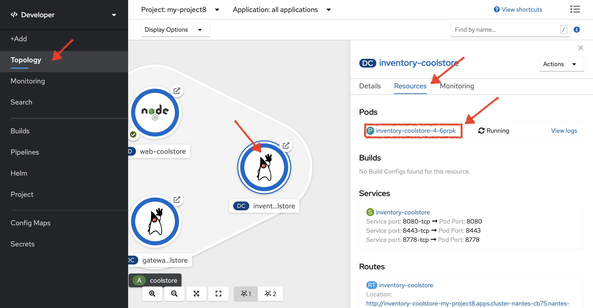

Then, `*from the Terminal tab, run the following command*`:

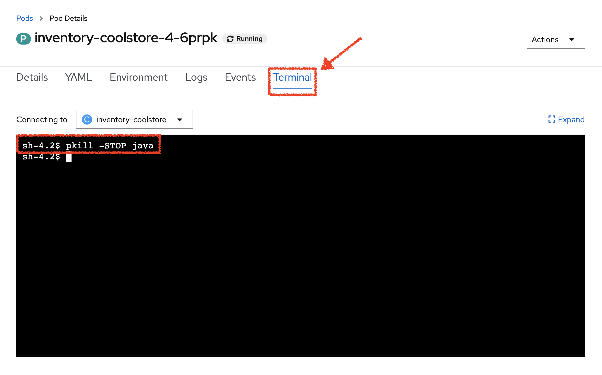

[source,shell,subs="{markup-in-source}",role=copy]
.>inventory-coolstore terminal
----
pkill -STOP java
----

So we just suspend the _Inventory Service_ java process to simulate a stuck situation.

In the {OPENSHIFT_CONSOLE_URL}[OpenShift Web Console^], `*click on the 'Events' and 'Logs' tabs *` and notice that 
everything seems to be ok.

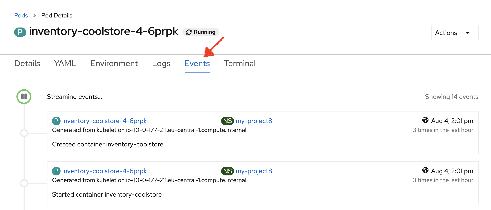

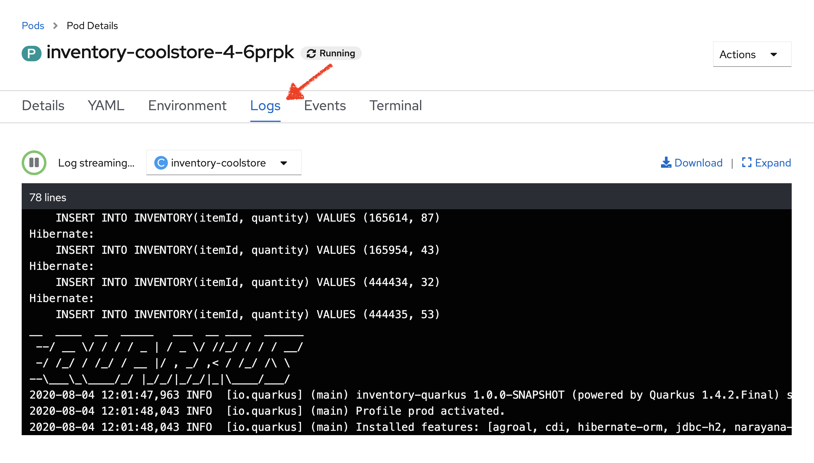

Now, `*access to your http://inventory-coolstore-my-project{USER_ID}.{APPS_HOSTNAME_SUFFIX}[Inventory Service^]*`.
You don't have any response anymore (as the process has been stopped previously).

Often, applications need a restart to work correctly again.

In the {OPENSHIFT_CONSOLE_URL}[OpenShift Web Console^], `*click on 'Actions' -> 'Delete Pod' -> 'Delete'*`

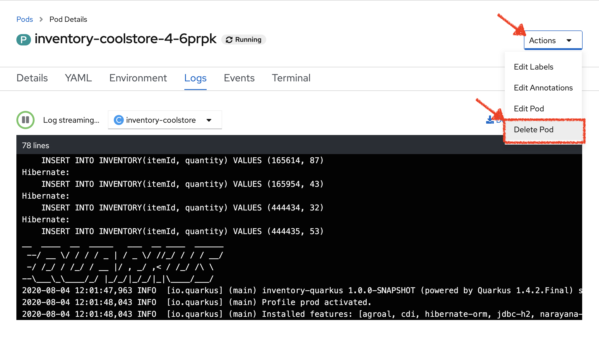

A new instance (pod) will be redeployed. Once done, `*access to your http://inventory-coolstore-my-project{USER_ID}.{APPS_HOSTNAME_SUFFIX}[Inventory Service^]*`.

Now the _Inventory Service_ is working again.

To make your application more robust and reliable, a **Liveness check**  will be used to check 
if the container itself has become unresponsive. If the liveness probe fails due to a condition such as a deadlock, 
the container could automatically restart (based on its restart policy).

'''

=== Configuring Liveness Probes

https://quarkus.io/guides/health-guide[SmallRye Health^] is a Quarkus extension which utilizes the MicroProfile Health specification.
It allows applications to provide information about their state to external viewers which is typically useful 
in cloud environments where automated processes must be able to determine whether the application should be discarded or restarted.

Let's add the needed dependencies to **/projects/workshop/labs/inventory-quarkus/pom.xml**. 
In your {CHE_URL}[Workspace^], `*edit the '/projects/workshop/labs/inventory-quarkus/pom.xml' file*`:

[source,xml,subs="{markup-in-source}",role=copy]
.pom.xml
----
    <dependency>
      <groupId>io.quarkus</groupId>
      <artifactId>quarkus-smallrye-health</artifactId>
    </dependency>
----

`*click on 'Terminal' -> 'Run Task...' ->  'Inventory - Build'*`

image::images/che-runtask.png[Che - RunTask, 500]

image::images/che-inventory-build.png[Che - Inventory Build, 500]

Then, `*push the updated component to the OpenShift cluster*`.

image::images/che-openshift-push-again-inventory.png[Che - OpenShift Push Inventory, 400]

Once completed, verify that the health endpoint works for the **Inventory Service** using `*curl*`

In your {CHE_URL}[Workspace^], open a new Terminal by `*clicking 
on the 'My Workspace' white box in the right menu, then 'Plugins' -> 'workshop-tools' -> '>_ New terminal'*`:

image::images/che-open-workshop-terminal.png[Che - Open OpenShift Terminal, 700]

In the window called **'>_ workshop-tools terminal'**, `*execute the following commands*`:

[source,shell,subs="{markup-in-source}",role=copy]
.>_ workshop-tools terminal
----
curl -w "\n" http://inventory-coolstore.my-project{USER_ID}.svc:8080/health
----

You should have the following output:

[source,json,subs="{markup-in-source}"]
----
{
    "status": "UP",
    "checks": [
        {
            "name": "Database connection(s) health check",
            "status": "UP"
        }
    ]
}
----

In the {OPENSHIFT_CONSOLE_URL}[OpenShift Web Console^], from the **Developer view**,
`*click on 'Topology' -> 'DC inventory-coolstore' -> 'Add Health Checks'*`.

image::images/openshift-inventory-add-health-check.png[Che - Inventory Add Health Check, 700]

Then `*click on 'Add Liveness Probe'*`

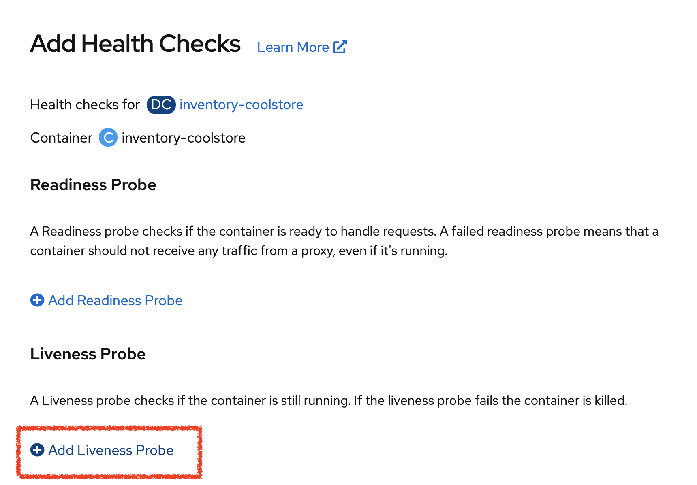

`*Enter the following information:*`

.Liveness Probe
[%header,cols=2*]
|===
|Parameter 
|Value

|Type
|HTTP GET

|Use HTTPS
|_Unchecked_

|HTTP Headers
|_Empty_

|Path
|/health/live

|Port
|8080

|Failure Threshold
|3

|Success Threshold
|1

|Initial Delay
|10

|Period
|10

|Timeout
|1

|===

Finally `*click on the check icon and the 'add' button*`. OpenShift automates deployments using 
https://docs.openshift.com/container-platform/4.2/welcome/index.html[deployment triggers^] 
that react to changes to the container image or configuration. 
Therefore, as soon as you define the probe, OpenShift automatically redeploys the pod using the new configuration including the liveness probe.

'''

=== Testing Liveness Probes

As you did previously, in the {OPENSHIFT_CONSOLE_URL}[OpenShift Web Console^], from the **Developer view**,
`*access into the container and suspend the _Inventory Service_ java process*`.

Then, still in the {OPENSHIFT_CONSOLE_URL}[OpenShift Web Console^], `*click on the 'Events' tab*`.

After 3 failed checks, OpenShift automatically restarts the container.

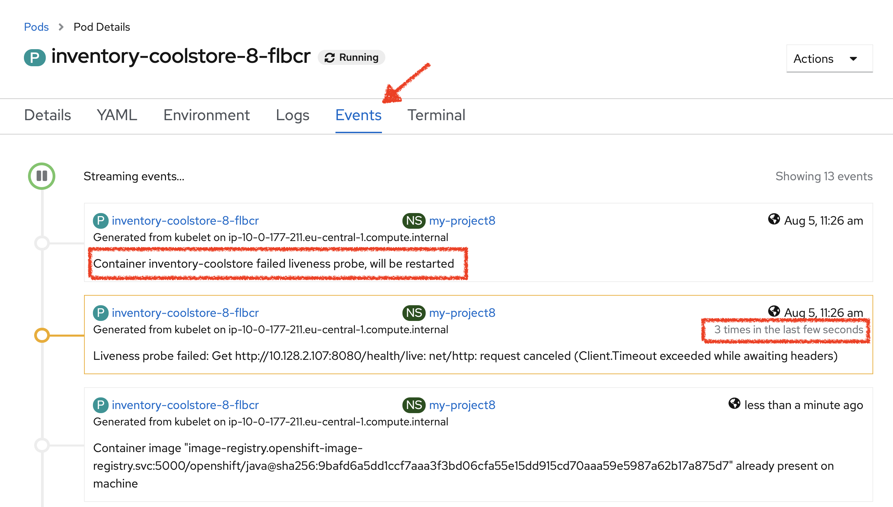

Now, `*access to your http://inventory-coolstore-my-project{USER_ID}.{APPS_HOSTNAME_SUFFIX}[Inventory Service^]*`.
The service is up and running again.

'''

===  Understanding Readiness Probes

**What happens if you DON'T setup Readiness checks?**

Let's imagine you have traffic to the _Catalog Service_

In your {CHE_URL}[Workspace^], `*click on 'Terminal' -> 'Run Task...' ->  'Catalog - Generate Traffic'*`

image::images/che-runtask.png[Che - RunTask, 500]

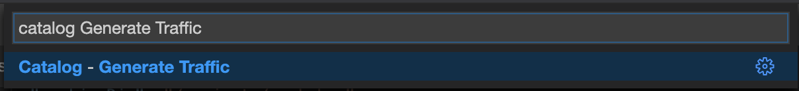

You should have the following output:

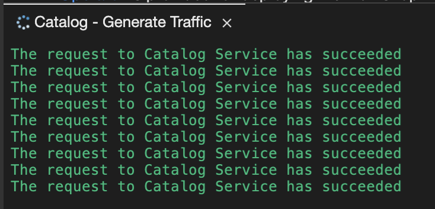

Now let's scale out your _Catalog Service_ to 2 instances. 

In the {OPENSHIFT_CONSOLE_URL}[OpenShift Web Console^], from the **Developer view**,
`*click on 'Topology' -> 'DC catalog-coolstore' -> 'Details' then click once on the up arrows 
on the right side of the pod blue circle*`.

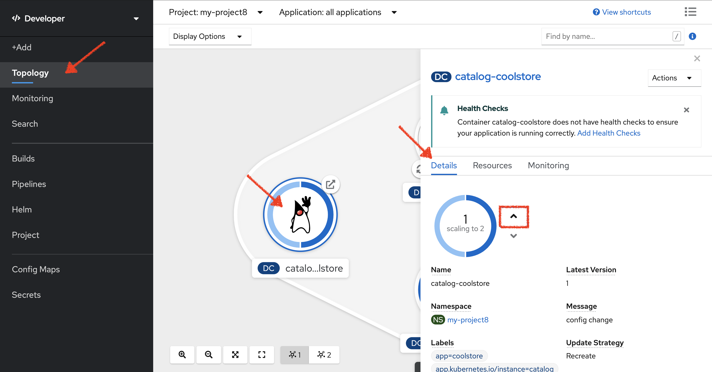

You should see the 2 instances (pods) running. 
Now, `*switch back to your {CHE_URL}[Workspace^] and check the output of the 'Catalog Generate Traffic' task*`.

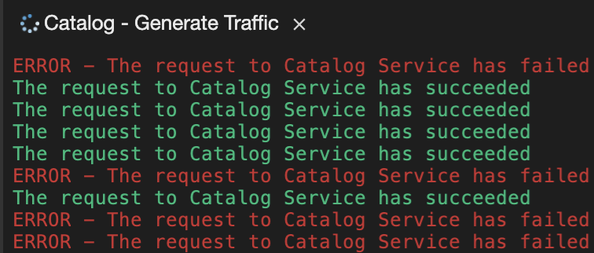

Why do some requests failed? Because as soon as the container is created, 
the traffic is sent to this new instance even if the application is not ready. The _Catalog Service_ takes more than 20 seconds to start up). 

In order to prevent this behaviour, a **Readiness check** is needed. It determines if the container in which it is scheduled is ready to service requests. 
If the readiness probe fails a container, the endpoints controller ensures the container has its IP address removed from the endpoints of all services. 
A readiness probe can be used to signal to the endpoints controller that even though a container is running, it should not receive any traffic from a proxy.

'''

===  Configuring Readiness Probes

First, scale down your _Catalog Service_ to 1 instance. In the {OPENSHIFT_CONSOLE_URL}[OpenShift Web Console^], from the **Developer view**,
`*click on 'Topology' -> 'DC catalog-coolstore' -> 'Details' then click once on the down arrows 
on the right side of the pod blue circle*`.

http://docs.spring.io/spring-boot/docs/current/reference/htmlsingle/#production-ready[Spring Boot Actuator^] is a 
sub-project of Spring Boot which adds health and management HTTP endpoints to the application. Enabling Spring Boot 
Actuator is done via adding **org.springframework.boot:spring-boot-starter-actuator** dependency to the Maven project 
dependencies which is already done for the **Catalog Service**.

Verify that the health endpoint works for the **Catalog Service** using `*curl*`.

In your {CHE_URL}[Workspace^], in the window called **'>_ workshop-tools terminal'**, 
`*execute the following commands*`:

[source,shell,subs="{markup-in-source}",role=copy]
.>_ workshop-tools terminal
----
curl -w "\n" http://catalog-coolstore.my-project{USER_ID}.svc:8080/actuator/health
----

You should have the following output:

[source,json,subs="{markup-in-source}"]
----
{"status":"UP"}
----

In the {OPENSHIFT_CONSOLE_URL}[OpenShift Web Console^], from the **Developer view**,
`*click on 'Topology' -> 'DC catalog-coolstore' -> 'Add Health Checks'*`.

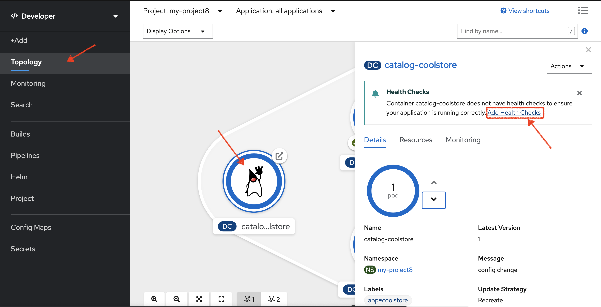

Then `*click on 'Add Readiness Probe'*`

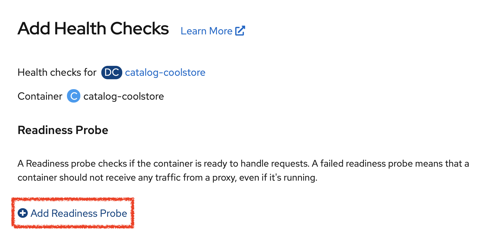

`*Enter the following information:*`

.Readiness Probe
[%header,cols=2*]
|===
|Parameter 
|Value

|Type
|HTTP GET

|Use HTTPS
|_Unchecked_

|HTTP Headers
|_Empty_

|Path
|/actuator/health

|Port
|8080

|Failure Threshold
|3

|Success Threshold
|1

|Initial Delay
|_Empty_

|Period
|10

|Timeout
|1

|===

Finally `*click on the check icon and the 'add' button*`. The Readiness check is now set up.
Now let's test it as you did previously.

In your {CHE_URL}[Workspace^], `*run the 'Catalog - Generate Traffic' task*`.

In the {OPENSHIFT_CONSOLE_URL}[OpenShift Web Console^], `*scale out the Catalog Service to 2 instances (pods)*`

In your {CHE_URL}[Workspace^], `*check the output of the 'Catalog Generate Traffic' task*`.

You should not see any error means that you can now **scale out your _Catalog Service_ with no downtime.**

'''

===  Understanding Startup Probes

**Startup probes** are similar to liveness probes but only executed at startup.
When a startup probe is configured, the other probes are disabled until it suceeds.

Sometimes, some (legacy) applications might need extra times for their first initialization. 
In such cases, setting a longer liveness internal might compromise the main benefit of this probe ie providing 
the fast response to stuck states.

**Startup probes** are useful to cover this worse case startup time.

'''

=== Monitoring All Application Healths

Now you understand and know how to configure Readiness, Liveness and Startup probes, let's confirm your expertise! 

`*Configure the remaining Probes to for Inventory and Catalog Probes*` using the following information:

[%header,cols=3*]
|===
|Inventory Service
|Readiness
|Startup

|Type
|HTTP GET
|HTTP GET

|Use HTTPS
|_Unchecked_
|_Unchecked_

|HTTP Headers
|_Empty_
|_Empty_

|Path
|/health/ready
|/health/live

|Port
|8080
|8080

|Failure Threshold
|3
|3

|Success Threshold
|1
|1

|Initial Delay
|_Empty_
|_Empty_

|Period
|5
|5

|Timeout
|1
|1

|===

[%header,cols=3*]
|===
|Catalog Service
|Liveness
|Startup

|Type
|HTTP GET
|HTTP GET

|Use HTTPS
|_Unchecked_
|_Unchecked_

|HTTP Headers
|_Empty_
|_Empty_

|Path
|/actuator/health
|/actuator/health

|Port
|8080
|8080

|Failure Threshold
|3
|15

|Success Threshold
|1
|1

|Initial Delay
|_Empty_
|_Empty_

|Period
|5
|10

|Timeout
|1
|1

|===

Finally, let's configure probes for Gateway and Web Service.
In your {CHE_URL}[Workspace^], `*click on 'Terminal' -> 'Run Task...' ->  'Probes - Configure Gateway & Web'*`

image::images/che-runtask.png[Che - RunTask, 500]

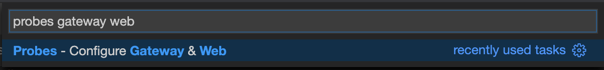

'''

=== Monitoring Applications Metrics

Metrics are another important aspect of monitoring applications which is required in order to 
gain visibility into how the application behaves and particularly in identifying issues.

OpenShift provides container metrics out-of-the-box and displays how much memory, cpu and network 
each container has been consuming over time. 

In the {OPENSHIFT_CONSOLE_URL}[OpenShift Web Console^], from the **Developer view**,
`*click on 'Monitoring' then select your 'my-project{USER_ID}' project*`.

In the project overview, you can see the different **Resource Usage** sections. 
`*click on one graph to get more details*`.

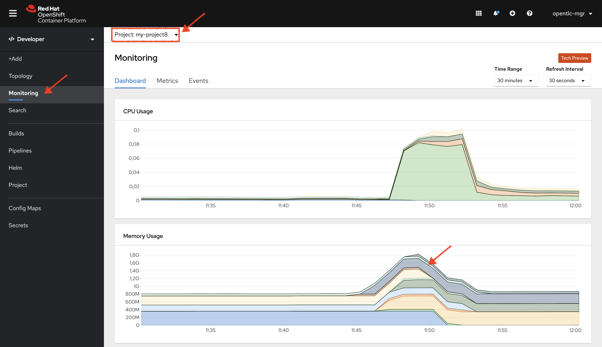

From the **Developer view**, `*click on 'Topology' -> any Deployment Config (DC) and click on the associated Pod (P)*`

In the pod overview, you can see a more detailed view of the pod consumption.

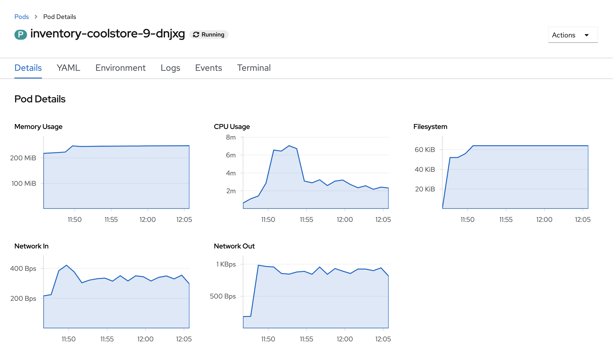

Well done! You are ready to move on to the next lab.
