:markup-in-source: verbatim,attributes,quotes
:CHE_URL: %CHE_URL%
:GIT_URL: %GIT_URL%
:GITOPS_URL: %GITOPS_URL%
:USER_ID: %USER_ID%
:OPENSHIFT_PASSWORD: %OPENSHIFT_PASSWORD%
:OPENSHIFT_CONSOLE_URL: %OPENSHIFT_CONSOLE_URL%/topology/ns/cn-project{USER_ID}

_60 MINUTE EXERCISE_

In this lab you will learn about deployment pipelines and you will create a pipeline to 
automate build and deployment of the Inventory service.

[sidebar]
.Continuous Delivery
--
So far you have been building and deploying each service manually to OpenShift. Although 
it's convenient for local development, it's an error-prone way of delivering software if 
extended to test and production environments.

Continuous Delivery (CD) refers to a set of practices with the intention of automating 
various aspects of delivery software. One of these practices is called **Delivery Pipeline** 
which is an automated process to define the steps a change in code or configuration has 
to go through in order to reach upper environments and eventually to production. 

OpenShift simplifies building CI/CD Pipelines by integrating TektonCD into
the platform and enables defining truly complex workflows directly from within OpenShift.
--

'''

=== Create a Git Repository for Inventory

The first step for any deployment pipeline is to store all code and configurations in 
a source code repository.

In {GIT_URL}[Gitea^], `*create a new Repository for Inventory Service*` as following:

.Inventory Repository
[%header,cols=2*]
|===
|Parameter 
|Value

|Owner*
|user{USER_ID}

|Repository Name*
|inventory-quarkus

|Visibility
|_unchecked_

|Description
|_leave it empty_

|.gitignore
|_leave it empty_

|License
|_leave it empty_

|Readme
|Default

|Intialize this repository with selected files and templates
|_unchecked_

|===

'''

=== Push Inventory Code to the Git Repository

Now that you have a Git repository for the Inventory service, you should push the 
source code into this Git repository.

In your {CHE_URL}[Workspace^], `*click on 'Terminal' -> 'Run Task...' ->  'Inventory - Commit'*`

image::images/che-runtask.png[Che - RunTask, 500]

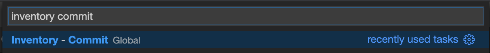

A terminal should be opened with the following output:

[source,shell,subs="{markup-in-source}"]
----
Initialized empty Git repository in /projects/workshop/labs/inventory-quarkus/.git/
[master (root-commit) f7b9db7] Initial
 12 files changed, 831 insertions(+)
 [...]
Enumerating objects: 29, done.
Counting objects: 100% (29/29), done.
Delta compression using up to 16 threads.
Compressing objects: 100% (20/20), done.
Writing objects: 100% (29/29), 10.76 KiB | 3.59 MiB/s, done.
Total 29 (delta 1), reused 0 (delta 0)
remote: . Processing 1 references
remote: Processed 1 references in total
To http://gitea-server.gitea.svc:3000/user{USER_ID}/inventory-quarkus.git
 * [new branch]      master -> master
----

Once done, in {GIT_URL}/user{USER_ID}/inventory-quarkus, `*refresh the page of your 'inventory-quarkus' repository*`. You should 
see the project files in the repository.

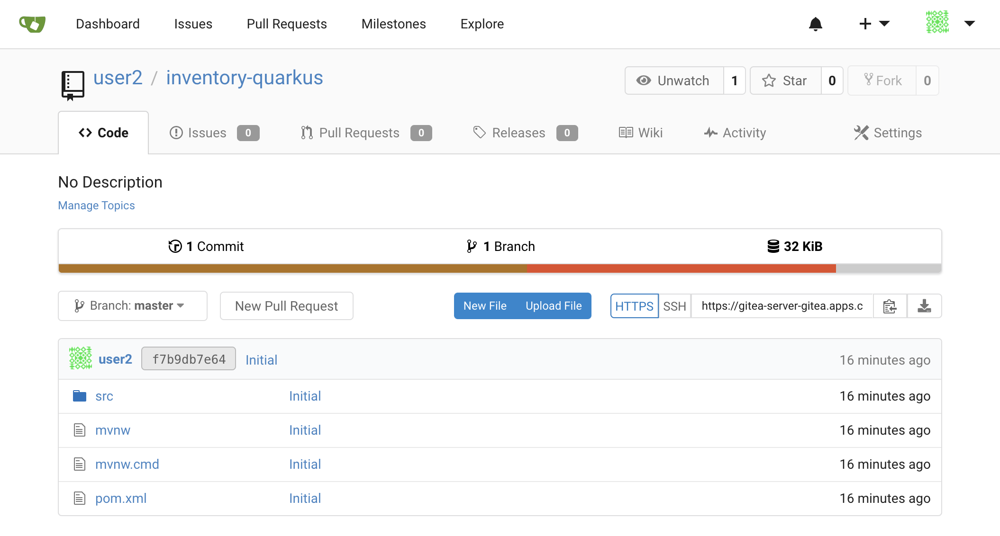

'''

=== What is OpenShift Pipelines?

[sidebar]
--
image::images/tekton-logo.png[Tekton, 300]

OpenShift Pipelines is a cloud-native, continuous integration and continuous delivery (CI/CD) solution 
for building pipelines based on  https://github.com/tektoncd/pipeline[Tekton Pipelines^] project.

* Standard CI/CD pipeline definition based on Tekton
* Build images with Kubernetes tools such as S2I, Buildah, Buildpacks, Kaniko, etc
* Deploy applications to multiple platforms such as Kubernetes, serverless and VMs
* Easy to extend and integrate with existing tools
* Scale pipelines on-demand
* Portable across any Kubernetes platform
* Designed for microservices and decentralized teams
* Integrated with the OpenShift Developer Console

https://github.com/tektoncd/pipeline[Tekton Pipelines^] provides Kubernetes-style resources for creating serverless 
CI/CD-style pipelines on Kubernetes.

The custom resources needed to define a pipeline are:

* **Task** - a reusable, loosely coupled number of steps that perform a specific task (e.g., building a container image)
* **Pipeline** - the definition of the pipeline and the **Task** that it should perform
* **PipelineResource** - inputs (e.g., git repository) and outputs (e.g., image registry) to and out of a **Pipeline** or **Task**
* **TaskRun** - the result of running an instance of **Task**
* **PipelineRun** - the result of running an instance of **Pipeline**, which includes a number of **TaskRun**

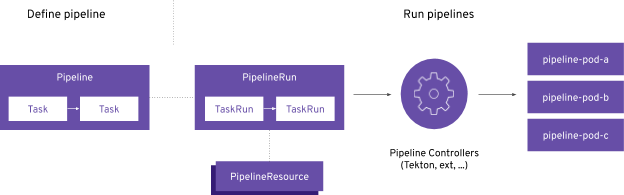

--

'''

=== Create an ImageStream

The container image you are about to create will be stored into the internal image registry of the OpenShift cluster by using
an https://docs.openshift.com/container-platform/4.5/openshift_images/image-streams-manage.html[**ImageStream**^].

It provides an abstraction for referencing container images from within OpenShift Container Platform. The imagestream and its 
tags allow you to see what images are available and ensure that you are using the specific image you need even if the image 
in the repository changes.

In the {OPENSHIFT_CONSOLE_URL}[OpenShift Web Console^], from the **Developer view**,
`*click on 'Search' -> 'Resources' -> 'IS ImageStream' -> 'Create Image Stream'*`.

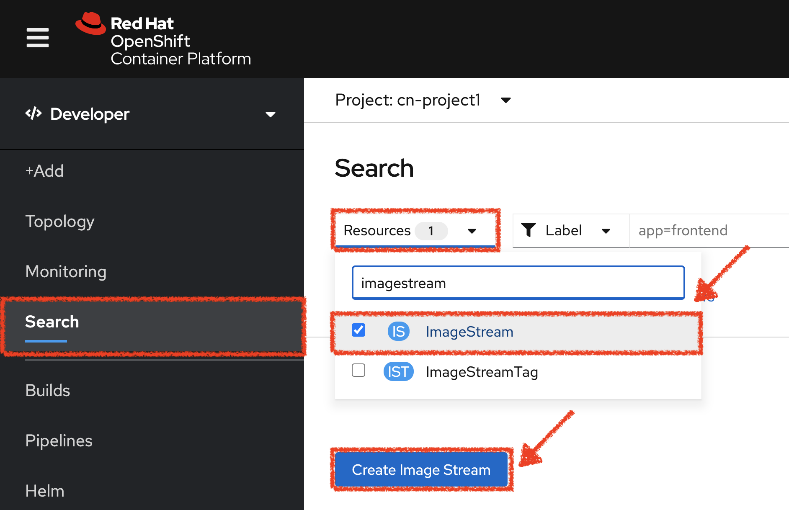

`*Then update the content as following:*`

[source,yaml,subs="{markup-in-source}",role=copy]
----
apiVersion: image.openshift.io/v1
kind: ImageStream
metadata:
  name: inventory-coolstore
  namespace: cn-project{USER_ID}
----

`*Then click on 'create'*`. Your ImageStream for the Inventory Service is now created.

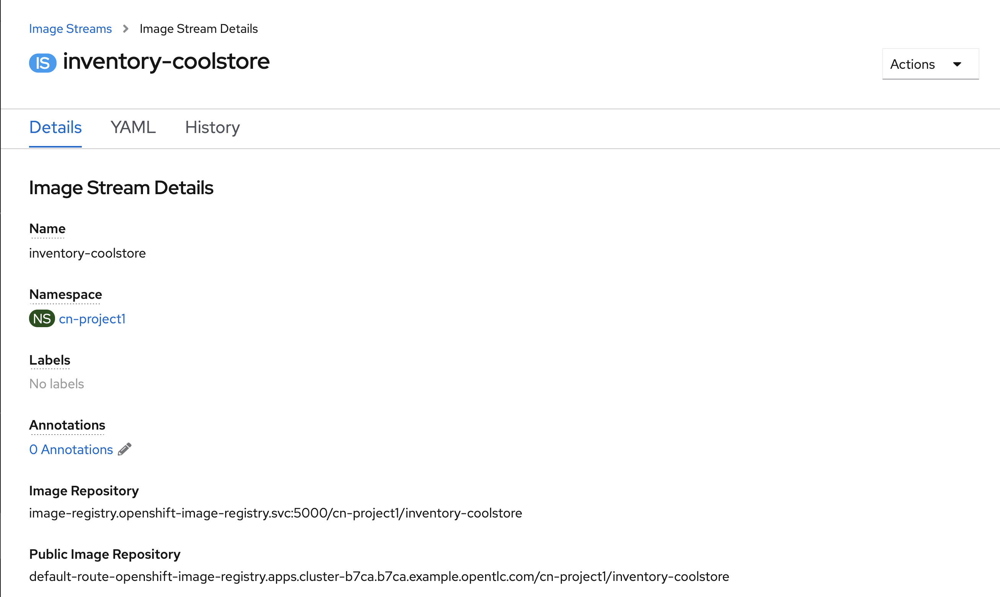

'''

=== Create a Pipeline

A **Pipeline** defines a number of **Task** that should be executed and how they interact 
with each other via *Workspace*.

In the {OPENSHIFT_CONSOLE_URL}[OpenShift Web Console^], from the **Developer view**,
`*click on 'Pipelines' -> 'Create Pipeline'*`.

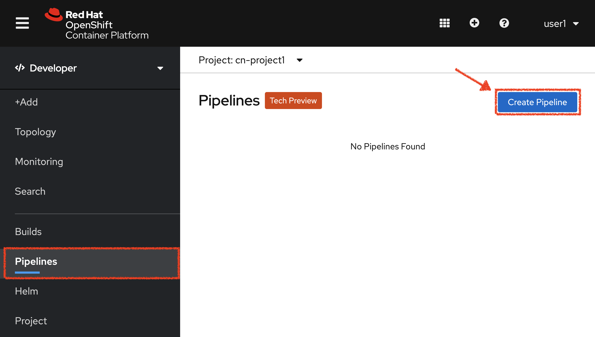

`*Specify 'inventory-pipeline' as Name then click on 'Select task' and select 'git-clone' task.*`

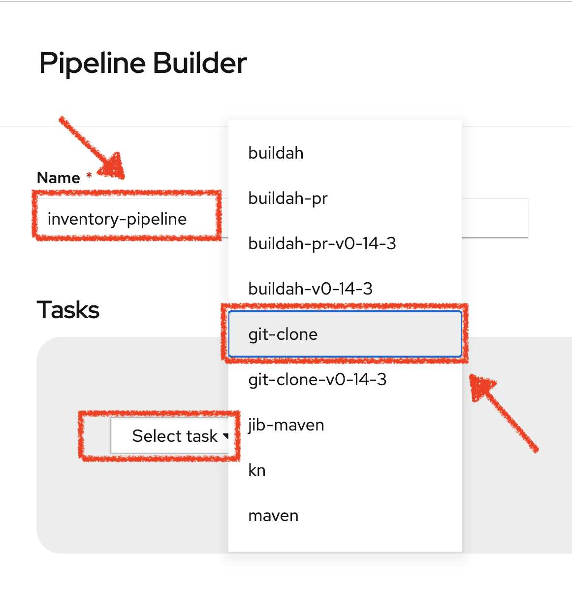

`*Click on the newly created 'git-clone' task and enter the following configuration*`:

.git-clone cluster task
[%header,cols=2*]
|===
|Display Name
|git-clone

|url
|http://gitea-server.gitea.svc:3000/user{USER_ID}/inventory-quarkus.git

|revision
|master

|refspec
|_Leave it blank_

|submodules
|true

|depth
|1

|refspec
|_Leave it blank_

|sslVerify
|true

|subdirectory
|_Leave it blank_

|deleteExisting
|true

|httpProxy
|_Leave it blank_

|httpsProxy
|_Leave it blank_

|noProxy
|_Leave it blank_

|===

Once done, let's add other tasks. `*Click on the blue plus icon at the left hand side of the 'git-clone' task*`

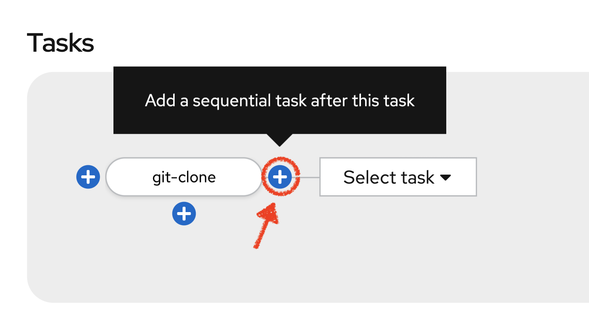

`*Then click on 'Select task' and select 's2i-java-11' task*`

`*Click on the newly created 's2i-java-11' task and enter the following configuration*`:

.s2i-java-11 cluster task
[%header,cols=2*]
|===
|Display Name
|s2i-java-11

|PATH_CONTEXT
|.

|TLSVERIFY
|false

|MAVEN_ARGS_APPEND
|_Leave it blank_

|MAVEN_CLEAR_REPO
|false

|MAVEN_MIRROR_URL
|http://nexus.opentlc-shared.svc:8081/repository/maven-all-public

|Image*
|image-registry.openshift-image-registry.svc:5000/cn-project{USER_ID}/inventory-coolstore

|===

Once done, `*click on 'Create'*`. Your simple Pipeline is now created.

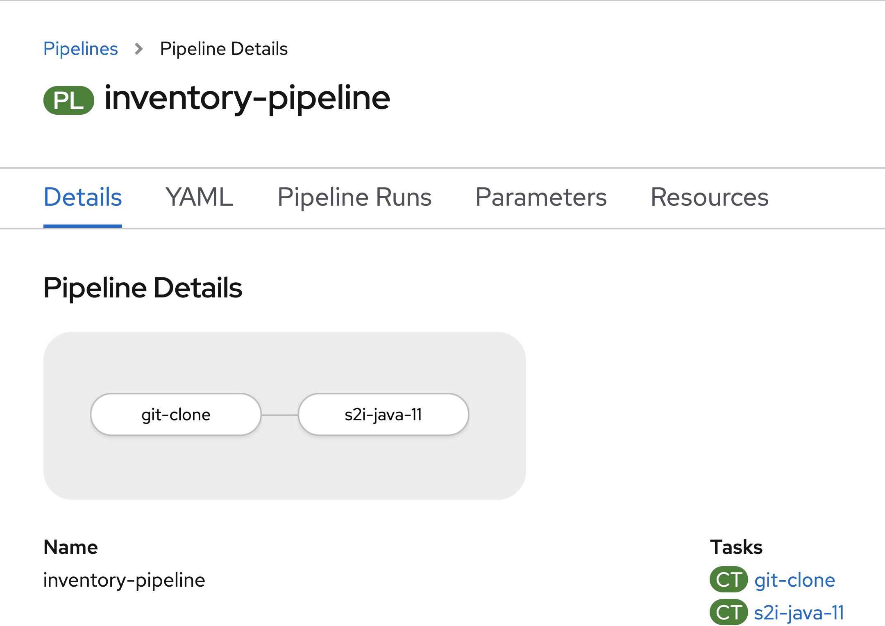

'''

=== Attach a Shared Workspace to the Pipeline

**Workspaces** allow **Tasks** to declare parts of the filesystem that need to be provided at runtime by TaskRuns. 

A TaskRun can make these parts of the filesystem available in many ways: using a read-only ConfigMap or Secret, an existing PersistentVolumeClaim shared with other Tasks, create a PersistentVolumeClaim from a provided VolumeClaimTemplate, or simply an emptyDir that is discarded when the TaskRun completes.

**Workspaces** are similar to Volumes except that they allow a Task author to defer to users and their TaskRuns when deciding which class of storage to use.

In the {OPENSHIFT_CONSOLE_URL}[OpenShift Web Console^], from the **Developer view**,
`*click on 'Search' -> 'Resources' -> 'PVC PersistentVolumeClaim' -> 'Create Persistent Volume Claim'*`.

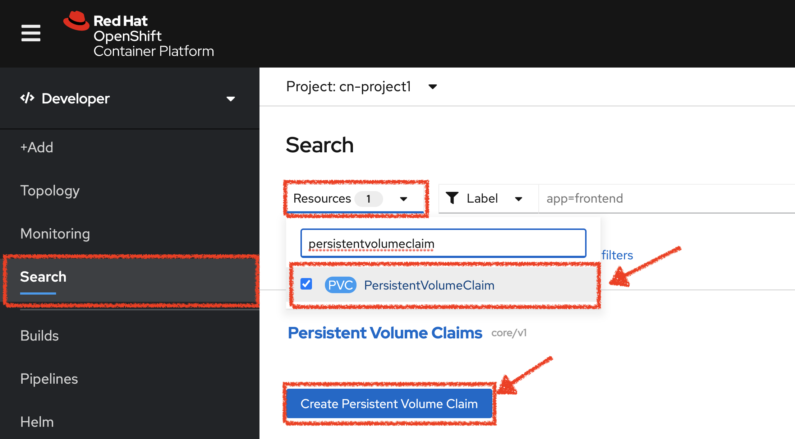

`*Enter the following configuration*`:

.Inventory PVC
[%header,cols=2*]
|===
|Parameter 
|Value

|Storage Class
|gp2

|Persistent Volume Claim Name *
|inventory-pipeline-pvc

|Access Mode *
|Single User (RWO)

|Size *
|512 MiB

|Use label selectors to request storage
|_unchecked_

|===

Then, `*Click on 'Create'*`. The Shared Storage for your pipeline is ready.

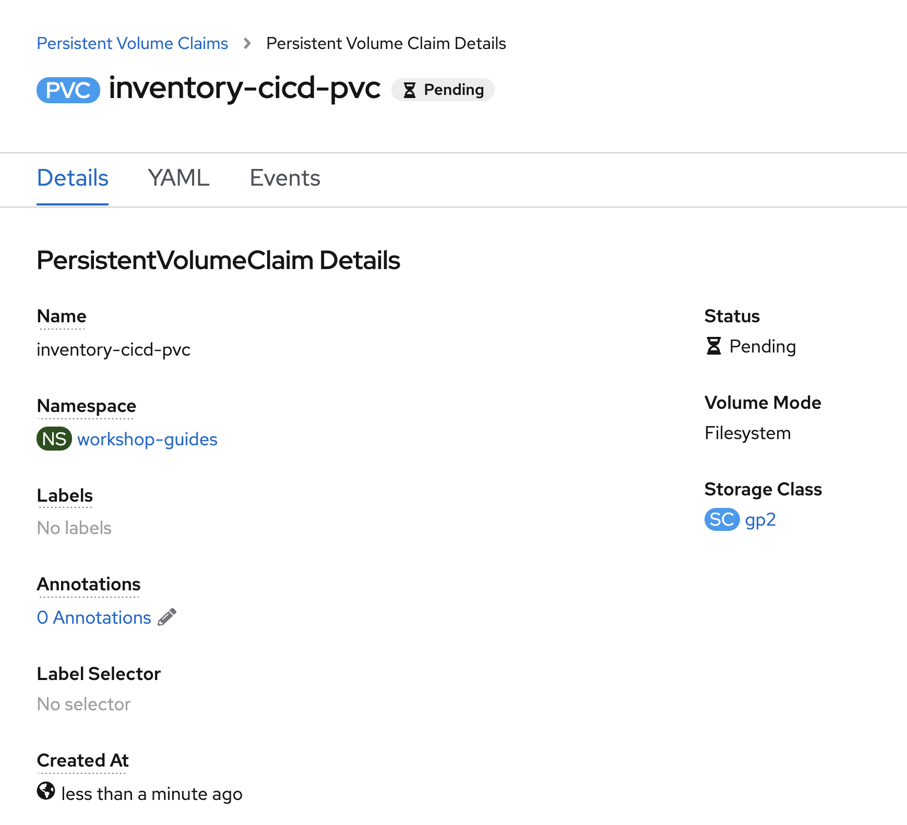

In the {OPENSHIFT_CONSOLE_URL}[OpenShift Web Console^], from the **Developer view**,
`*click on 'Pipelines' -> 'PL inventory-pipeline' -> 'YAML'*`

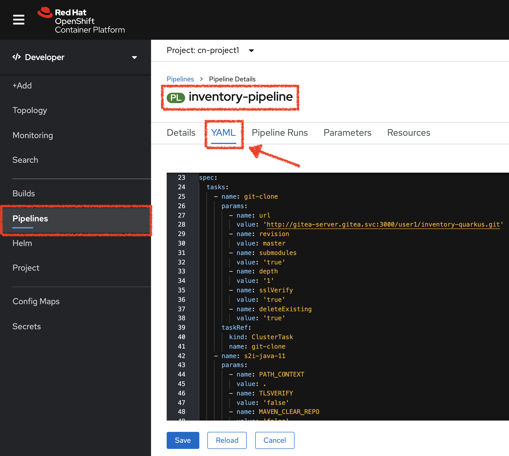

`*Add the three (3) workspace configurations*` as following:

[source,yaml,subs="{markup-in-source}"]
----
apiVersion: tekton.dev/v1beta1
kind: Pipeline
metadata:
  [...]
  name: inventory-pipeline
  namespace: cn-project{USER_ID}
  [...]
spec:
  **workspaces:
    - name: shared-workspace**
  tasks:
    - name: git-clone
      params:
        [...]
      taskRef:
        [...]
      **workspaces:
        - name: output
          workspace: shared-workspace**
    - name: s2i-java-11
      params:
        [...]
      taskRef:
        [...]
      runAfter:
        [...]
      **workspaces:
        - name: source
          workspace: shared-workspace**
----

Finally, `*Click on 'Save'*`. A shared workspace is now configured into your Pipeline.

'''

=== Run the Pipeline

Now that your pipeline is created and configured, let's run it.

In the {OPENSHIFT_CONSOLE_URL}[OpenShift Web Console^], from the **Developer view**,
`*click on 'Pipelines' -> 'PL inventory-pipeline' -> 'Actions' -> 'Start'*`

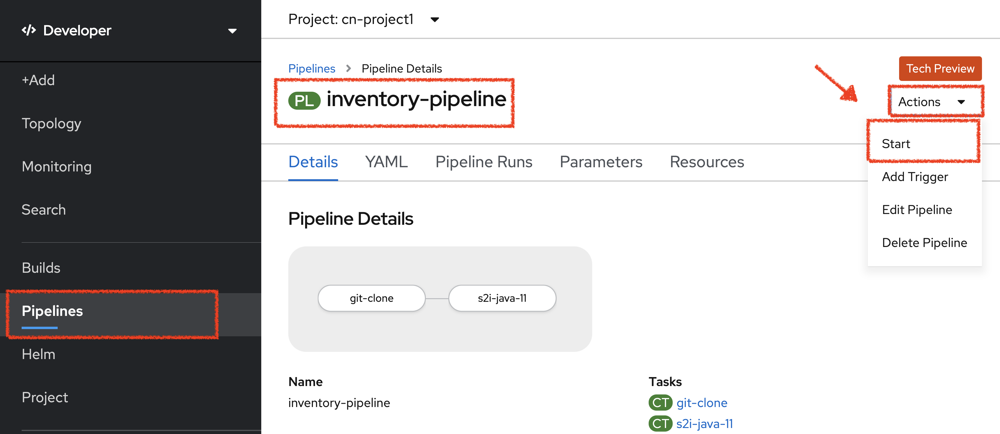

`*Enter the following parameters then click on 'Start'*`

.Pipeline Parameters
[%header,cols=3*]
|===
|Name 
|Type
|Value

|shared-workspace
|PVC
|PVC inventory-pipeline-pvc

|===

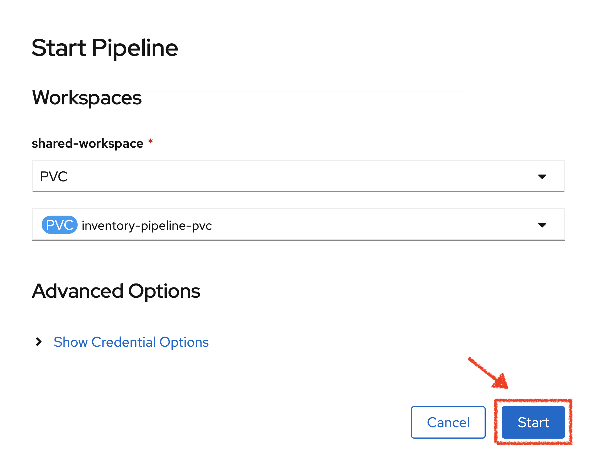

Congratulations!! You have created and run your first **Pipeline on OpenShift**!!

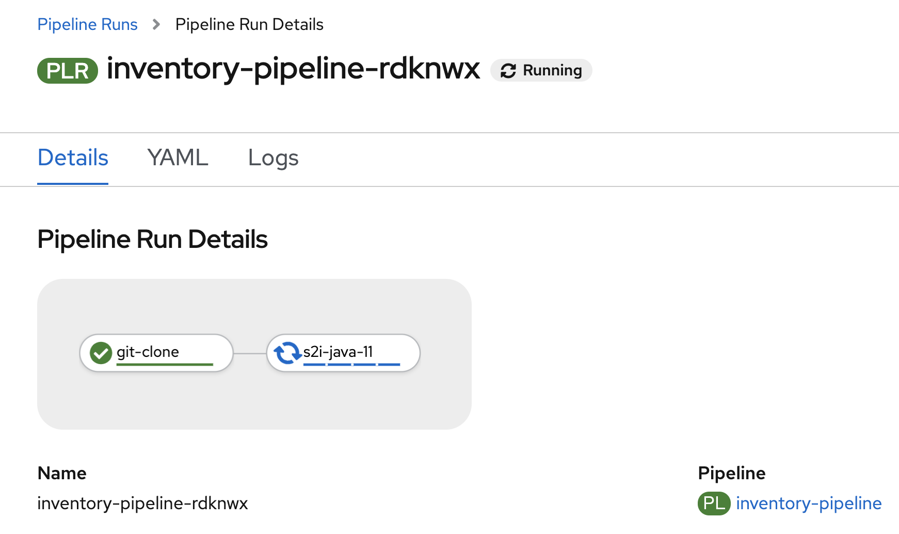

'''

=== Create a custom Task

You have learnt and understood how to create a simple **Pipeline**.
Now, let's `*create a task to deploy the OpenShift Configuration from Argo CD*` and add it the existing pipeline.

A **Task** consists of a collection of steps that are executed sequentially. 

Each **Task** is executed in a separate container within the same pod. 
They can also have inputs and outputs in order to interact with other tasks in the pipeline.

In the {OPENSHIFT_CONSOLE_URL}[OpenShift Web Console^], from the **Developer view**,
`*click on 'Search' -> 'Task' -> 'T Task' -> 'Create Task'*`.

`*Then update the content as following:*`

[source,yaml,subs="{markup-in-source}",role=copy]
----
apiVersion: tekton.dev/v1beta1
kind: Task
metadata:
  name: argocd-task-sync-and-wait
  namespace: cn-project{USER_ID}
  labels:
    app.kubernetes.io/version: "0.1"
  annotations:
    tekton.dev/pipelines.minVersion: "0.12.1"
    tekton.dev/tags: deploy
    tekton.dev/displayName: "argocd"
spec:
  description: >-
    This task syncs (deploys) an Argo CD application and waits for it to be healthy.
    To do so, it requires the address of the Argo CD server and some form of
    authentication either a username/password or an authentication token.
  params:
    - name: application-name
      description: name of the application to sync
  stepTemplate:
    envFrom:
      - configMapRef:
          name: argocd-env-configmap  # used for server address
      - secretRef:
          name: argocd-env-secret  # used for authentication (username/password or auth token)
  steps:
    - name: login
      image: argoproj/argocd:v1.7.6
      script: |
        if [ -z $ARGOCD_AUTH_TOKEN ]; then
          yes | argocd login $ARGOCD_SERVER --username=$ARGOCD_USERNAME --password=$ARGOCD_PASSWORD --plaintext;
        fi
    - name: sync
      image: argoproj/argocd:v1.7.6
      script: |
        argocd app sync cn-project{USER_ID} --label app.kubernetes.io/instance=$(params.application-name)
    - name: wait
      image: argoproj/argocd:v1.7.6
      script: |
        argocd app wait -l app.kubernetes.io/instance=$(params.application-name) --health
----

`*Then click on 'create'*`. Your Argo CD Task is now created.

image::images/openshift-argocd-task.png[OpenShift - ArgoCD Task, 500]

Now let's define the Argo CD server endpoint as well as the credentials to access to.

In the {OPENSHIFT_CONSOLE_URL}[OpenShift Web Console^], from the **Developer view**,
`*click on 'Config Maps' then click on the 'Create Config Map' button*`.

image::images/openshift-create-configmap.png[Che - OpenShift Create Config Map, 900]

Then `*replace the content*` with the following input:

[source,yaml,subs="{markup-in-source}",role=copy]
----
apiVersion: v1
kind: ConfigMap
metadata:
  name: argocd-env-configmap
  namespace: cn-project{USER_ID}
data:
  ARGOCD_SERVER: argocd-server.argocd.svc
----

`*Click on the 'Create button. Then click on 'Secret' then click on the 'Create Secret' button*`.

image::images/openshift-create-keyvalue-secret.png[Che - OpenShift Create Secret, 900]

`*Enter the following configuration*`:

.ArgoCD Task Secret
[%header,cols=2*]
|===
|Parameter 
|Value

|Secret Name * 
|argocd-env-secret

|Key1/Value1
|ARGOCD_USERNAME/user{USER_ID}

|Key2/Value2
|ARGOCD_PASSWORD/{OPENSHIFT_PASSWORD}

|===

`*Click on the 'Create button*` 

'''

=== Expand your Pipeline

Now let's expand your Inventory Pipeline to cover the Continuous Deployment.

In the {OPENSHIFT_CONSOLE_URL}[OpenShift Web Console^], from the **Developer view**,
`*click on 'Pipelines' -> 'PL inventory-pipeline' -> 'Actions' -> 'Edit'*`

First, let's create a Input Git resource needed for the openshift-client task.

`*Scroll down, click on 'Add Resources' and enter the following parameters*`

image::images/openshift-add-tekton-resources.png[OpenShift Pipeline,500]

.Input Resources
[%header,cols=2*]
|===
|Parameter 
|Value

|Name 
|app-git

|Resource Type 
|git

|===

`*Complete your pipeline with the two following tasks and their configurations*`

image::images/openshift-full-inventory-pipeline.png[OpenShift Pipeline,900]

.ArgoCD Task Configuration
[%header,cols=3*]
|===
|Section
|Parameter 
|Value

|Parameters
|application-name * 
|inventory

|===

.OpenShift Client Task Configuration
[%header,cols=3*]
|===
|Section
|Parameter 
|Value

|Parameters
|SCRIPT 
|oc $@

|Parameters
|ARGS1
|rollout

|Parameters
|ARGS2
|latest

|Parameters
|ARGS3
|inventory-coolstore

|Input Resources
|source *
|app-git

|===

'''

=== Run the Full Pipeline

In the {OPENSHIFT_CONSOLE_URL}[OpenShift Web Console^], from the **Developer view**,
`*click on 'Pipelines' -> 'PL inventory-pipeline' -> 'Actions' -> 'Start' and enter the following parameters*`

.Pipeline Git Resources
[%header,cols=2*]
|===
|Name 
|Value

|app-git *
|Create Pipeline Resource

|URL *
|http://gitea-server.gitea.svc:3000/user{USER_ID}/inventory-quarkus.git

|Revision
|_leave it empty_

|===

.Pipeline Workspaces
[%header,cols=3*]
|===
|Name 
|Type
|Value

|shared-workspace
|PVC
|PVC inventory-pipeline-pvc

|===

`*Finally click on 'Start'*`

Congratulations!! You have deployed your first application using OpenShift Pipeline!!

image::images/openshift-run-full-inventory-pipeline.png[OpenShift Pipeline,900]

Once finished,from the **Topology view**, `*select the 'cn-project{USER_ID}'*`.

image::images/openshift-tekton-inventory-deployed.png[OpenShift - Inventory Deployed by Tekton, 700]

Now, you can see that the **Inventory Service has been deployed by OpenShift Pipeline** and it is up and running.

In the {GITOPS_URL}[Argo CD^], `*Select the 'Application menu' then click on the 'cn-project{USER_ID}' application*`:

image::images/argocd-outofsync-application.png[Argo CD - Out Of Sync Application, 500]

Argo CD has synchronized all the Inventory OpenShift manifests stored into your {GIT_URL}/user{USER_ID}/gitops-cn-project['gitops-cn-project' Git Repository^] 
with your 'cn-project{USER_ID}' project on OpenShift.

image::images/argocd-synced-inventory.png[Argo CD - Synced Inventory, 900]

Your Argo CD application is still 'OutofSync' because the other OpenShift Manifests (Catalog, Gateway and Web) are not synchronized yet.
This is the next step.

'''

=== Deploy the whole application with Tekton

Previously, for the **Inventory Service**, you have learned how to create, configure and run an OpenShift pipeline.
Now, `*let's deploy the rest of the application*`.

For doing so, `*click on 'Terminal' -> 'Run Task...' ->  'Pipeline - Deploy Coolstore'*`

image::images/che-runtask.png[Che - RunTask, 500]

image::images/che-pipeline-deploy-coolstore.png[Che - Pipeline Deploy Coolstore, 500]

Once executed, in the {OPENSHIFT_CONSOLE_URL}[OpenShift Web Console^], from the **Developer view**,
`*click on 'Pipelines' -> 'PL - coolstore-java-pipeline' -> 'Pipeline Runs'*`

image::images/openshift-coolstore-java-pipeline-run.png[OpenShift Pipeline Runs, 700]

You should see 2 pipelines running for the 2 Java services (Catalog and Gateway).

`*Click on 'Pipelines' -> 'PL - coolstore-nodejs-pipeline' -> 'Pipeline Runs'*`

image::images/openshift-coolstore-nodejs-pipeline-run.png[OpenShift Pipeline Runs, 700]

You should see 1 pipeline running for the Web services.

`*Click on 'Topology'*` from the **Developer view** of the {OPENSHIFT_CONSOLE_URL}[OpenShift Web Console^]
and validate that the CoolStore application is deployed, up and running in the **cn-project{USER_ID}** project.

image::images/openshift-tekton-coolstore-deployed.png[OpenShift - Coolstore Deployed by Tekton, 700]

Finally, in the {GITOPS_URL}[Argo CD^], `*Select the 'Application menu' then click on the 'cn-project{USER_ID}' application*`:

image::images/argocd-sync-application.png[Argo CD - Sync Application, 500]

Argo CD has synchronized all the OpenShift manifests stored into your {GIT_URL}/user{USER_ID}/gitops-cn-project['gitops-cn-project' Git Repository^] 
with your 'cn-project{USER_ID}' project on OpenShift.

image::images/argocd-synced-coolstore.png[Argo CD - Synced Coolstore, 900]

Your Argo CD application is now 'Synced'.

'''

Well done! You are ready for the next lab.