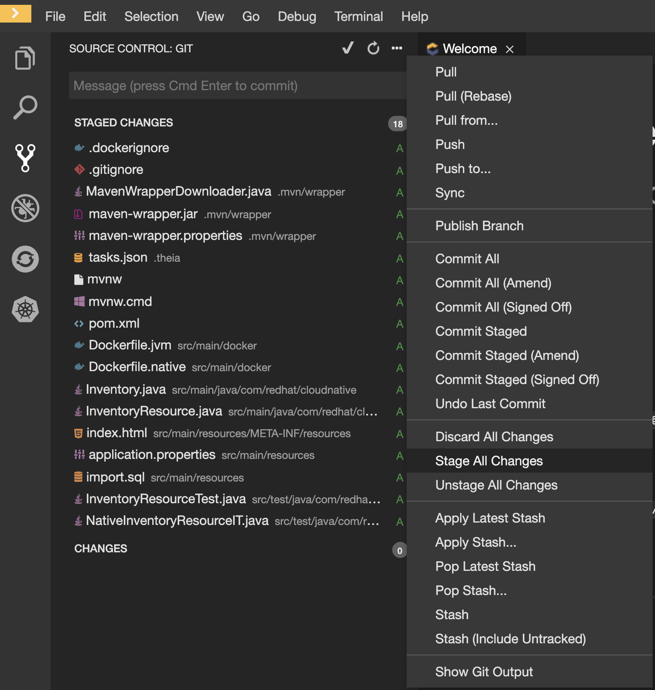
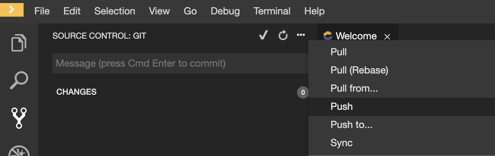
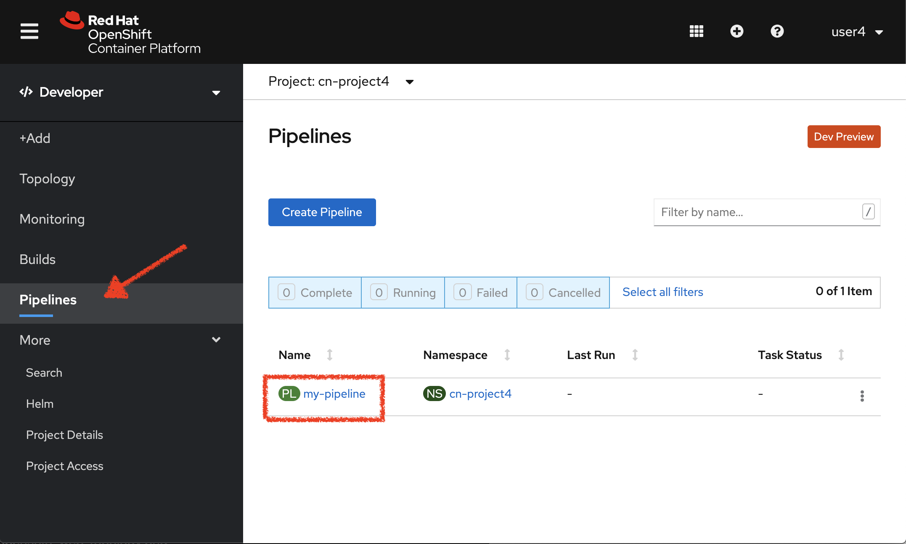
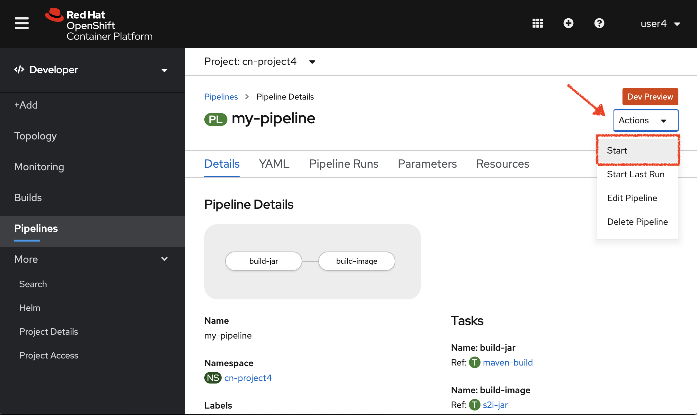
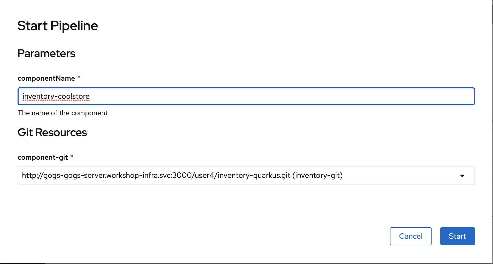
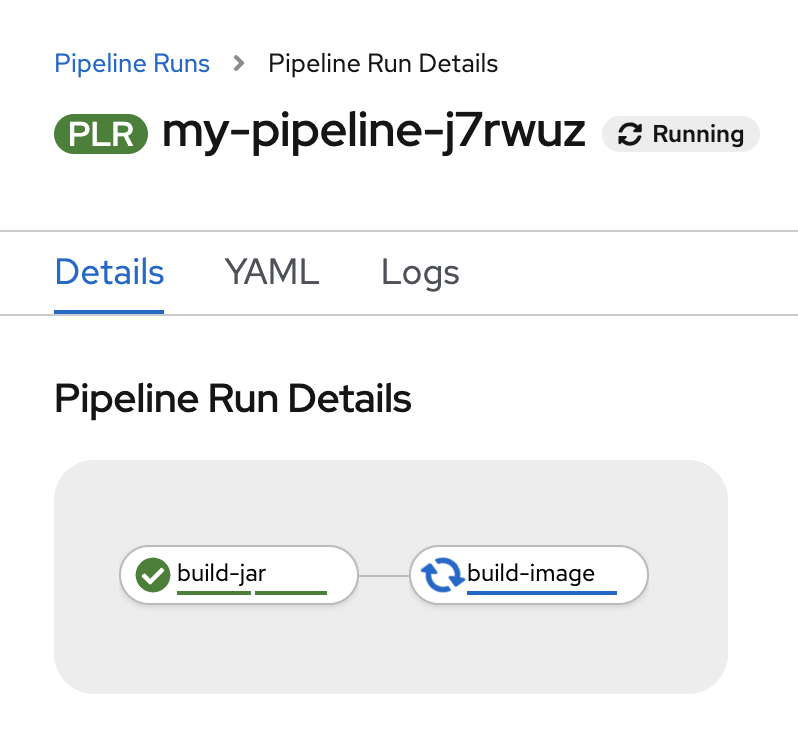
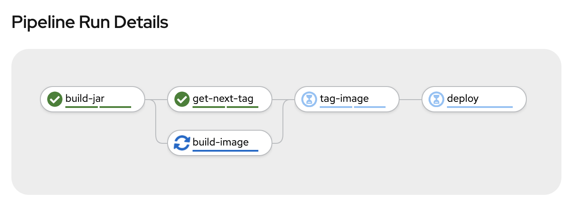
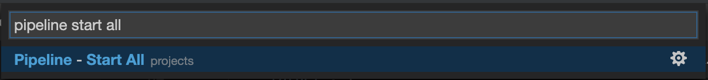
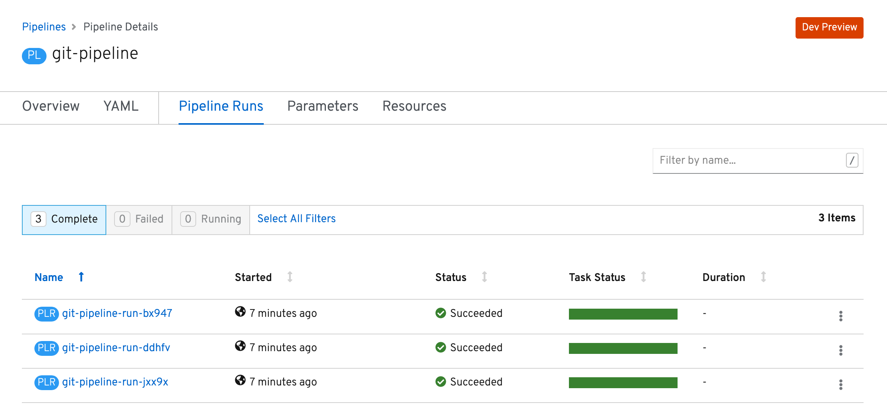

:markup-in-source: verbatim,attributes,quotes
:CHE_URL: %CHE_URL%
:GOGS_URL: %GOGS_URL%
:USER_ID: %USER_ID%
:OPENSHIFT_PASSWORD: %OPENSHIFT_PASSWORD%
:OPENSHIFT_CONSOLE_URL: %OPENSHIFT_CONSOLE_URL%/topology/ns/cn-project{USER_ID}

_30 MINUTE EXERCISE_

In this lab you will learn about deployment pipelines and you will create a pipeline to 
automate build and deployment of the Inventory service.

[sidebar]
.Continuous Delivery
--
So far you have been building and deploying each service manually to OpenShift. Although 
it's convenient for local development, it's an error-prone way of delivering software if 
extended to test and production environments.

Continuous Delivery (CD) refers to a set of practices with the intention of automating 
various aspects of delivery software. One of these practices is called **Delivery Pipeline** 
which is an automated process to define the steps a change in code or configuration has 
to go through in order to reach upper environments and eventually to production. 

OpenShift simplifies building CI/CD Pipelines by integrating TektonCD into
the platform and enables defining truly complex workflows directly from within OpenShift.
--

'''

=== Create a Git Repository for Inventory

The first step for any deployment pipeline is to store all code and configurations in 
a source code repository.

In {GOGS_URL}[Gogs^], `*create a new Repository for Inventory Service*` as following:

.Inventory Repository
[%header,cols=2*]
|===
|Parameter 
|Value

|Owner*
|user{USER_ID}

|Repository Name*
|inventory-quarkus

|Visibility
|_unchecked_

|Description
|_leave it empty_

|.gitignore
|_leave it empty_

|License
|_leave it empty_

|Readme
|Default

|Intialize this repository with selected files and templates
|_unchecked_

|===

'''

=== Push Inventory Code to the Git Repository

Now that you have a Git repository for the Inventory service, you should push the 
source code into this Git repository.

In your {CHE_URL}[Workspace^], via the command menu (`*'View' -> 'Find Command...'*`),
`*run 'Git: Close Repository' then run 'Git: Initialize Repository'*`

image::images/che-git-close.png[Che - Git Close, 600]

image::images/che-git-init.png[Che - Git Initialize, 600]

`*Select the '/projects/workshop/labs/inventory-quarkus' folder, click on 'Initialize Repository' -> 'Add to Workspace'*`

In your {CHE_URL}[Workspace^], open a new Terminal by `*clicking 
on the 'My Workspace' white box in the right menu, then 'Plugins' -> 'workshop-tools' -> '>_ New terminal'*`:

image::images/che-open-workshop-terminal.png[Che - Open OpenShift Terminal, 700]

In the window called **'>_ workshop-tools terminal'**, `*execute the following commands*`:

[source,shell,subs="{markup-in-source}",role=copy]
.>_ workshop-tools terminal
----
cd /projects/workshop/labs/inventory-quarkus
git remote add origin http://gogs-gogs-server.workshop-infra.svc:3000/user{USER_ID}/inventory-quarkus
----

Open the **Source Code Management (SCM) view** by clicking on `*'View' -> 'SCM menu'*`

`*Click on '...' -> 'Stage All Changes'*`

`*Click on the 'check' icon and enter 'Initial' as commit message*`

image::images/che-scm-commit.png[Che - SCM Commit, 900]

`*Click on '...' -> 'Push'*`

`*Click on the 'OK' button*` to publish the new **master branch**. 
Finally, `*enter your Gogs credentials (user{USER_ID}/{OPENSHIFT_PASSWORD})*`.

image::images/che-scm-username.png[Che - SCM Username, 500]

image::images/che-scm-password.png[Che - SCM Password, 500]

Once done, in {GOGS_URL}/user{USER_ID}/inventory-quarkus, `*refresh the page of your 'inventory-quarkus' repository*`. You should 
see the project files in the repository.

image::images/cd-gogs-inventory-repo.png[Inventory Repository,900]

'''

=== What is OpenShift Pipelines?

[sidebar]
--
image::images/tekton-logo.png[Tekton, 300]

OpenShift Pipelines is a cloud-native, continuous integration and continuous delivery (CI/CD) solution 
for building pipelines based on  https://github.com/tektoncd/pipeline[Tekton Pipelines^] project.

* Standard CI/CD pipeline definition based on Tekton
* Build images with Kubernetes tools such as S2I, Buildah, Buildpacks, Kaniko, etc
* Deploy applications to multiple platforms such as Kubernetes, serverless and VMs
* Easy to extend and integrate with existing tools
* Scale pipelines on-demand
* Portable across any Kubernetes platform
* Designed for microservices and decentralized teams
* Integrated with the OpenShift Developer Console

https://github.com/tektoncd/pipeline[Tekton Pipelines^] provides Kubernetes-style resources for creating serverless 
CI/CD-style pipelines on Kubernetes.

The custom resources needed to define a pipeline are:

* **Task** - a reusable, loosely coupled number of steps that perform a specific task (e.g., building a container image)
* **Pipeline** - the definition of the pipeline and the **Task** that it should perform
* **PipelineResource** - inputs (e.g., git repository) and outputs (e.g., image registry) to and out of a **Pipeline** or **Task**
* **TaskRun** - the result of running an instance of **Task**
* **PipelineRun** - the result of running an instance of **Pipeline**, which includes a number of **TaskRun**

image::images/tekton-architecture.png[Tekton Architecture, 600]

--

'''

=== Create the Image Builder for Inventory Service

In your {CHE_URL}[Workspace^], open a new Terminal by `*clicking 
on the 'My Workspace' white box in the right menu, then 'Plugins' -> 'workshop-tools' -> '>_ New terminal'*`:

image::images/che-open-workshop-terminal.png[Che - Open OpenShift Terminal, 700]

In the window called **'>_ workshop-tools terminal'**, `*execute the following commands*`:

[source,shell,subs="{markup-in-source}",role=copy]
.>_ workshop-tools terminal
----
oc new-build java \
  --name=inventory-coolstore \
  --binary=true \
  --labels=app=coolstore,app.kubernetes.io/instance=inventory \
  --namespace=cn-project{USER_ID}
----

You should have the following output:

[source,shell,subs="{markup-in-source}"]
.>_ workshop-tools terminal
----
    Java Applications 
    ----------------- 
    Platform for building and running plain Java applications (fat-jar and flat classpath)

    Tags: builder, java

    * A source build using binary input will be created
      * The resulting image will be pushed to image stream tag "inventory-coolstore:latest"
      * A binary build was created, use 'start-build --from-dir' to trigger a new build

--> Creating resources with label app=coolstore,app.kubernetes.io/instance=inventory ...
    imagestream.image.openshift.io "inventory-coolstore" created
    buildconfig.build.openshift.io "inventory-coolstore" created
--> Success
----

'''

=== Create a Tekton Task

A **Task** consists of a collection of steps that are executed sequentially. 

Each **Task** is executed in a separate container within the same pod. 
They can also have inputs and outputs in order to interact with other tasks in the pipeline.

First, `*create a task to generate the binary (JAR) using Maven*`.

In the window called **'>_ workshop-tools terminal'**, `*execute the following commands*`:

[source,shell,subs="{markup-in-source}",role=copy]
.>_ workshop-tools terminal
----
cat <<EOF | oc apply --namespace=cn-project{USER_ID} -f -
---
apiVersion: tekton.dev/v1alpha1
kind: Task
metadata:
  name: maven-build
spec:
  inputs:
    resources:
    - name: source-repo
      type: git 
  outputs:
    resources:
    - name: source-repo
      type: git    
  steps:
  - name: build
    image: 'maven:3.6.3-openjdk-11-slim'
    workingdir: /workspace/source-repo
    command:
    - /usr/bin/mvn
    args:
    - clean 
    - package 
    - '-DskipTests' 
    volumeMounts:
    - mountPath: /.m2
      name: m2-folder
  - name: copy-jar
    image: 'registry.access.redhat.com/ubi8/ubi-minimal:latest'
    command:
    - /usr/bin/bash
    args: 
    - '-c'
    - 'cp /workspace/source-repo/target/*.jar /workspace/output/source-repo/ROOT.jar'
  volumes:
  - name: m2-folder
    emptyDir: {}
EOF
----
<1> Defines Tekton **Task** Kubernetes resource 
<2> Name of the **Task**
<3> **inputs** defines paramaters or input resources needed by the **Task**
<4> **outputs** defines resources to be uploaded and shared with next **Steps**/**Tasks**
<5> **steps** defines the body of the **Task**.
<6> **volumes** defines Kubernetes volumes that you want to make available to the **Task**

Then, `*create a task to create the container image from the binary (s2i)*`.

[source,shell,subs="{markup-in-source}",role=copy]
.>_ workshop-tools terminal
----
cat <<EOF | oc apply --namespace=cn-project{USER_ID} -f -
---
apiVersion: tekton.dev/v1alpha1
kind: Task
metadata:
  name: s2i-jar
spec:
  inputs:
    resources:
      - name: source-repo
        type: git
    params:
      - name: componentName
        default: sample
        description: The name of the component
  steps:
    - name: build-image
      image: 'quay.io/openshift/origin-cli:latest'
      command:
        - /usr/bin/oc
      args:
        - start-build
        - \$(inputs.params.componentName)
        - '--from-file=/workspace/source-repo/ROOT.jar'
        - '--follow'
EOF
----

'''

=== Create a Pipeline

A **Pipeline** defines a number of **Task** that should be executed and how they interact 
with each other via their inputs and outputs.

In the window called **'>_ workshop-tools terminal'**, `*execute the following commands*`:

[source,shell,subs="{markup-in-source}",role=copy]
.>_ workshop-tools terminal
----
cat <<EOF | oc apply --namespace=cn-project{USER_ID} -f -
---
apiVersion: tekton.dev/v1alpha1
kind: Pipeline
metadata:
  name: my-pipeline
spec:
  resources:
    - name: component-git
      type: git
  params:
    - name: componentName
      default: sample
      description: The name of the component
  tasks:
    - name: build-jar
      taskRef:
        name: maven-build
      resources:
        inputs:
          - name: source-repo
            resource: component-git
        outputs:
          - name: source-repo
            resource: component-git
    - name: build-image
      taskRef:
        name: s2i-jar
      runAfter:
        - build-jar
      resources:
        inputs:
          - name: source-repo
            resource: component-git
            from: 
              - build-jar
      params:
        - name: componentName
          value: '\$(params.componentName)'
EOF
----
<1> Defines Tekton **Pipeline** Kubernetes resource 
<2> Name of the **Pipeline**
<3> **resources** defines which **PipelineResources** of which types the **Pipeline** will be using in its **Tasks**
<4> **params** defines input parameters that must be supplied to the **Pipeline** and to its **Tasks**
<5> **tasks** defines which **Tasks** to run and how to run them
<6> References to a Tekton **Task**

'''

=== Create a Pipeline Resource

A **PipelineResource** in a pipeline are the set of objects that are going to be used as inputs to a **Task** 
and can be output by a **Task**.

In the window called **'>_ workshop-tools terminal'**, `*execute the following commands*`:

[source,shell,subs="{markup-in-source}",role=copy]
.>_ workshop-tools terminal
----
cat <<EOF | oc apply --namespace=cn-project{USER_ID} -f -
---
apiVersion: tekton.dev/v1alpha1
kind: PipelineResource 
metadata:
  name: inventory-git
spec:
  type: git
  params:
  - name: url
    value: http://gogs-gogs-server.workshop-infra.svc:3000/user{USER_ID}/inventory-quarkus.git
  - name: revision
    value: master
EOF
----
<1> Defines Tekton **PipelineResource** Kubernetes resource 
<2> Name of the **PipelineResource**
<3> Type of the **PipelineResource**, a GitHub source which contains your application code.
<4> Params of the Git **PipelineResource** 

'''

=== Run the Pipeline

Now that your pipeline is created and configured, let's trigger it.

In the {OPENSHIFT_CONSOLE_URL}[OpenShift Web Console^], from the **Developer view**,
`*click on 'Pipelines' -> 'my-pipeline'*`

Then, `*click on 'Actions' -> 'Start'*`

Finally, `*enter the following parameters*`

.Pipeline Parameters
[%header,cols=2*]
|===
|Name 
|Value

|componentName
|inventory-coolstore

|===

Congratulations!! You have created and run your first **OpenShift Pipeline with Tekton**!!

'''

=== Expand your Pipeline

Now, you have learnt and understood how to create a simple **Pipeline** with **Task** and **PipelineResource**.
Let's create more tasks and expand the existing pipeline.

In your {CHE_URL}[Workspace^], via the command menu (`*'View' -> 'Find Command...'*`),
`*run 'Kubernetes: Use Namespace' and enter 'cn-project{USER_ID}'*`

image::images/che-kubernetes-use-namespace.png[Che - Kubernetes Create, 500]

Then,`*double click on each following file to open it*` then 
via the command menu (`*'View' -> 'Find Command...'*`),
`*run 'Kubernetes: Create'*`

image::images/che-kubernetes-create.png[Che - Kubernetes Create, 500]

.OpenShift Pipeline
[%header,cols=2*]
|===
|OpenShift Resource
|Description

|/projects/workshop/labs/pipelines/inventory/increment-version-task.yaml
|**Task** which retrieves the current version of the current image of your application 
then increment it. 
If "latest" is the current version, the next version will be "1.0", then "1.1", ...

|/projects/workshop/labs/pipelines/inventory/oc-tag-image-task.yaml
|**Task** which tags the new version of the image and updates the Deployment configuration
of your application.

|/projects/workshop/labs/pipelines/inventory/oc-deploy-task.yaml 
|**Task** which triggers a new deployment of your application.

|/projects/workshop/labs/pipelines/inventory/jar-pipeline.yaml
|**Pipeline** which defines Cloud-Native CI/CD of your Java Jar application by calling defined **Task** above.

|===

Once created, trigger the **Inventory Pipeline**.
In the {OPENSHIFT_CONSOLE_URL}[OpenShift Web Console^], from the **Developer view**,
`*click on 'Pipelines' -> 'jar-pipeline' -> 'Actions' -> 'Start'*` and the following parameters

.Pipeline Parameters
[%header,cols=2*]
|===
|Name 
|Value

|componentName
|inventory-coolstore

|===

Once finished,from the **Topology view**, `*select the 'cn-project{USER_ID}'*`.

image::images/openshift-tekton-inventory-deployed.png[OpenShift - Inventory Deployed by Tekton, 700]

Now, you can see that the **Inventory Service has been deployed by Tekton** and it is up and running.

'''

=== Deploy the whole application with Tekton

Previously, for the **Inventory Service**, you have learned how to create, configure and run a Tekton pipeline.
Now, `*let's deploy the rest of the application wioth Tekton*`.

For doing so, `*click on 'Terminal' -> 'Run Task...' ->  'Pipeline - Start All'*`

image::images/che-runtask.png[Che - RunTask, 500]

Once executed, in the {OPENSHIFT_CONSOLE_URL}[OpenShift Web Console^], from the **Developer view**,
`*click on 'Pipelines' -> 'PL - git-pipeline' -> 'Pipeline Runs'*`

You should see 3 pipelines running for the 3 remaining services (Catalog, Gateway and Web).

Finally , `*click on 'Topology'*` from the **Developer view** of the {OPENSHIFT_CONSOLE_URL}[OpenShift Web Console^]
and validate that the CoolStore application is deployed, up and running in the **cn-project{USER_ID}** project.

image::images/openshift-tekton-coolstore-deployed.png[OpenShift - Coolstore Deployed by Tekton, 700]

'''

Well done! You are ready for the next lab.
