:markup-in-source: verbatim,attributes,quotes
:CHE_URL: %CHE_URL%
:GIT_URL: %GIT_URL%
:GITOPS_URL: %GITOPS_URL%
:USER_ID: %USER_ID%
:OPENSHIFT_PASSWORD: %OPENSHIFT_PASSWORD%
:OPENSHIFT_CONSOLE_URL: %OPENSHIFT_CONSOLE_URL%/topology/ns/cn-project{USER_ID}

_20 MINUTE EXERCISE_

In this lab you will learn about deployment pipelines and you will create a pipeline to 
automate build and deployment of the Inventory service.

[sidebar]
.Continuous Delivery
--
So far you have been building and deploying each service manually to OpenShift. Although 
it's convenient for local development, it's an error-prone way of delivering software if 
extended to test and production environments.

Continuous Delivery (CD) refers to a set of practices with the intention of automating 
various aspects of delivery software. One of these practices is called **Delivery Pipeline** 
which is an automated process to define the steps a change in code or configuration has 
to go through in order to reach upper environments and eventually to production. 

OpenShift simplifies building CI/CD Pipelines by integrating TektonCD into
the platform and enables defining truly complex workflows directly from within OpenShift.
--

'''

=== Create a custom Task

You have learnt and understood how to create a simple **Pipeline**.
Now, let's `*create a task to deploy the OpenShift Configuration from Argo CD*` and add it the existing pipeline.

A **Task** consists of a collection of steps that are executed sequentially. 

Each **Task** is executed in a separate container within the same pod. 
They can also have inputs and outputs in order to interact with other tasks in the pipeline.

In the {OPENSHIFT_CONSOLE_URL}[OpenShift Web Console^], from the **Developer view**,
`*click on 'Search' -> 'Task' -> 'T Task' -> 'Create Task'*`.

`*Then update the content as following:*`

[source,yaml,subs="{markup-in-source}",role=copy]
----
apiVersion: tekton.dev/v1beta1
kind: Task
metadata:
  name: argocd-task-sync-and-wait
  namespace: cn-project{USER_ID}
  labels:
    app.kubernetes.io/version: "0.1"
  annotations:
    tekton.dev/pipelines.minVersion: "0.12.1"
    tekton.dev/tags: deploy
    tekton.dev/displayName: "argocd"
spec:
  description: >-
    This task syncs (deploys) an Argo CD application and waits for it to be healthy.
    To do so, it requires the address of the Argo CD server and some form of
    authentication either a username/password or an authentication token.
  params:
    - name: application-name
      description: name of the application to sync
  stepTemplate:
    envFrom:
      - configMapRef:
          name: argocd-env-configmap  # used for server address
      - secretRef:
          name: argocd-env-secret  # used for authentication (username/password or auth token)
  steps:
    - name: login
      image: argoproj/argocd:v1.7.6
      script: |
        if [ -z $ARGOCD_AUTH_TOKEN ]; then
          yes | argocd login $ARGOCD_SERVER --username=$ARGOCD_USERNAME --password=$ARGOCD_PASSWORD --plaintext;
        fi
    - name: sync
      image: argoproj/argocd:v1.7.6
      script: |
        argocd app sync cn-project{USER_ID} --label app.kubernetes.io/instance=$(params.application-name)
    - name: wait
      image: argoproj/argocd:v1.7.6
      script: |
        argocd app wait -l app.kubernetes.io/instance=$(params.application-name) --health
----

`*Then click on 'create'*`. Your Argo CD Task is now created.

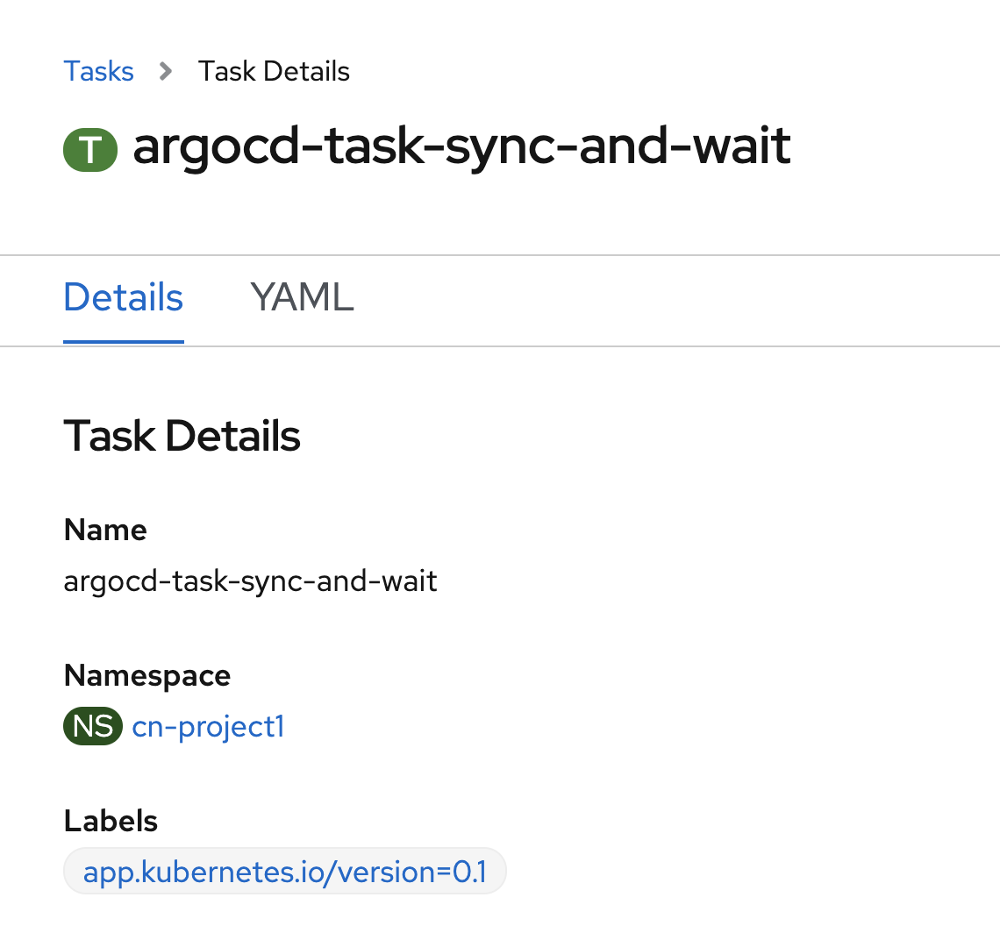

Now let's define the Argo CD server endpoint as well as the credentials to access to.

In the {OPENSHIFT_CONSOLE_URL}[OpenShift Web Console^], from the **Developer view**,
`*click on 'Config Maps' then click on the 'Create Config Map' button*`.

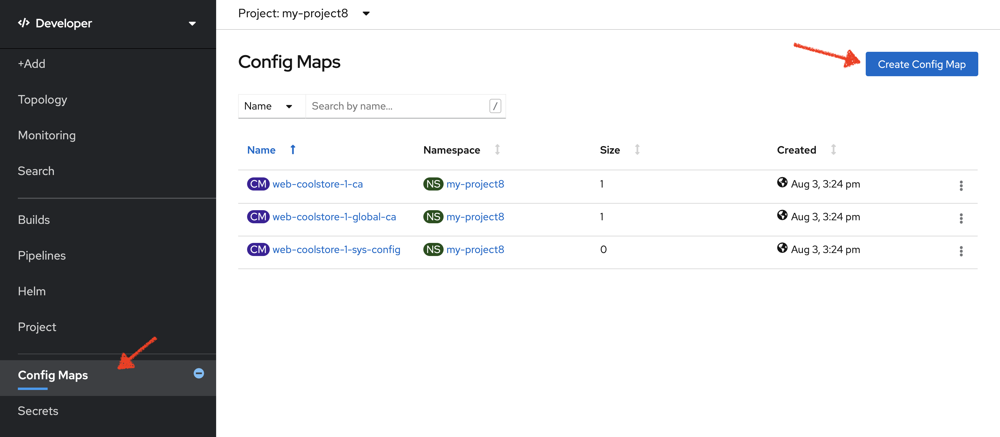

Then `*replace the content*` with the following input:

[source,yaml,subs="{markup-in-source}",role=copy]
----
apiVersion: v1
kind: ConfigMap
metadata:
  name: argocd-env-configmap
  namespace: cn-project{USER_ID}
data:
  ARGOCD_SERVER: argocd-server.argocd.svc
----

`*Click on the 'Create button. Then click on 'Secret' then click on the 'Create Secret' button*`.

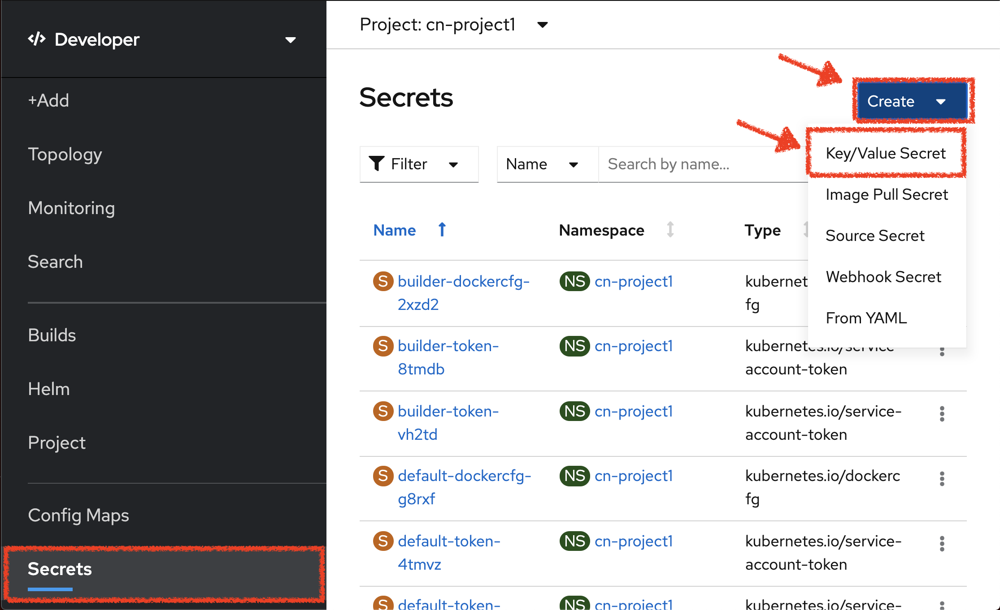

`*Enter the following configuration*`:

.ArgoCD Task Secret
[%header,cols=2*]
|===
|Parameter 
|Value

|Secret Name * 
|argocd-env-secret

|Key1/Value1
|ARGOCD_USERNAME/user{USER_ID}

|Key2/Value2
|ARGOCD_PASSWORD/{OPENSHIFT_PASSWORD}

|===

`*Click on the 'Create button*` 

'''

=== Expand your Pipeline

Now let's expand your Inventory Pipeline to cover the Continuous Deployment.

In the {OPENSHIFT_CONSOLE_URL}[OpenShift Web Console^], from the **Developer view**,
`*click on 'Pipelines' -> 'PL inventory-pipeline' -> 'Actions' -> 'Edit'*`

then, `*complete your pipeline with the two following tasks and their configurations*`

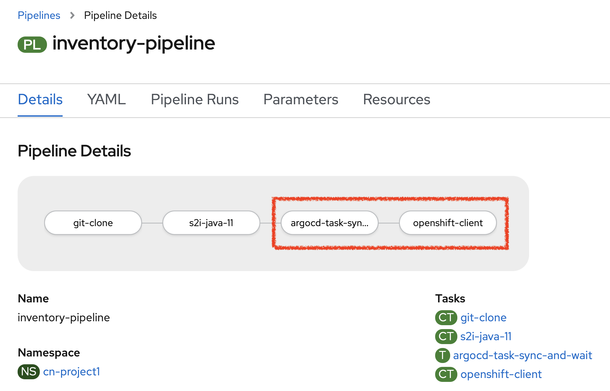

.ArgoCD Task Configuration
[%header,cols=3*]
|===
|Section
|Parameter 
|Value

|Parameters
|application-name * 
|inventory

|===

.OpenShift Client Task Configuration
[%header,cols=3*]
|===
|Section
|Parameter 
|Value

|Parameters
|SCRIPT 
|oc $@

|Parameters
|ARGS1
|rollout

|Parameters
|ARGS2
|latest

|Parameters
|ARGS3
|inventory-coolstore

|===

'''

=== Run the Full Pipeline

In the {OPENSHIFT_CONSOLE_URL}[OpenShift Web Console^], from the **Developer view**,
`*click on 'Pipelines' -> 'PL inventory-pipeline' -> 'Actions' -> 'Start' and enter the following parameters*`

.Pipeline Workspaces
[%header,cols=3*]
|===
|Name 
|Type
|Value

|shared-workspace
|PVC
|PVC inventory-pipeline-pvc

|===

`*Finally click on 'Start'*`

Congratulations!! You have deployed your first application using OpenShift Pipeline!!

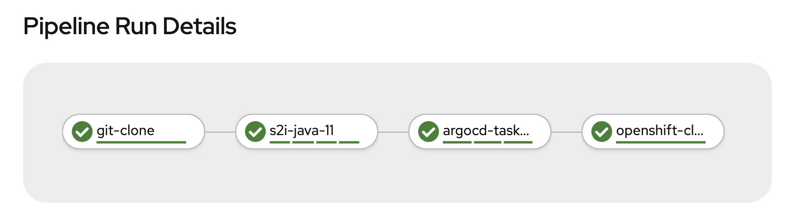

Once finished,from the **Topology view**, `*select the 'cn-project{USER_ID}'*`.

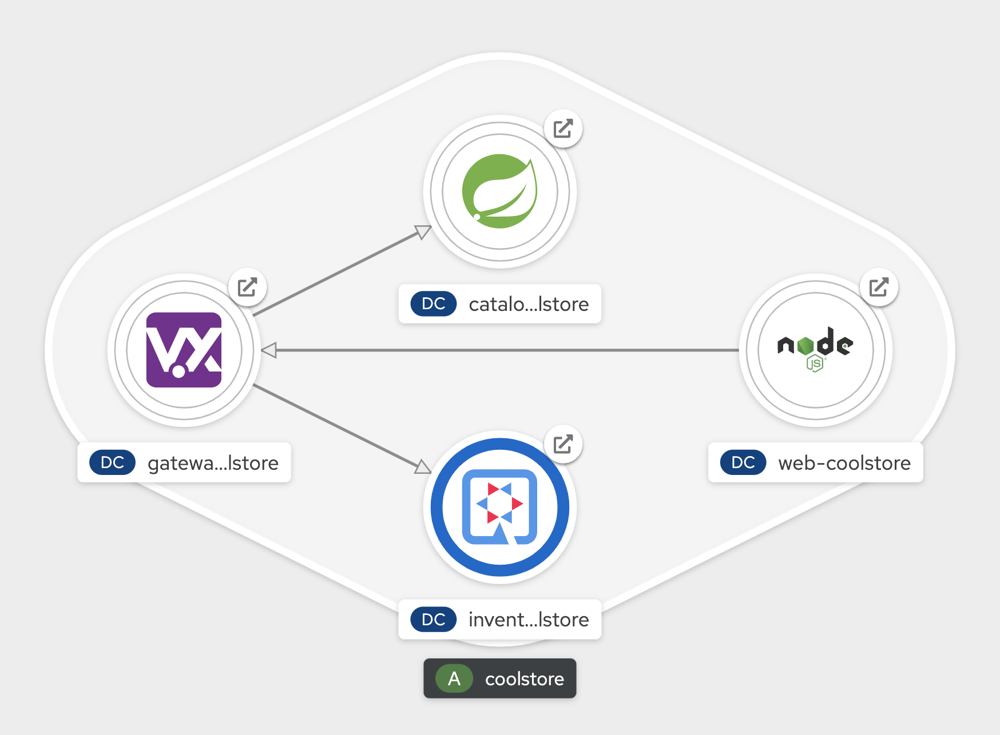

Now, you can see that the **Inventory Service has been deployed by OpenShift Pipeline** and it is up and running.

In the {GITOPS_URL}[Argo CD^], `*Select the 'Application menu' then click on the 'cn-project{USER_ID}' application*`:

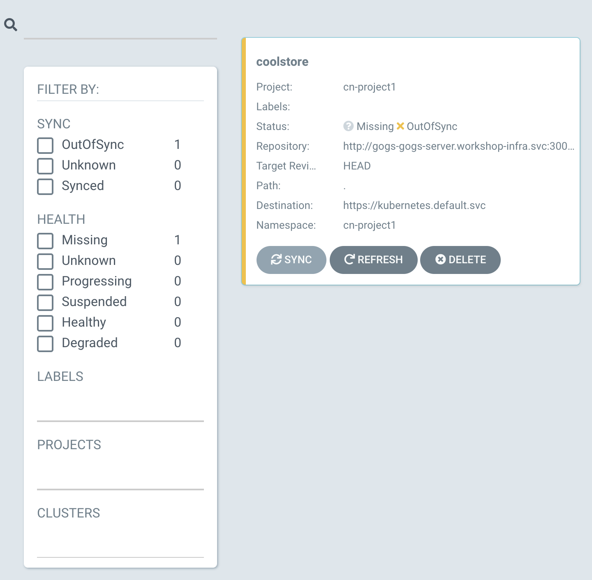

`*Filter to only display  the _Synced_ resources*`. Argo CD has synchronized all the Inventory OpenShift manifests stored into your {GIT_URL}/user{USER_ID}/gitops-cn-project['gitops-cn-project' Git Repository^] 
with your 'cn-project{USER_ID}' project on OpenShift.

image::images/argocd-synced-inventory.png[Argo CD - Synced Inventory, 900]

Your Argo CD application is still 'OutofSync' because the other OpenShift Manifests (Catalog, Gateway and Web) are not synchronized yet.
This is the next step.

'''

=== Deploy the whole application with Tekton

Previously, for the **Inventory Service**, you have learned how to create, configure and run an OpenShift pipeline.
Now, `*let's deploy the rest of the application*`.

For doing so, `*click on 'Terminal' -> 'Run Task...' ->  'Pipeline - Deploy Coolstore'*`

image::images/che-runtask.png[Che - RunTask, 500]

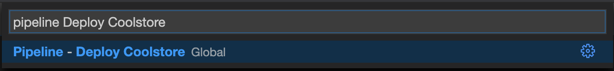

Once executed, in the {OPENSHIFT_CONSOLE_URL}[OpenShift Web Console^], from the **Developer view**,
`*click on 'Pipelines' -> 'PL - coolstore-java-pipeline' -> 'Pipeline Runs'*`

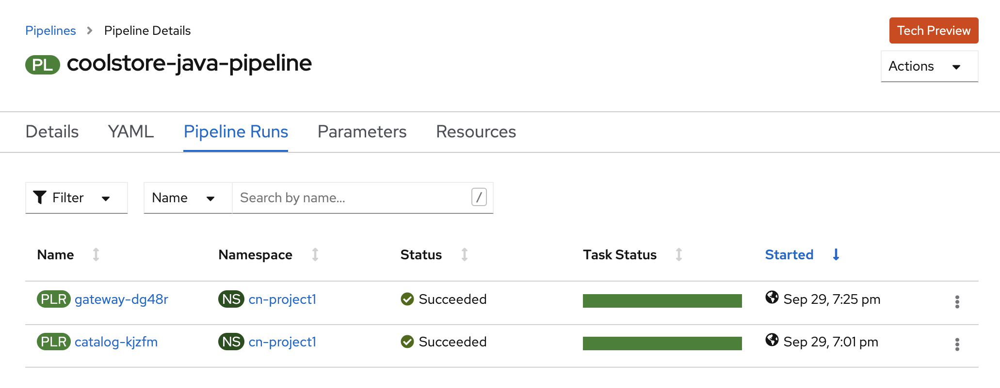

You should see 2 pipelines running for the 2 Java services (Catalog and Gateway).

`*Click on 'Pipelines' -> 'PL - coolstore-nodejs-pipeline' -> 'Pipeline Runs'*`

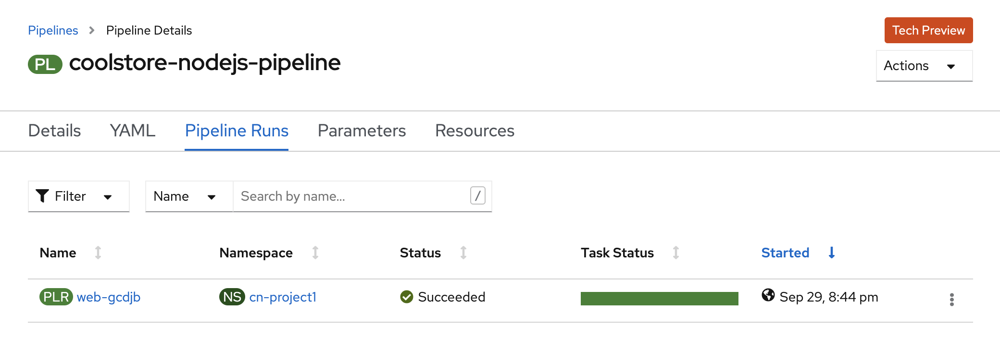

You should see 1 pipeline running for the Web services.

`*Click on 'Topology'*` from the **Developer view** of the {OPENSHIFT_CONSOLE_URL}[OpenShift Web Console^]
and validate that the CoolStore application is deployed, up and running in the **cn-project{USER_ID}** project.

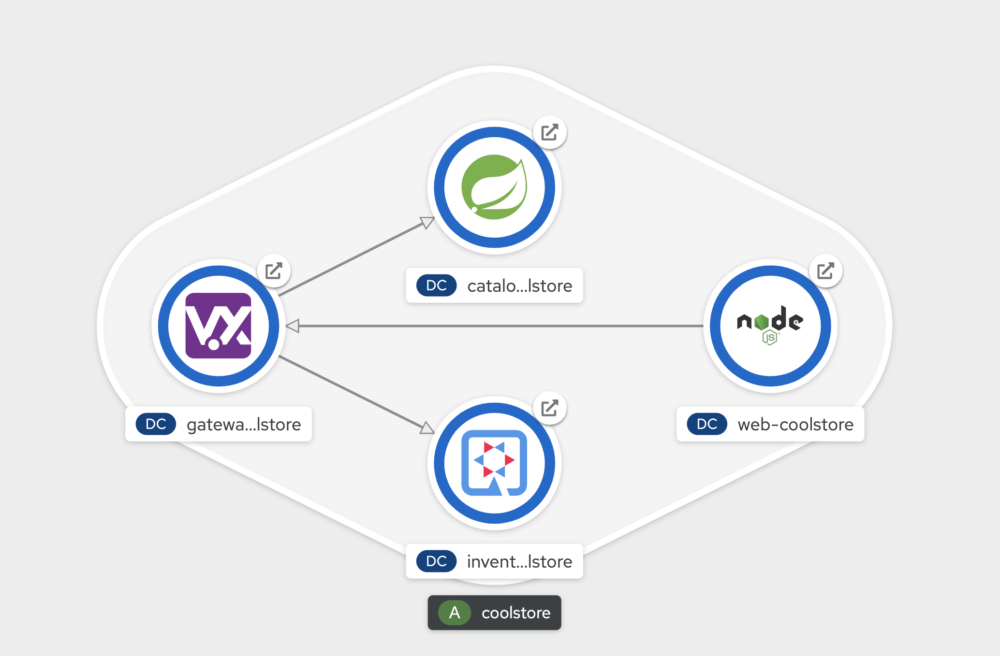

Finally, in the {GITOPS_URL}[Argo CD^], `*Select the 'Application menu' then click on the 'cn-project{USER_ID}' application*`:

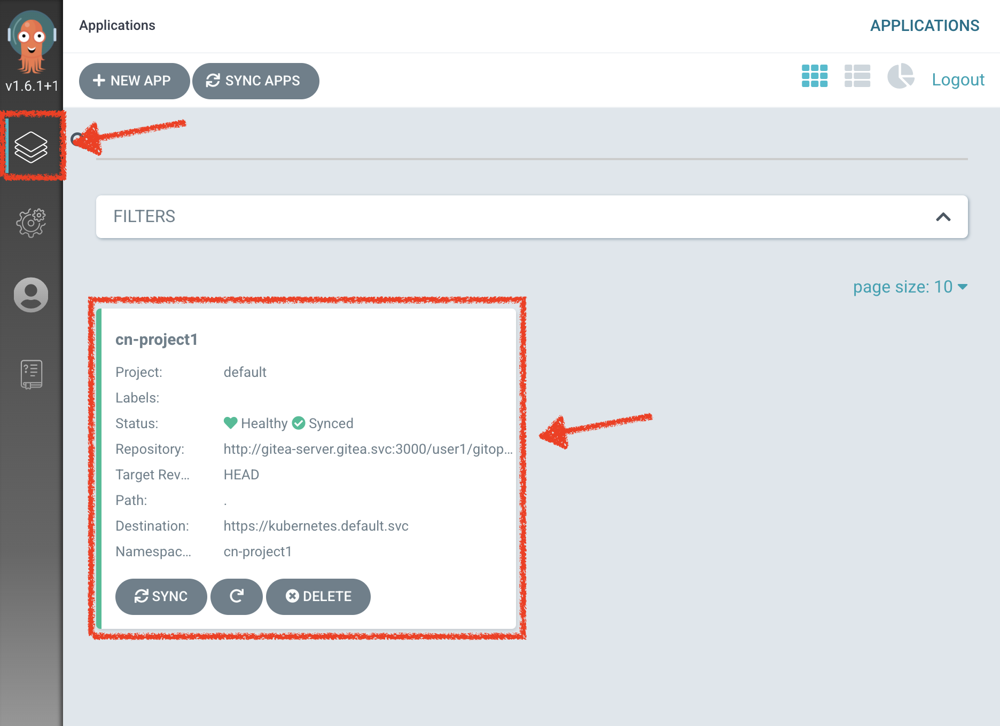

Argo CD has synchronized all the OpenShift manifests stored into your {GIT_URL}/user{USER_ID}/gitops-cn-project['gitops-cn-project' Git Repository^] 
with your 'cn-project{USER_ID}' project on OpenShift.

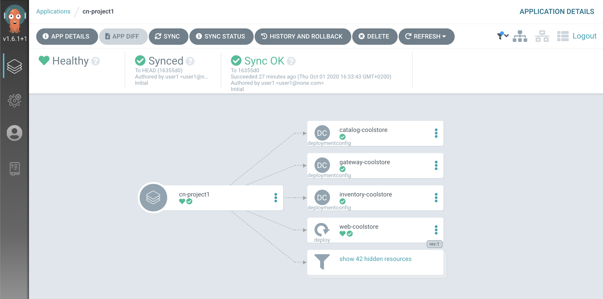

Your Argo CD application is now 'Synced'.

'''

Well done! You are ready for the next lab.