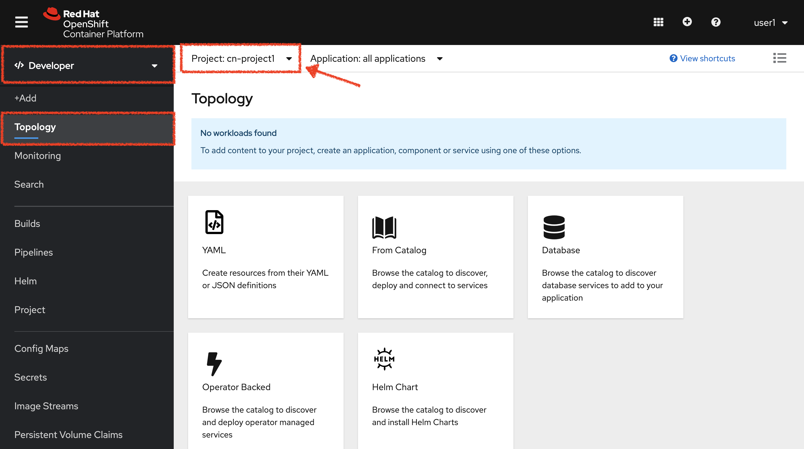

:markup-in-source: verbatim,attributes,quotes
:CHE_URL: %CHE_URL%
:GIT_URL: %GIT_URL%
:GITOPS_URL: %GITOPS_URL%
:USER_ID: %USER_ID%
:OPENSHIFT_PASSWORD: %OPENSHIFT_PASSWORD%
:OPENSHIFT_CONSOLE_URL: %OPENSHIFT_CONSOLE_URL%/topology/ns/cn-project{USER_ID}

_30 MINUTE EXERCISE_

In this lab you will learn about deployment pipelines and you will create a pipeline to 
automate the build of the Inventory service.

[sidebar]
.Continuous Integration
--
So far you have been building and deploying each service manually to OpenShift. Although 
it's convenient for local development, it's an error-prone way of delivering software if 
extended to test and production environments.

Continuous Integration (CI) is a phase in the software development cycle where code from different team members 
or different features are integrated together. This usually involves merging code (integration), 
building the application (container) and carrying out basic tests all within an ephemeral environment.

OpenShift simplifies building CI/CD Pipelines by integrating TektonCD into
the platform and enables defining truly complex workflows directly from within OpenShift.
--

'''

=== Create a Git Repository for Inventory

The first step is to create a Git repository to store your source code. 
You can use any Git server (e.g. GitHub, BitBucket, etc). For this lab we will use a 
Gitea git server.

`*Click on the below button called 'Developer Repository'*`

[link={GIT_URL}]
[window=_blank, align="center"]
image::images/developer-repository-button.png[Developer Repository - Button, 300]

Then, `*click on 'Sign In' and login via OpenShift as user{USER_ID}/{OPENSHIFT_PASSWORD}*`

image::images/gitea-signin.png[Sign Up Gitea,700]

Create a new repository called *'inventory-quarkus'*.
`*Click on the plus icon*` as below and enter the following values:

image::images/gitea-plus-icon.png[Create New Repository,900]

.Inventory Repository
[%header,cols=2*]
|===
|Parameter 
|Value

|Owner*
|user{USER_ID}

|Repository Name*
|inventory-quarkus

|===

`*Click on 'Create Repository' button*`.

The Git repository is created now. 

'''

=== Push Inventory Code to the Git Repository

Now that you have a Git repository for the Inventory service, you should push the 
source code into this Git repository.

In your {CHE_URL}[Workspace^], `*click on 'Terminal' -> 'Run Task...' ->  'Inventory - Commit'*`

image::images/che-runtask.png[Che - RunTask, 500]

image::images/che-inventory-commit.png[Che - Inventory Commit, 500]

A terminal should be opened with the following output:

[source,shell,subs="{markup-in-source}"]
----
Initialized empty Git repository in /projects/workshop/labs/inventory-quarkus/.git/
[master (root-commit) f7b9db7] Initial
 12 files changed, 831 insertions(+)
 [...]
Enumerating objects: 29, done.
Counting objects: 100% (29/29), done.
Delta compression using up to 16 threads.
Compressing objects: 100% (20/20), done.
Writing objects: 100% (29/29), 10.76 KiB | 3.59 MiB/s, done.
Total 29 (delta 1), reused 0 (delta 0)
remote: . Processing 1 references
remote: Processed 1 references in total
To http://gitea-server.gitea.svc:3000/user{USER_ID}/inventory-quarkus.git
 * [new branch]      master -> master
----

Once done, in {GIT_URL}/user{USER_ID}/inventory-quarkus, `*refresh the page of your 'inventory-quarkus' repository*`. You should 
see the project files in the repository.

image::images/cd-gitea-inventory-repo.png[Inventory Repository,900]

'''

=== What is OpenShift Pipelines?

[sidebar]
--
image::images/tekton-logo.png[Tekton, 300]

OpenShift Pipelines is a cloud-native, continuous integration and continuous delivery (CI/CD) solution 
for building pipelines based on  https://github.com/tektoncd/pipeline[Tekton Pipelines^] project.

* Standard CI/CD pipeline definition based on Tekton
* Build images with Kubernetes tools such as S2I, Buildah, Buildpacks, Kaniko, etc
* Deploy applications to multiple platforms such as Kubernetes, serverless and VMs
* Easy to extend and integrate with existing tools
* Scale pipelines on-demand
* Portable across any Kubernetes platform
* Designed for microservices and decentralized teams
* Integrated with the OpenShift Developer Console

https://github.com/tektoncd/pipeline[Tekton Pipelines^] provides Kubernetes-style resources for creating serverless 
CI/CD-style pipelines on Kubernetes.

The custom resources needed to define a pipeline are:

* **Task** - a reusable, loosely coupled number of steps that perform a specific task (e.g., building a container image)
* **Pipeline** - the definition of the pipeline and the **Task** that it should perform
* **PipelineResource** - inputs (e.g., git repository) and outputs (e.g., image registry) to and out of a **Pipeline** or **Task**
* **TaskRun** - the result of running an instance of **Task**
* **PipelineRun** - the result of running an instance of **Pipeline**, which includes a number of **TaskRun**

image::images/tekton-architecture.png[Tekton Architecture, 600]

--

'''
=== Switch to the Staging Environment

First, let's switch your OpenShift Console to your Staging Environement eg 'cn-project{USER_ID}'.

In the {OPENSHIFT_CONSOLE_URL}[OpenShift Web Console^], from the **Developer view**,
`*click on 'Topology' then select your 'cn-project{USER_ID}'*`.

'''

=== Create an ImageStream

The container image you are about to create will be stored into the internal image registry of the OpenShift cluster by using
an https://docs.openshift.com/container-platform/4.5/openshift_images/image-streams-manage.html[**ImageStream**^].

It provides an abstraction for referencing container images from within OpenShift Container Platform. The imagestream and its 
tags allow you to see what images are available and ensure that you are using the specific image you need even if the image 
in the repository changes.

In the {OPENSHIFT_CONSOLE_URL}[OpenShift Web Console^], from the **Developer view**,
`*click on 'Search' -> 'Resources' -> 'IS ImageStream' -> 'Create Image Stream'*`.

image::images/openshift-create-imagestream.png[OpenShift - Create ImageStream, 700]

`*Then update the content as following:*`

[source,yaml,subs="{markup-in-source}",role=copy]
----
apiVersion: image.openshift.io/v1
kind: ImageStream
metadata:
  name: inventory-coolstore
  namespace: cn-project{USER_ID}
----

`*Then click on 'create'*`. Your ImageStream for the Inventory Service is now created.

image::images/openshift-inventory-imagestream.png[OpenShift - Inventory ImageStream, 900]

'''

=== Create a Pipeline

A **Pipeline** defines a number of **Task** that should be executed and how they interact 
with each other via *Workspace*.

In the {OPENSHIFT_CONSOLE_URL}[OpenShift Web Console^], from the **Developer view**,
`*click on 'Pipelines' -> 'Create Pipeline'*`.

image::images/openshift-create-pipeline.png[OpenShift - Create Pipeline, 700]

`*Specify 'inventory-pipeline' as Name then click on 'Select task' and select 'git-clone' task.*`

image::images/openshift-add-git-clone-task.png[OpenShift - Add Git Clone Task, 500]

`*Click on the newly created 'git-clone' task and enter the following configuration*`:

.git-clone cluster task
[%header,cols=2*]
|===
|Parameter 
|Value

|Display Name
|git-clone

|url
|http://gitea-server.gitea.svc:3000/user{USER_ID}/inventory-quarkus.git

|revision
|master

|deleteExisting
|true

|===

Once done, let's add other tasks. `*Click on the blue plus icon at the left hand side of the 'git-clone' task*`

image::images/openshift-add-task.png[OpenShift - Add task, 500]

`*Then click on 'Select task' and select 's2i-java-11' task*`

`*Click on the newly created 's2i-java-11' task and enter the following configuration*`:

.s2i-java-11 cluster task
[%header,cols=2*]
|===
|Parameter 
|Value

|Display Name
|s2i-java-11

|PATH_CONTEXT
|.

|TLSVERIFY
|false

|MAVEN_MIRROR_URL
|http://nexus.opentlc-shared.svc:8081/repository/maven-all-public

|Image*
|image-registry.openshift-image-registry.svc:5000/cn-project{USER_ID}/inventory-coolstore

|===

Once done, `*click on 'Create'*`. Your simple Pipeline is now created.

image::images/openshift-simple-pipeline.png[OpenShift - Simple Pipeline, 700]

'''

=== Attach a Shared Workspace to the Pipeline

**Workspaces** allow **Tasks** to declare parts of the filesystem that need to be provided at runtime by TaskRuns. 

A TaskRun can make these parts of the filesystem available in many ways: using a read-only ConfigMap or Secret, an existing PersistentVolumeClaim shared with other Tasks, create a PersistentVolumeClaim from a provided VolumeClaimTemplate, or simply an emptyDir that is discarded when the TaskRun completes.

**Workspaces** are similar to Volumes except that they allow a Task author to defer to users and their TaskRuns when deciding which class of storage to use.

In the {OPENSHIFT_CONSOLE_URL}[OpenShift Web Console^], from the **Developer view**,
`*click on 'Search' -> 'Resources' -> 'PVC PersistentVolumeClaim' -> 'Create Persistent Volume Claim'*`.

image::images/openshift-create-pvc.png[OpenShift - Create PVC, 700]

`*Enter the following configuration*`:

.Inventory PVC
[%header,cols=2*]
|===
|Parameter 
|Value

|Storage Class
|gp2

|Persistent Volume Claim Name *
|inventory-pipeline-pvc

|Access Mode *
|Single User (RWO)

|Size *
|1 GiB

|===

Then, `*Click on 'Create'*`. The Shared Storage for your pipeline is ready.

image::images/openshift-inventory-pvc.png[OpenShift - Inventory PVC, 500]

In the {OPENSHIFT_CONSOLE_URL}[OpenShift Web Console^], from the **Developer view**,
`*click on 'Pipelines' -> 'PL inventory-pipeline' -> 'YAML'*`

image::images/openshift-inventory-pipeline-yaml.png[OpenShift - Inventory Pipeline YAML, 700]

`*Add the three (3) workspace configurations*` as following:

[source,yaml,subs="{markup-in-source}"]
----
apiVersion: tekton.dev/v1beta1
kind: Pipeline
metadata:
  [...]
  name: inventory-pipeline
  namespace: cn-project{USER_ID}
  [...]
spec:
  **workspaces:
    - name: shared-workspace**
  tasks:
    - name: git-clone
      params:
        [...]
      taskRef:
        [...]
      **workspaces:
        - name: output
          workspace: shared-workspace**
    - name: s2i-java-11
      params:
        [...]
      taskRef:
        [...]
      runAfter:
        [...]
      **workspaces:
        - name: source
          workspace: shared-workspace**
----

Finally, `*Click on 'Save'*`. A shared workspace is now configured into your Pipeline.

'''

=== Run the Pipeline

Now that your pipeline is created and configured, let's run it.

In the {OPENSHIFT_CONSOLE_URL}[OpenShift Web Console^], from the **Developer view**,
`*click on 'Pipelines' -> 'PL inventory-pipeline' -> 'Actions' -> 'Start'*`

image::images/openshift-start-inventory-pipeline.png[OpenShift Start Inventory Pipeline,900]

`*Enter the following parameters then click on 'Start'*`

.Pipeline Parameters
[%header,cols=3*]
|===
|Name 
|Type
|Value

|shared-workspace
|PVC
|PVC inventory-pipeline-pvc

|===

image::images/openshift-inventory-pipeline-parameters.png[OpenShift Inventory Pipeline Parameters,500]

Congratulations!! You have created and run your first **CI Pipeline on OpenShift**!!

image::images/openshift-inventory-pipeline-run.png[OpenShift Inventory Pipeline Run,700]

'''

Well done! You are ready for the next lab.