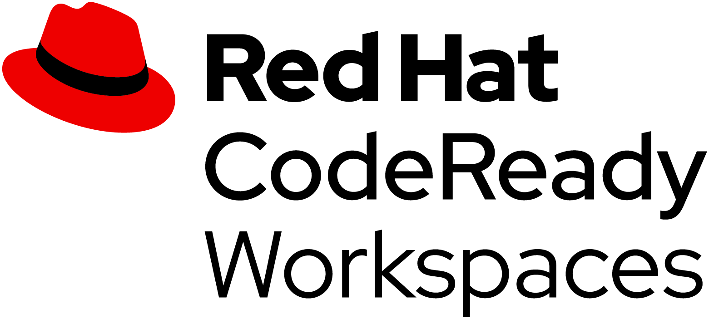
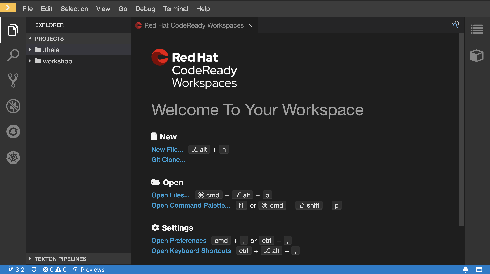
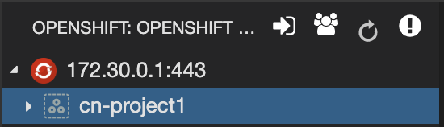
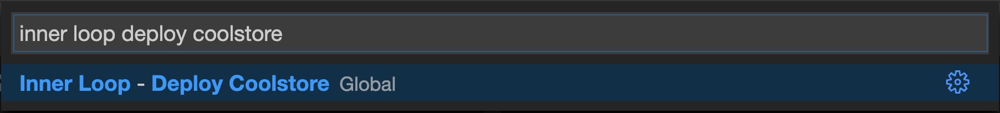
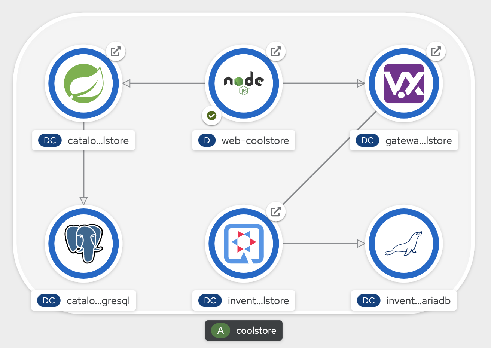

:CHE_URL: %CHE_URL%
:USER_ID: %USER_ID%
:OPENSHIFT_PASSWORD: %OPENSHIFT_PASSWORD%
:OPENSHIFT_CONSOLE_URL: %OPENSHIFT_CONSOLE_URL%/topology/ns/my-project{USER_ID}/graph

_10 MINUTE EXERCISE_

In this lab you will learn about providing your Developer Workspace with a Kubernetes-native development platform 
and getting familiar with the OpenShift CLI and OpenShift Web Console.

=== What is CodeReady Workspaces?

[sidebar]
--
[window=_blank, align="center"]

https://access.redhat.com/products/red-hat-codeready-workspaces[CodeReady Workspaces^] is a Kubernetes-native IDE and developer collaboration platform.

As an open-source project, the core goals of https://access.redhat.com/products/red-hat-codeready-workspaces[CodeReady Workspaces^]  are to:

* **Accelerate project and developer onboarding:** As a zero-install development environment that runs in your browser, https://access.redhat.com/products/red-hat-codeready-workspaces[CodeReady Workspaces^]  makes it easy for anyone to join your team and contribute to a project.
* **Remove inconsistency between developer environments:** No more: “But it works on my machine.” Your code works exactly the same way in everyone’s environment.
* **Provide built-in security and enterprise readiness:** As https://access.redhat.com/products/red-hat-codeready-workspaces[CodeReady Workspaces^]  becomes a viable replacement for VDI solutions, it must be secure and it must support enterprise requirements, such as role-based access control and the ability to remove all source code from developer machines.

To achieve those core goals, https://access.redhat.com/products/red-hat-codeready-workspaces[CodeReady Workspaces^]  provides:

* **Workspaces:** Container-based developer workspaces providing all the tools and dependencies needed to code, build, test, run, and debug applications.
* **Browser-based IDEs:** Bundled browser-based IDEs with language tooling, debuggers, terminal, VCS integration, and much more.
* **Extensible platform:** Bring your own IDE. Define, configure, and extend the tools that you need for your application by using plug-ins, which are compatible with Visual Studio Code extensions.
* **Enterprise Integration:** Multi-user capabilities, including Keycloak for authentication and integration with LDAP or AD.
--

'''

=== Getting your Developer Workspace with a single click

https://access.redhat.com/products/red-hat-codeready-workspaces[CodeReady Workspaces^]  will provide you an out-of-box 
*Developer Workspace* with all the tools and the dependencies we need to do the job. **And with only one single click!**

[NOTE]
.Devfile
====
https://access.redhat.com/products/red-hat-codeready-workspaces[CodeReady Workspaces^] uses https://access.redhat.com/documentation/en-us/red_hat_codeready_workspaces/2.2/html/end-user_guide/workspaces-overview_crw#configuring-a-workspace-using-a-devfile_crw[Devfiles^] to automate the provisioning 
of a specific workspace by defining:

* projects to clone
* browser IDE to use
* preconfigured commands
* tools that you need
* application runtime definition

Providing a https://github.com/mcouliba/cloud-native-workshop/blob/ocp4.5/devfile.yaml[devfile.yaml^] file inside a Git source repository signals to https://access.redhat.com/products/red-hat-codeready-workspaces[CodeReady Workspaces^] to configure the project and runtime according 
to this file.
====

`*Click on the below button called 'Developer Workspace'*`

[link={CHE_URL}/dashboard/#/ide/user{USER_ID}/wksp-cloud-native]
[window=_blank, align="center"]
image::images/developer-workspace-button.svg[Developer Workspace - Button, 300]

Then `*login as user{USER_ID}/{OPENSHIFT_PASSWORD}*` and let's the magic happens...

image::images/che-login.png[Che - Login, 500]

[TIP]
====
If you have the following screen, please `*click on 'Allow selected permissions'*`

image::images/che-openshift-authorize-access.png[Che - OpenShift OAuth Authorize Access, 600]
====

Once completed, you will have a fully functional Browser-based IDE within the source code already imported.

'''

=== Connect Your Workspace to Your OpenShift User

First, in your {CHE_URL}[Workspace^], 
`*click on 'Terminal' -> 'Run Task...' ->  'OpenShift - Login'*`

image::images/che-runtask.png[Che - RunTask, 500]

A terminal should be opened with the following output:

[source,shell,subs="{markup-in-source}"]
----
Login successful.

You have access to the following projects and can switch between them with 'oc project <projectname>':

  * cn-project{USER_ID}

Using project "cn-project{USER_ID}".
----

'''

=== Deploy the CoolStore Application in your Development Environment

In your {CHE_URL}[Workspace^], 
`*click on 'Terminal' -> 'Run Task...' ->  'Inner Loop - Deploy Coolstore'*`

image::images/che-runtask.png[Che - RunTask, 500]

A terminal should be opened with the following output:

[source,shell,subs="{markup-in-source}"]
----
Now using project "my-project{USER_ID}" on server "https://api.cluster-3738.3738.example.opentlc.com:6443".

You can add applications to this project with the 'new-app' command. For example, try:

    oc new-app ruby~https://github.com/sclorg/ruby-ex.git

to build a new example application in Ruby. Or use kubectl to deploy a simple Kubernetes application:

    kubectl create deployment hello-node --image=gcr.io/hello-minikube-zero-install/hello-node

[...]

deploymentconfig.apps.openshift.io/catalog-coolstore annotated
deploymentconfig.apps.openshift.io/inventory-coolstore annotated
Application Configuration Externalization Done
The deployment of the Coolstore Application by Inner Loop has succeeded
----

'''

=== Log in to the OpenShift Developer Console

OpenShift ships with a web-based console that will allow users to
perform various tasks via a browser.

`*Click on the below button called 'Developer Console'*`

[link={OPENSHIFT_CONSOLE_URL}]
[window=_blank, align="center"]
image::images/developer-console-button.png[Developer Workspace - Button, 300]

`*Enter your username and password (user{USER_ID}/{OPENSHIFT_PASSWORD})*` and 
then log in. After you have authenticated to the web console, you will be presented with a
list of projects that your user has permission to work with. 

`*Select the 'Developer View' then your 'my-project{USER_ID}'*` to be taken to the project overview page
which will list all of the routes, services, deployments, and pods that you have
running as part of your project. 

You should have the whole Coolstore Application up and running in your Development environment (my-project{USER_ID})

Now you are ready to get started with the labs!
