:markup-in-source: verbatim,attributes,quotes
:CHE_URL: %CHE_URL%
:GIT_URL: %GIT_URL%
:GITOPS_URL: %GITOPS_URL%
:USER_ID: %USER_ID%
:OPENSHIFT_PASSWORD: %OPENSHIFT_PASSWORD%
:OPENSHIFT_CONSOLE_URL: %OPENSHIFT_CONSOLE_URL%/topology/ns/cn-project{USER_ID}

_20 MINUTE EXERCISE_

In this lab you will learn about deploying and managing Kubernetes resources using a GitOps tool.

'''

=== Export OpenShift Resources

First, you need to export the project resources from OpenShift.

In your {CHE_URL}[Workspace^], `*click on 'Terminal' -> 'Run Task...' ->  'GitOps - Export'*`

image::images/che-runtask.png[Che - RunTask, 500]

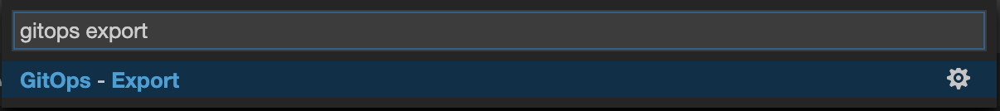

A terminal should be opened with the following output:

[source,shell,subs="{markup-in-source}"]
.>_ GitOps Export
----
--- Export Kubernetes resources for GitOps from my-project{USER_ID} to cn-project{USER_ID} ---
Exporting resources for inventory-coolstore...
Exporting resources for catalog-coolstore...
Exporting resources for gateway-coolstore...
Exporting resources for web-coolstore...
--- Kubernetes resources has been exported! ---
----

This operation exports the project resources (deploymentconfig, route, secret, service)
and cleans them up. As a result, you should have all resources in YAML files under 
the **/project/workshop/lab/gitops** folder.

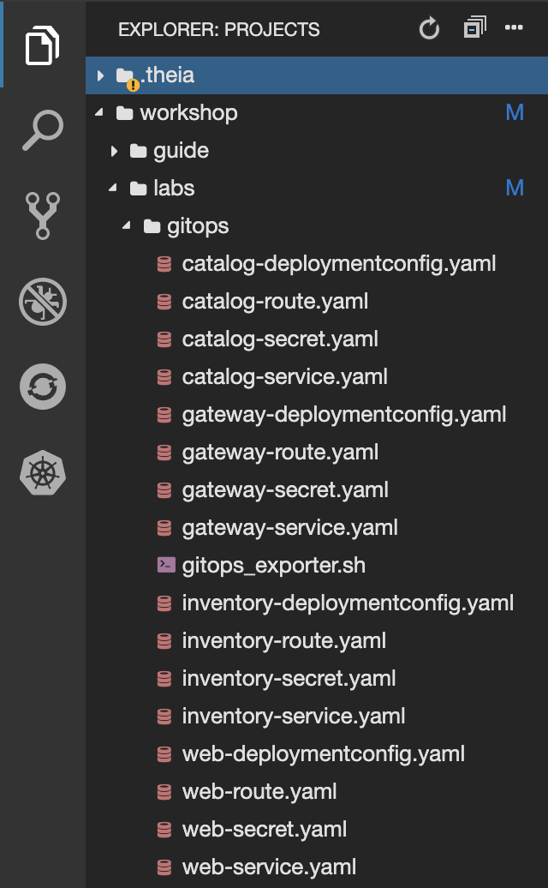

'''

=== Push them into a Git Repository

The first step is to store all Kubernetes/OpenShift resources in 
a source code repository. You can use any Git server (e.g. GitHub, BitBucket, etc) for this lab but we have prepared a 
Gitea git server.

`*Click on the below button called 'Developer Repository'*`

[link={GIT_URL}]
[window=_blank, align="center"]

Then, `*click on 'Sign In' and login via OpenShift as user{USER_ID}/{OPENSHIFT_PASSWORD}*`

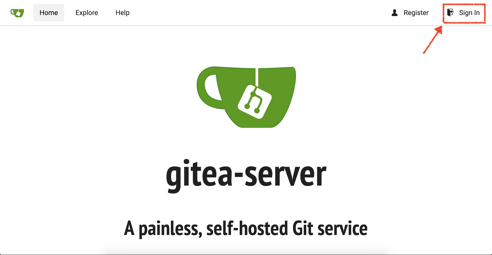

Create a new repository *'gitops-cn-project'*.
`*Click on the plus icon*` as below and enter the following values:

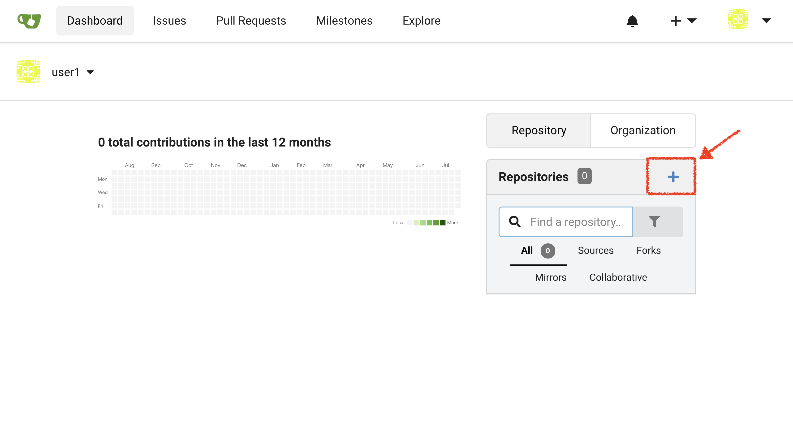

.GitOps Repository
[%header,cols=2*]
|===
|Parameter 
|Value

|Owner*
|user{USER_ID}

|Repository Name*
|gitops-cn-project

|Visibility
|_unchecked_

|Description
|_leave it empty_

|Template
|_leave it empty_

|Issue Labels
|_leave it empty_

|.gitignore
|_leave it empty_

|License
|_leave it empty_

|Readme
|Default

|Intialize this repository with selected files and templates
|_unchecked_

|Default Branch
|master

|===

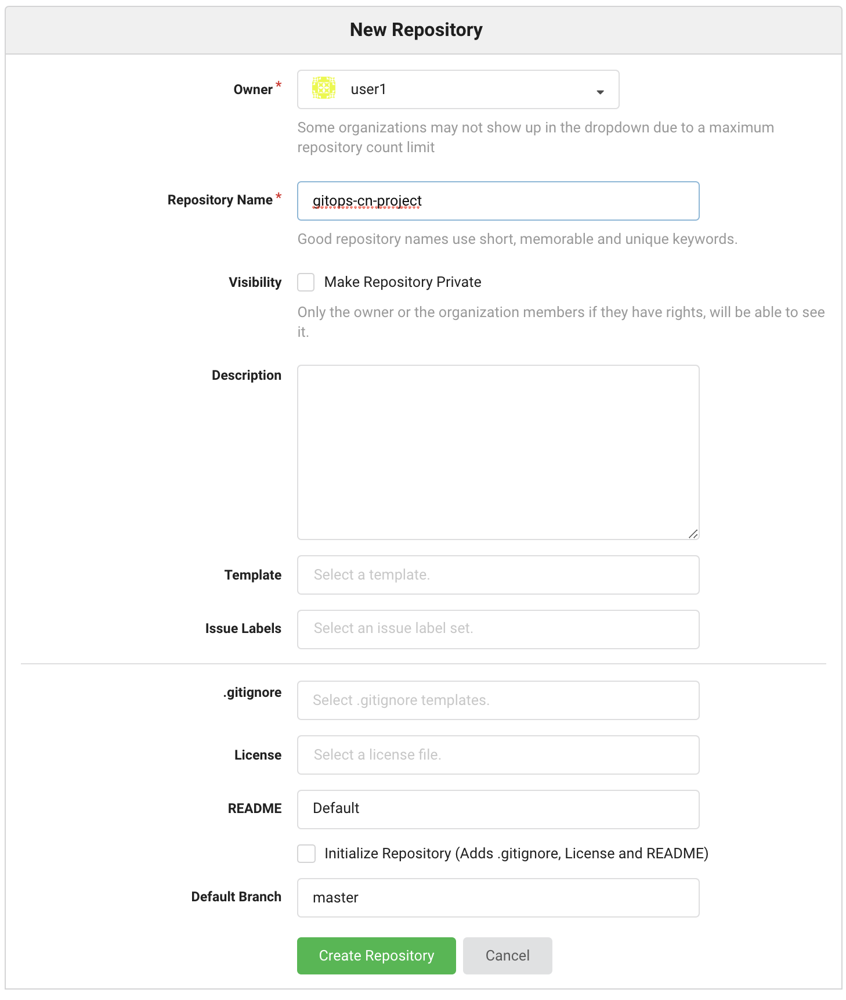

`*Click on 'Create Repository' button*`.

The Git repository is created now. 

'''

=== Push The Configuration to the Git Repository

Now that you have a Git repository for the Inventory service, you should push the 
source code into this Git repository.

In your {CHE_URL}[Workspace^], `*click on 'Terminal' -> 'Run Task...' ->  'GitOps - Commit'*`

image::images/che-runtask.png[Che - RunTask, 500]

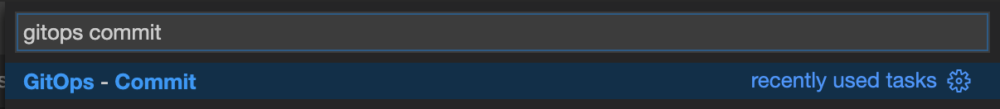

A terminal should be opened with the following output:

[source,shell,subs="{markup-in-source}"]
.>_ GitOps Commit
----
Initialized empty Git repository in /projects/workshop/labs/gitops/.git/
[master (root-commit) 2f074b4] Initial
 28 files changed, 1064 insertions(+)
 [...]
Enumerating objects: 25, done.
Counting objects: 100% (25/25), done.
Delta compression using up to 16 threads.
Compressing objects: 100% (25/25), done.
Writing objects: 100% (25/25), 5.79 KiB | 5.79 MiB/s, done.
Total 25 (delta 16), reused 0 (delta 0)
remote: . Processing 1 references
remote: Processed 1 references in total
To http://gitea-server.gitea.svc:3000/user{USER_ID}/gitops-cn-project.git
 * [new branch]      master -> master
----

Once done, in {GIT_URL}/user{USER_ID}/gitops-cn-project, `*refresh the page of your 'gitops-cn-project' repository*`. You should 
see the project files in the repository.

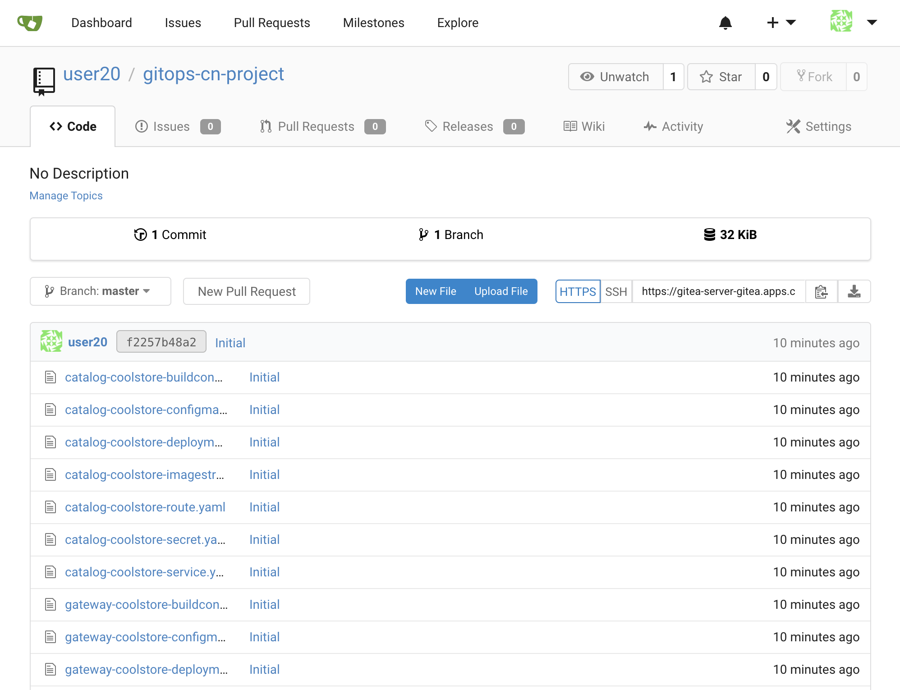

'''

=== What is Argo CD?

[sidebar]
--
image::images/argocd-logo.png[Argo CD Logo, 200]

https://argoproj.github.io/argo-cd/[Argo CD^] is a declarative, GitOps continuous delivery tool for Kubernetes.

It follows the GitOps pattern of using Git repositories as the source of truth for defining 
the desired application state. 

It automates the deployment of the desired application states in the specified target environments. Application 
deployments can track updates to branches, tags, or pinned to a specific version of manifests at a Git commit.
--

'''

=== Log in to Argo CD

`*Click on the below button called 'Developer GitOps'*`

[link={GITOPS_URL}]
[window=_blank, align="center"]
image::images/developer-gitops-button.png[Developer GitOps - Button, 300]

Then `*login via OpenShift as user{USER_ID}/{OPENSHIFT_PASSWORD}*`, `*click on 'Allow selected permissions'*`

[window=_blank, align="center"]
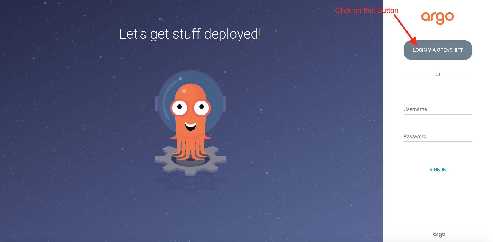

Once completed, you will be redirected to the following page.

image::images/argocd-home.png[Argo CD - Home Page, 500]

'''

=== Add your Newly Created GitOps Repository 

`*Select the 'Configuration menu' then click on 'Repositories'*`

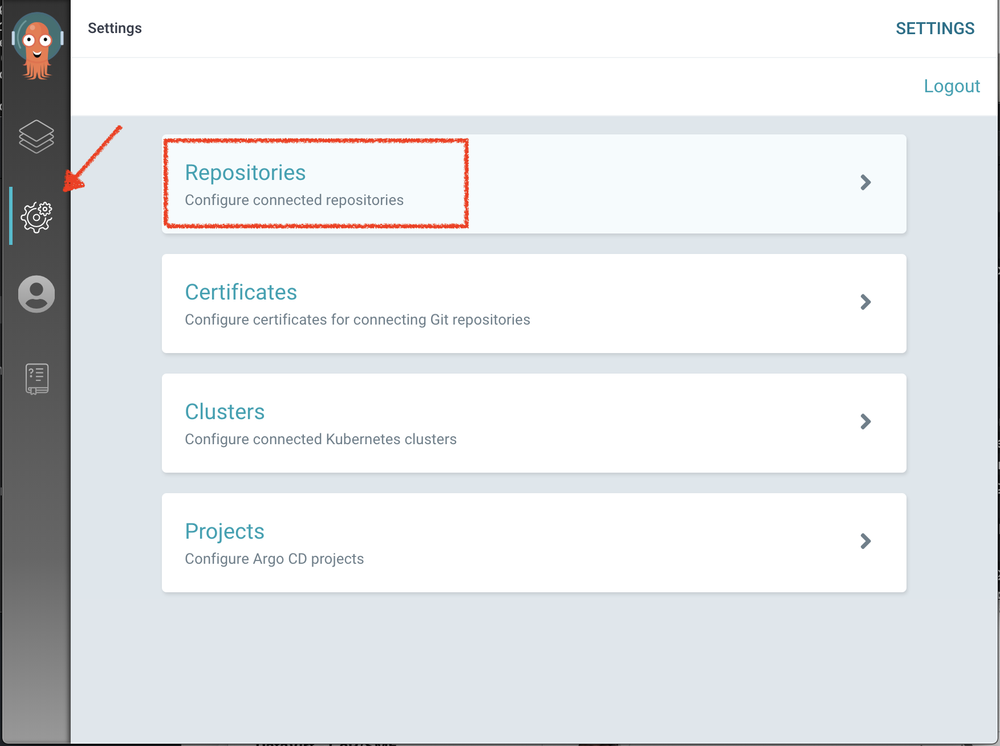

`*Click on 'CONNECT REPO USING HTTPS'*` and enter the following:

.Repository Configuration
[%header,cols=2*]
|===
|Parameter 
|Value

|Type
|git

|Repository URL
|http://gitea-gitea-server.workshop-infra.svc:3000/user{USER_ID}/gitops-cn-project.git

|Username (optional)
|_leave it empty_

|Password (optional)
|_leave it empty_

|TLS client certificate (optional)
|_leave it empty_

|TLS client certificate key (optional)
|_leave it empty_

|Skip server verification
|_unchecked_

|Enable LFS support (Git only)
|_unchecked_

|===

Finally, `*Click on 'CONNECT'*`.

Your GitOps repository is now added to Argo CD.

image::images/argocd-repository.png[Argo CD - Repository, 800]

'''

=== Create a GitOps Application

`*Select the 'Application menu' then click on '+ New App'*` and enter the following details:

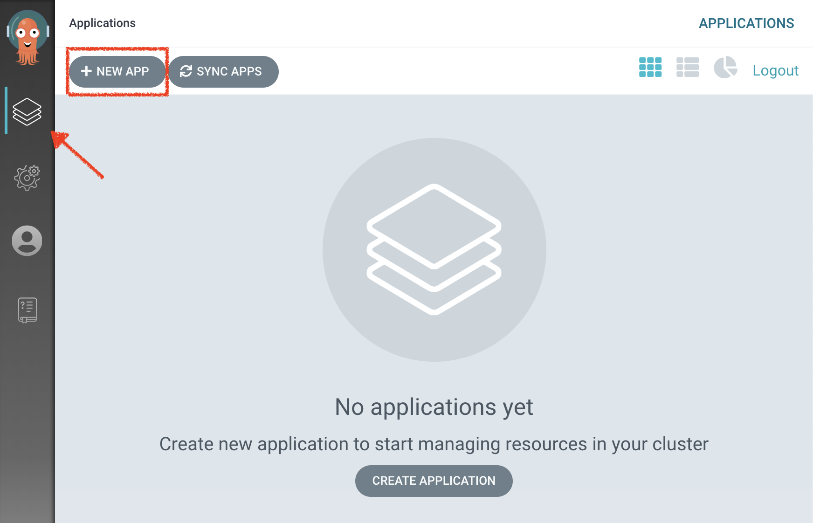

.Application Configuration
[%header,cols=3*]
|===
|Section 
|Parameter 
|Value

|GENERAL
|Application Name
|cn-project{USER_ID}

|GENERAL
|Project
|default

|GENERAL
|SYNC POLICY
|Manual

|SOURCE
|Repository URL
|http://gitea-gitea-server.workshop-infra.svc:3000/user{USER_ID}/gitops-cn-project.git

|SOURCE
|Revision
|HEAD

|SOURCE
|Path
|. _(dot)_

|DESTINATION
|Cluster
|in-cluster (https://kubernetes.default.svc)

|DESTINATION
|Namespace
|cn-project{USER_ID}

|ALL OTHER SECTIONS
|*
|_leave them empty/by default_

|===

Finally, `*Click on 'CREATE'*`.

Your Coolstore Application has been created in Argo CD.

image::images/argocd-outofsync-application.png[Argo CD - OutOfSync Application, 500]

The application status is initially in yellow **OutOfSync** state since the application has yet to be 
deployed into cn-project{USER_ID} OpenShift project, and no Kubernetes resources have been created.

'''

=== Sync/Deploy The GitOps Application

Let's deploy the Coolstore Application into cn-project{USER_ID}!

From the **Application menu**, `*Click on 'Sync > Synchronize'*`.

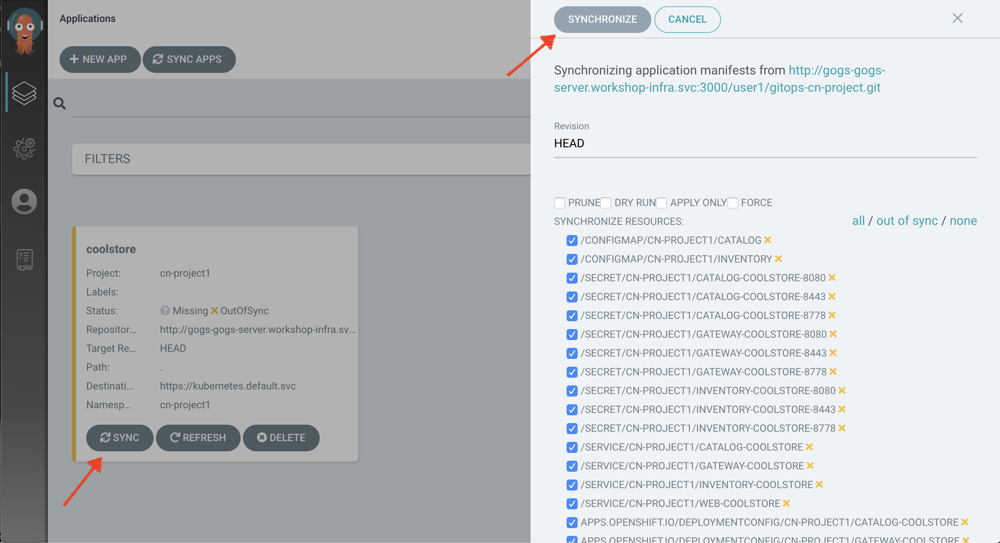

This task retrieves the manifests from the GitOps Repository and performs _kubectl apply_ command of 
the manifests. Your application is now running and you can now view its resource components, 
logs, events, and assessed health status.

`*Click on your 'coolstore' application*` and you should see everything in green.

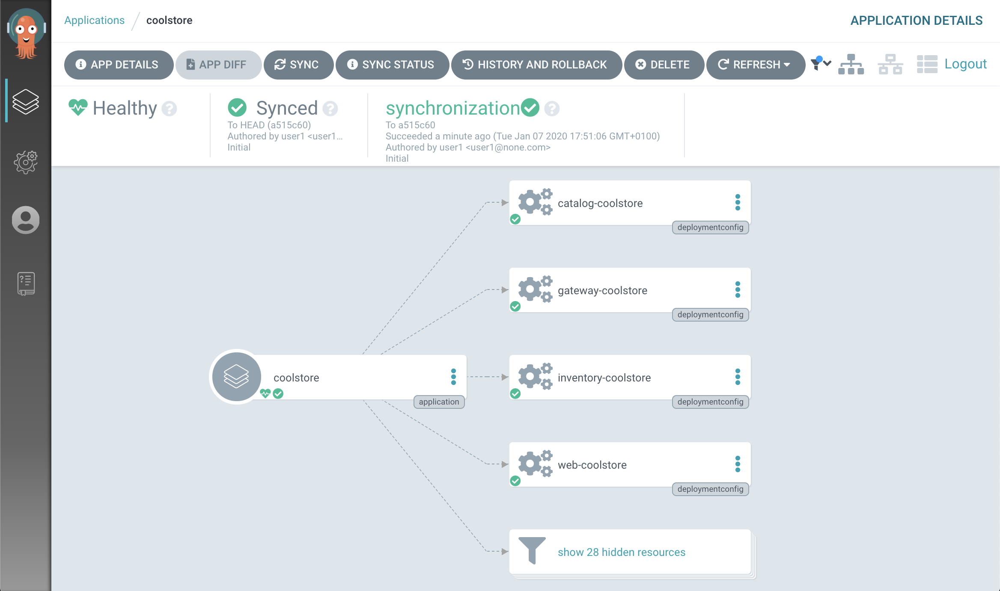

In the {OPENSHIFT_CONSOLE_URL}[OpenShift Web Console^], from the **Developer view**,
`*Select the 'cn-project{USER_ID}'*` to be taken to the project overview page.

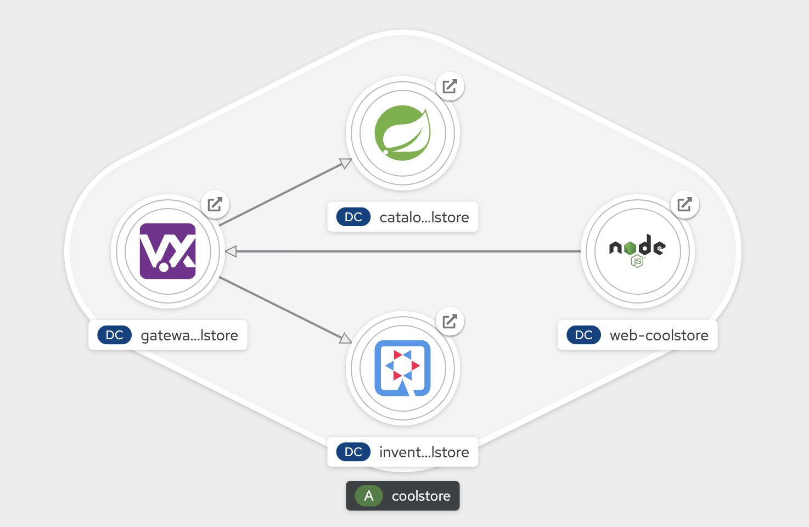

You can see that all resources of your application have been created by Argo CD. 
None of the services is deployed, up and running as we removed all automatic deployment triggers when exporting the configuration
and there is no image available on your **cn-project{USER_ID}** project. **You are going to fix it in the next lab.**

'''

Well done! You are ready for the next lab.
