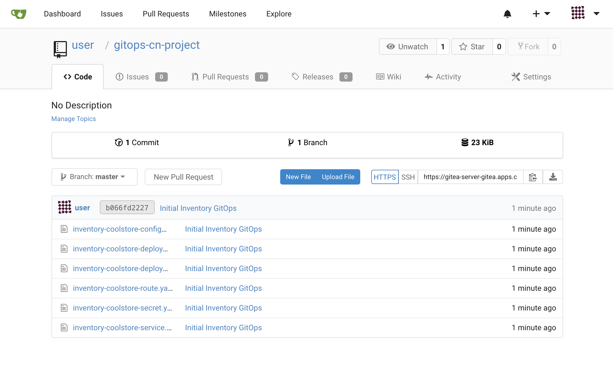
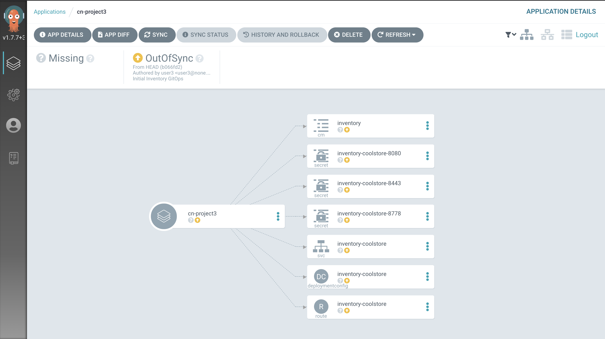
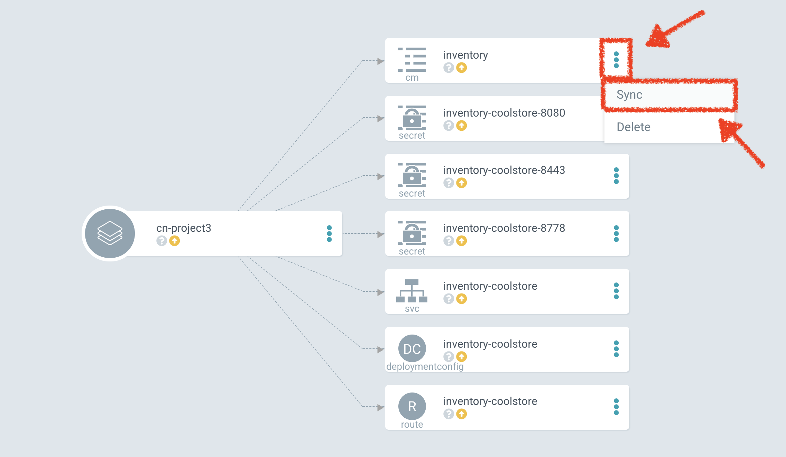
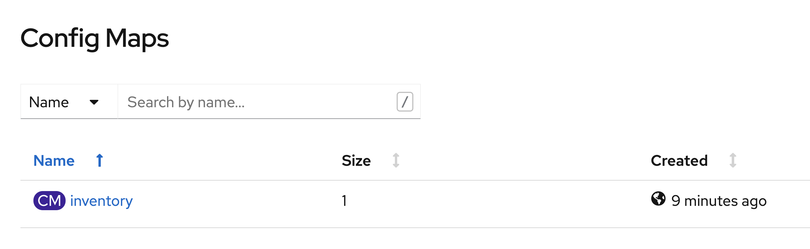
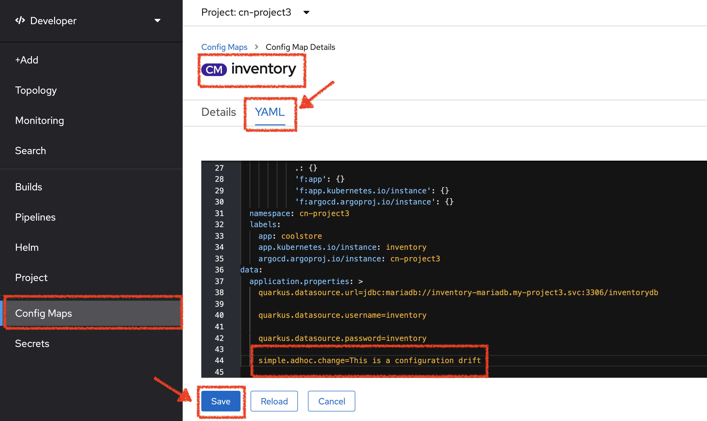
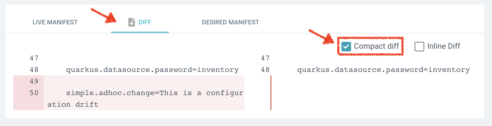
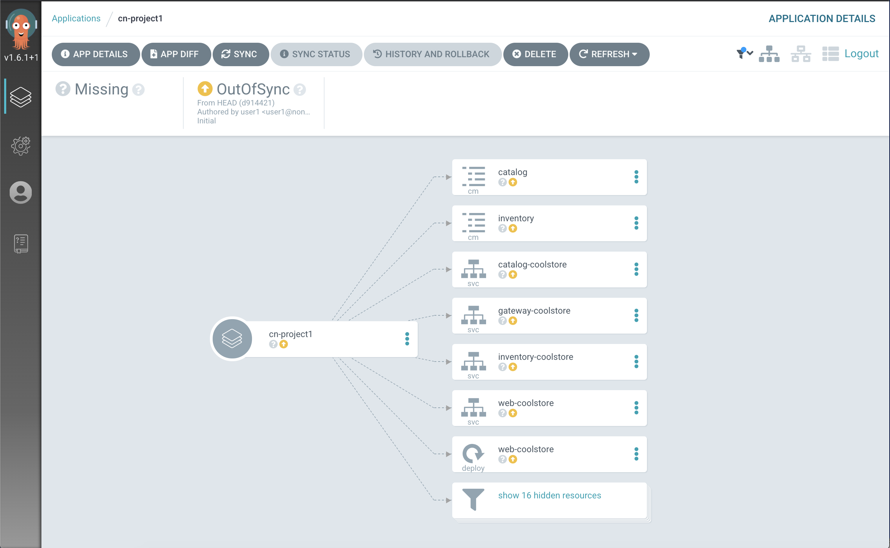

:markup-in-source: verbatim,attributes,quotes
:CHE_URL: %CHE_URL%
:GIT_URL: %GIT_URL%
:GITOPS_URL: %GITOPS_URL%
:USER_ID: %USER_ID%
:OPENSHIFT_PASSWORD: %OPENSHIFT_PASSWORD%
:OPENSHIFT_CONSOLE_URL: %OPENSHIFT_CONSOLE_URL%/topology/ns/cn-project{USER_ID}

_20 MINUTE EXERCISE_

In this lab you will learn about deploying and managing Kubernetes resources using a GitOps tool.

[sidebar]
.GitOps Methodology
--
**GitOps** is a set of practices that leverages Git workflows to manage infrastructure and application configurations.
By using Git repositories as the source of truth, it allows DevOps teams to store the entire state of the cluster configuration in Git 
so that the trail of changes are visible and auditable. 

**GitOps** simplifies the propagation of infrastructure and application 
configuration changes across multiple clusters by defining your infrastructure and applications definitions as “code”.

- Ensure that the clusters have similar states for configuration, monitoring, or storage.
- Recover or recreate clusters from a known state.
- Create clusters with a known state.
- Apply or revert configuration changes to multiple clusters.
- Associate templated configuration with different environments.

**Gitops** is also beneficial for application configuration management. It ensures consistency in applications when you deploy them to 
different clusters in different environments, like development, stage, and production.

- Promote applications across clusters, from stage to production.
- Apply or revert application changes to multiple OpenShift Container Platform clusters.

OpenShift provides the flexibility to choose when and how you integrate GitOps methodology into your business practices and pipelines.
--

'''

=== Export OpenShift Resources

First, you need to export the project resources from OpenShift.

In your {CHE_URL}[Workspace^], `*click on 'Terminal' -> 'Run Task...' ->  'GitOps - Export Coolstore'*`

image::images/che-runtask.png[Che - RunTask, 500]

A terminal should be opened with the following output:

[source,shell,subs="{markup-in-source}"]
----
--- Export Kubernetes resources for GitOps from my-project{USER_ID} to cn-project{USER_ID} ---
Exporting resources for inventory-coolstore...
Exporting resources for catalog-coolstore...
Exporting resources for gateway-coolstore...
Exporting resources for web-coolstore...
--- Kubernetes resources has been exported! ---
----

This operation exports the project resources (deploymentconfig, route, secret, service)
and cleans them up. As a result, you should have all resources in YAML files under 
the **/projects/workshop/labs/gitops** folder.

image::images/che-gitops-export-result.png[Che - GitOps Export Result, 300]

'''

=== Create a Git Repository for Your Configuration

The next step is to store all Kubernetes/OpenShift resources in 
a source code repository.

In {GIT_URL}[Gitea^], `*create a new Repository*` as following:

.GitOps Repository
[%header,cols=2*]
|===
|Parameter 
|Value

|Owner*
|user{USER_ID}

|Repository Name*
|gitops-cn-project

|===

`*Click on 'Create Repository' button*`.

The Git repository is created now. 

'''

=== Push the Configuration of Inventory Service into the Git Repository

Now that you have a Git repository for the configuration, you should push it into this Git repository.

In your {CHE_URL}[Workspace^], `*click on 'Terminal' -> 'Run Task...' ->  'GitOps - Commit Inventory'*`

image::images/che-runtask.png[Che - RunTask, 500]

A terminal should be opened with the following output:

[source,shell,subs="{markup-in-source}"]
----
Initialized empty Git repository in /projects/workshop/labs/gitops/.git/
[master (root-commit) b066fd2] Initial Inventory GitOps
 6 files changed, 251 insertions(+)
 create mode 100644 inventory-coolstore-configmap.yaml
 create mode 100644 inventory-coolstore-deployment.yaml
 create mode 100644 inventory-coolstore-deploymentconfig.yaml
 create mode 100644 inventory-coolstore-route.yaml
 create mode 100644 inventory-coolstore-secret.yaml
 create mode 100644 inventory-coolstore-service.yaml
Enumerating objects: 8, done.
Counting objects: 100% (8/8), done.
Delta compression using up to 16 threads.
Compressing objects: 100% (7/7), done.
Writing objects: 100% (8/8), 2.47 KiB | 2.47 MiB/s, done.
Total 8 (delta 1), reused 0 (delta 0)
remote: . Processing 1 references
remote: Processed 1 references in total
To http://gitea-server.gitea.svc:3000/user{USER_ID}/gitops-cn-project.git
 * [new branch]      master -> master
----

Once done, in {GIT_URL}/user{USER_ID}/gitops-cn-project, `*refresh the page of your 'gitops-cn-project' repository*`. You should 
see the files in the repository.

'''

=== What is Argo CD?

[sidebar]
--
image::images/argocd-logo.png[Argo CD Logo, 200]

https://argoproj.github.io/argo-cd/[Argo CD^] is a declarative, GitOps continuous delivery tool for Kubernetes.

It follows the GitOps pattern of using Git repositories as the source of truth for defining 
the desired application state. 

It automates the deployment of the desired application states in the specified target environments. Application 
deployments can track updates to branches, tags, or pinned to a specific version of manifests at a Git commit.
--

'''

=== Log in to Argo CD

`*Click on the below button called 'Developer GitOps'*`

[link={GITOPS_URL}]
[window=_blank, align="center"]
image::images/developer-gitops-button.png[Developer GitOps - Button, 300]

Then `*login via OpenShift as user{USER_ID}/{OPENSHIFT_PASSWORD}*`, `*click on 'Allow selected permissions'*`

[window=_blank, align="center"]
image::images/argocd-login-page.png[Argo CD - Login Page, 500]

Once completed, you will be redirected to the following page.

image::images/argocd-home.png[Argo CD - Home Page, 500]

'''

=== Add your Newly Created GitOps Repository 

In {GITOPS_URL}[Argo CD^], `*Select the 'Configuration menu' then click on 'Repositories'*`

image::images/argocd-configure-repositories.png[Argo CD - Configure Repositories, 500]

`*Click on 'CONNECT REPO USING HTTPS'*` and enter the following:

.Repository Configuration
[%header,cols=2*]
|===
|Parameter 
|Value

|Type
|git

|Repository URL
|http://gitea-server.gitea.svc:3000/user{USER_ID}/gitops-cn-project.git

|===

Finally, `*Click on 'CONNECT'*`.

Your GitOps repository is now added to Argo CD.

image::images/argocd-repository.png[Argo CD - Repository, 800]

'''

=== Create a GitOps Application

In {GITOPS_URL}[Argo CD^], `*Select the 'Application menu' then click on '+ New App'*` and enter the following details:

image::images/argocd-configure-application.png[Argo CD - Configure Application, 500]

.Application Configuration
[%header,cols=3*]
|===
|Section 
|Parameter 
|Value

|GENERAL
|Application Name
|cn-project{USER_ID}

|GENERAL
|Project
|default

|GENERAL
|SYNC POLICY
|Manual

|SOURCE
|Repository URL
|http://gitea-server.gitea.svc:3000/user{USER_ID}/gitops-cn-project.git

|SOURCE
|Revision
|HEAD

|SOURCE
|Path
|. _(dot)_

|DESTINATION
|Cluster
|https://kubernetes.default.svc

|DESTINATION
|Namespace
|cn-project{USER_ID}

|ALL OTHER SECTIONS
|*
|_leave them empty/by default_

|===

Finally, `*Click on 'CREATE'*`.

Your Coolstore Application has been created in Argo CD.

image::images/argocd-outofsync-application.png[Argo CD - OutOfSync Application, 700]

The application status is initially in yellow **OutOfSync** state since the application has yet to be 
deployed into cn-project{USER_ID} OpenShift project, and no Kubernetes resources have been created.

'''

=== Deploy a Resource on OpenShift

In {GITOPS_URL}[Argo CD^], `*click on the 3 points at the left of the 'CM Inventory' resource then select 'Sync'*`

Then `*click on the 'Synchonize' button*`. Now the ConfigMap of Inventory has been deployed and synchronized 
with your environment.

In the {OPENSHIFT_CONSOLE_URL}[OpenShift Web Console^], from the **Developer view**,
`*select your 'cn-project{USER_ID}'*` and `*click on 'Config Maps'. You should find the resource you just 
deployed via Argo CD.

'''

=== Recover from a Configuration Drift

A _Configuration Drift_ is a term used whenever someone makes ad hoc changes in a (production) environment
which are not recorded or tracked.

In the {OPENSHIFT_CONSOLE_URL}[OpenShift Web Console^], from the **Developer view**,
`*select your 'cn-project{USER_ID}'*` and `*click on 'Config Maps' -> 'CM inventory' -> 'YAML'*`.

`*Add the following line in your configuration then click on 'Save'*`

[source,yaml,subs="{markup-in-source}",role=copy]
----
simple.adhoc.change=This is a configuration drift
----

In {GITOPS_URL}[Argo CD^], the 'CM Inventory' resource is no longer synchronized. 
`*Click on it then select 'Diff' tab and check 'Compact diff'*`.

Argo CD detects automatically your modification which is not compliant with the desired state described in 
Git, the source of truth. Indeed, from now, when you want to change the configuration, you will have to update 
the Git Repository first to record and track your changes and so to avoid _configuration drifts_.

You can leave the configuration drift as it is. You will fix it in the next lab.

'''

=== Push the Coolstore Configuration to the Git Repository

To prepare the next lab, you need to push, on the Git repository, the configuration of the other services of the coolstore application.

In your {CHE_URL}[Workspace^], `*click on 'Terminal' -> 'Run Task...' ->  'GitOps - Commit Coolstore'*`

image::images/che-runtask.png[Che - RunTask, 500]

A terminal should be opened with the following output:

[source,shell,subs="{markup-in-source}"]
----
Reinitialized existing Git repository in /projects/gitops/.git/
[master 7d5e824] Initial Coolstore GitOps
 18 files changed, 612 insertions(+)
 [...]
Enumerating objects: 15, done.
Counting objects: 100% (15/15), done.
Delta compression using up to 16 threads.
Compressing objects: 100% (14/14), done.
Writing objects: 100% (14/14), 3.80 KiB | 3.80 MiB/s, done.
Total 14 (delta 8), reused 0 (delta 0)
remote: . Processing 1 references
remote: Processed 1 references in total
To http://gitea-server.gitea.svc:3000/user{USER_ID}/gitops-cn-project.git
   d35eafe..7d5e824  master -> master
----

Once done, in {GIT_URL}/user{USER_ID}/gitops-cn-project, `*refresh the page of your 'gitops-cn-project' repository*`. You should 
see the project files in the repository.

image::images/gitea-gitops-repo.png[GitOps Repository,900]

In {GITOPS_URL}[Argo CD^], the application status  is once again in yellow **OutOfSync** state since the Catalog, Gateway and Web services 
have not yet been deployed into cn-project{USER_ID} OpenShift project.

**You are going to fix it in the next lab.**

'''

Well done! You are ready for the next lab.