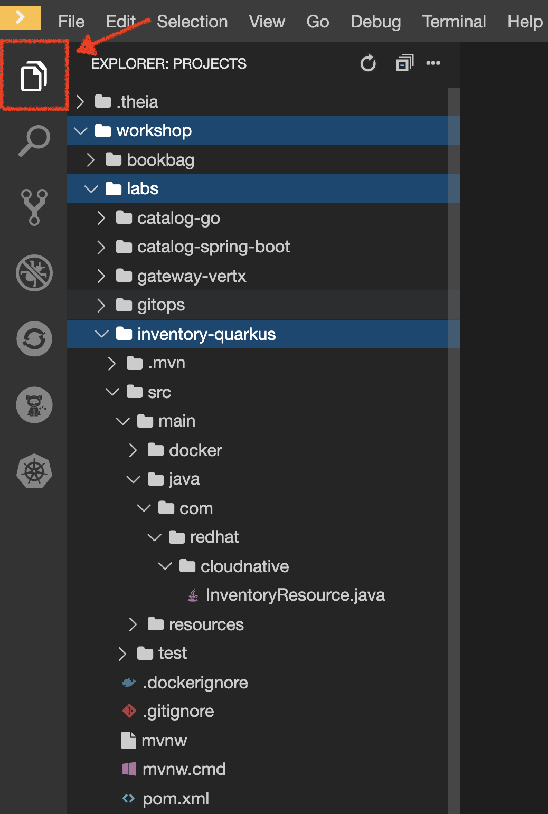
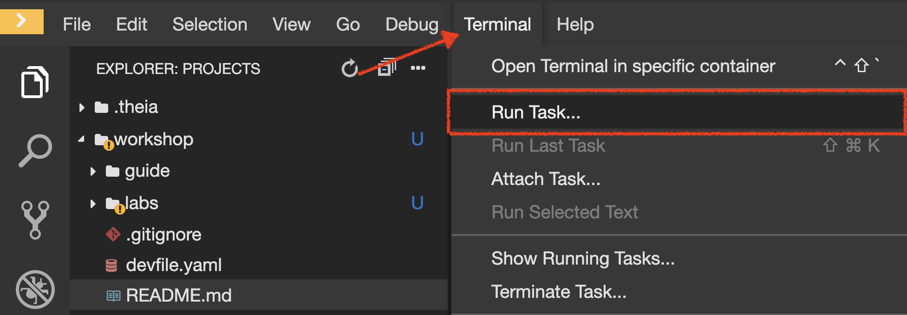
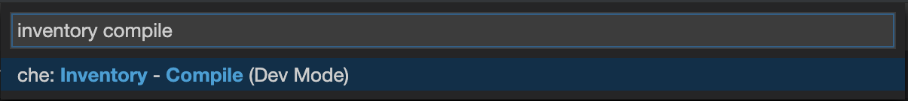
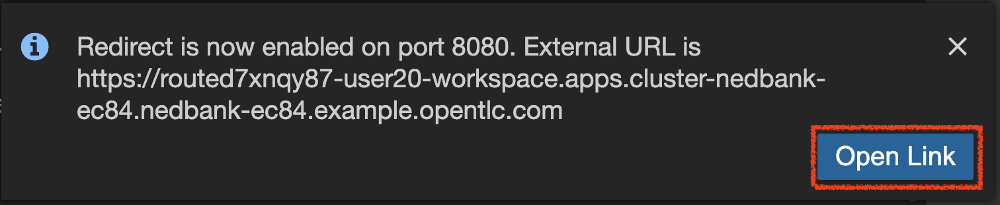
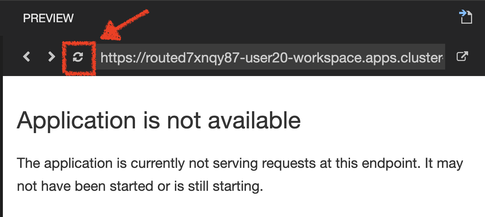

:markup-in-source: verbatim,attributes,quotes
:APPS_HOSTNAME_SUFFIX: %APPS_HOSTNAME_SUFFIX%
:CHE_URL: %CHE_URL%
:USER_ID: %USER_ID%
:OPENSHIFT_CONSOLE_URL: %OPENSHIFT_CONSOLE_URL%/topology/ns/my-project{USER_ID}/graph

_45 MINUTE EXERCISE_

In this lab you will learn about building microservices using Quarkus.

image::images/coolstore-arch-inventory-quarkus.png[CoolStore Architecture,400]

'''

=== What is Quarkus?

[sidebar]
--
image::images/quarkus-logo.png[Quarkus, 500]

https://quarkus.io/[Quarkus^] is a Kubernetes Native Java stack tailored for GraalVM & OpenJDK HotSpot, 
crafted from the best of breed Java libraries and standards.

**Container First**: https://quarkus.io/[Quarkus^] tailors your application for GraalVM and HotSpot. Amazingly fast boot time, incredibly low RSS memory 
(not just heap size!) offering near instant scale up and high density memory utilization in container orchestration platforms 
like Kubernetes. We use a technique we call https://quarkus.io/vision/container-first/[compile time boot^].

**Unifies Imperative and Reactive**: Combine both the familiar https://quarkus.io/vision/continuum[imperative code and 
the non-blocking reactive style^] when developing applications

**Developer Joy**: A cohesive platform for optimized developer joy:

* Unified configuration
* Zero config, live reload in the blink of an eye
* Streamlined code for the 80% common usages, flexible for the 20%
* No hassle native executable generation

**Best of Breed Libraries and Standards**: Quarkus brings a cohesive, fun to use full-stack framework by leveraging best of breed libraries you 
love and use wired on a https://quarkus.io/vision/standards[standard backbone^].
--

'''

=== Quarkus Maven Project

The **inventory-quarkus** project has the following structure which shows the components of 
the Quarkus project laid out in different subdirectories according to Maven best practices:

The **'/projects/workshop/labs/inventory-quarkus'** folder contents:

* the Maven structure
* a com.redhat.cloudnative.InventoryResource resource exposed on /hello
* an associated unit test
* a landing page that is accessible on http://localhost:8080 after starting the application
* example Dockerfile files for both native and jvm modes in src/main/docker
* the application configuration file

`*Look at the pom.xml*`. You will find the import of the Quarkus BOM, allowing you to omit the version 
on the different Quarkus dependencies. In addition, you can see the **quarkus-maven-plugin** responsible of the packaging 
of the application and also providing the development mode.

[source,xml]
.pom.xml
----
<dependencyManagement>
    <dependencies>
        <dependency>
            <groupId>io.quarkus</groupId>
            <artifactId>quarkus-bom</artifactId>
            <version>${quarkus.version}</version>
            <type>pom</type>
            <scope>import</scope>
        </dependency>
    </dependencies>
</dependencyManagement>

<build>
    <plugins>
        <plugin>
            <groupId>io.quarkus</groupId>
            <artifactId>quarkus-maven-plugin</artifactId>
            <version>${quarkus.version}</version>
            <executions>
                <execution>
                    <goals>
                        <goal>build</goal>
                    </goals>
                </execution>
            </executions>
        </plugin>
    </plugins>
</build>
----

If we focus on the dependencies section, you can see the following extensions:

[source,xml]
.pom.xml
----
    <dependency>
        <groupId>io.quarkus</groupId>
        <artifactId>quarkus-resteasy-jsonb</artifactId>
    </dependency>
    <dependency>
        <groupId>io.quarkus</groupId>
        <artifactId>quarkus-hibernate-orm</artifactId>
    </dependency>
    <dependency>
        <groupId>io.quarkus</groupId>
        <artifactId>quarkus-jdbc-h2</artifactId>
    </dependency>
----

.Quarkus Extensions
[%header,cols=2*]
|===
|Name 
|Description

|https://quarkus.io/guides/rest-json-guide[JSON REST Services^]
|It allows you to develop REST services to consume and produce JSON payloads

|https://quarkus.io/guides/hibernate-orm-guide[Hibernate ORM^]
|The de facto JPA implementation and offers you the full breath of an Object Relational Mapper. 

|https://quarkus.io/guides/datasource-guide#h2[Datasources (H2)^]
|Using datasources is the main way of obtaining connections to a database.

|===

`*Examine 'src/main/java/com/redhat/cloudnative/InventoryResource.java' file*`:

[source,java]
.InventoryResource.java
----
package com.redhat.cloudnative;

import javax.ws.rs.GET;
import javax.ws.rs.Path;
import javax.ws.rs.Produces;
import javax.ws.rs.core.MediaType;

@Path("/hello")
public class InventoryResource {

    @GET
    @Produces(MediaType.TEXT_PLAIN)
    public String hello() {
        return "hello";
    }
}
----

It’s a very simple REST endpoint, returning "hello" to requests on "/hello".

[TIP]
====
With Quarkus, there is no need to create an Application class. It’s supported, but not required. In addition, 
only one instance of the resource is created and not one per request. You can configure this using the different **Scoped** annotations 
(ApplicationScoped, RequestScoped, etc).
====

'''

=== Enable the Development Mode

**quarkus:dev** runs Quarkus in development mode. This enables hot deployment with background compilation, 
which means that when you modify your Java files and/or your resource files and refresh your browser, these changes will 
automatically take effect. This works too for resource files like the configuration property file. Refreshing the browser 
triggers a scan of the workspace, and if any changes are detected, the Java files are recompiled and the application is redeployed; 
your request is then serviced by the redeployed application. If there are any issues with compilation or deployment an error page 
will let you know.

In your {CHE_URL}[Workspace^], `*click on 'Terminal' -> 'Run Task...' ->  'Inventory - Compile (Dev Mode)'*`

When pop-ups appear, `*confirm you want to expose the 8080 port*`.

And finally `*click on 'Open Link'*`.

Your browser will be redirect on **your Inventory Service running inside your Workspace**.

image::images/che-quarkus-preview.png[Che - Quarkus Preview, 500]

[NOTE]
====
If you have the following result on the 'Preview' window, please `*click on the refresh icon of this same window`*,

====

`*Modify the 'src/main/resources/META-INF/resources/index.html' file*` as following

[source,java,role=copy]
.index.html
----
<!DOCTYPE html>
<html lang="en">
    <head>
        <meta charset="UTF-8">
        <title>Inventory Service</title>
        <link rel="stylesheet" href="https://maxcdn.bootstrapcdn.com/bootstrap/4.0.0-beta/css/bootstrap.min.css"
            integrity="sha384-/Y6pD6FV/Vv2HJnA6t+vslU6fwYXjCFtcEpHbNJ0lyAFsXTsjBbfaDjzALeQsN6M" crossorigin="anonymous">
        <link rel="stylesheet" type="text/css"
            href="https://cdnjs.cloudflare.com/ajax/libs/patternfly/3.24.0/css/patternfly.min.css">
        <link rel="stylesheet" type="text/css"
            href="https://cdnjs.cloudflare.com/ajax/libs/patternfly/3.24.0/css/patternfly-additions.min.css">
    </head>
    <body>
        

            

                <h1 class="display-3"> Inventory Service</h1>
                
This is a Quarkus Microservice for the CoolStore Demo. (<a href="/api/inventory/329299">Test it</a>)
                

            

        

        

            <footer>
                
&copy; Red Hat 2019

            </footer>
        

    </body>
</html>
----

`*Refresh your browser*` and you should have the following content **without rebuilding your JAR file**

image::images/inventory-quarkus.png[Inventory Quarkus,500]

Now let's write some code and create a domain model and a RESTful endpoint to create the Inventory service

'''

=== Create a Domain Model

`*Create the 'src/main/java/com/redhat/cloudnative/Inventory.java' file`* as following:

[source,java,role=copy]
----
package com.redhat.cloudnative;

import javax.persistence.Entity;
import javax.persistence.Id;
import javax.persistence.Table;
import javax.persistence.Column;
import java.io.Serializable;

@Entity
@Table(name = "INVENTORY")
public class Inventory implements Serializable {

    private static final long serialVersionUID = 1L;

    @Id
    private String itemId;

    @Column
    private int quantity;

    public Inventory() {
    }

    public String getItemId() {
        return itemId;
    }

    public void setItemId(String itemId) {
        this.itemId = itemId;
    }

    public int getQuantity() {
        return quantity;
    }

    public void setQuantity(int quantity) {
        this.quantity = quantity;
    }

    @Override
    public String toString() {
        return "Inventory [itemId='" + itemId + '\'' + ", quantity=" + quantity + ']';
    }
}
----
<1> **@Entity** marks the class as a JPA entity
<2> **@Table** customizes the table creation process by defining a table name and database constraint
<3> **@Id** marks the primary key for the table

[NOTE]
====
You don't need to press a save button! Che automatically saves the changes made to the files.
====

`*Update the 'src/main/resources/application.properties' file*` to match with the following content:

.application.properties
[source,bash,role=copy]
----
quarkus.datasource.url=jdbc:h2:mem:inventory;DB_CLOSE_ON_EXIT=FALSE;DB_CLOSE_DELAY=-1
quarkus.datasource.driver=org.h2.Driver
quarkus.datasource.username=sa
quarkus.datasource.password=sa
quarkus.hibernate-orm.database.generation=drop-and-create
quarkus.hibernate-orm.log.sql=true
quarkus.hibernate-orm.sql-load-script=import.sql

%prod.quarkus.package.uber-jar=true
----
<1> An **uber-jar** contains all the dependencies required packaged in the **jar** to enable running the 
application with **java -jar**. By default, in Quarkus, the generation of the uber-jar is disabled. With the
**%prod** prefix, this option is only activated when building the jar intended for deployments.

`*Update the 'src/main/resources/import.sql' file`* as following:
[source,sql,role=copy]
.import.sql
----
INSERT INTO INVENTORY(itemId, quantity) VALUES (100000, 0);
INSERT INTO INVENTORY(itemId, quantity) VALUES (329299, 35);
INSERT INTO INVENTORY(itemId, quantity) VALUES (329199, 12);
INSERT INTO INVENTORY(itemId, quantity) VALUES (165613, 45);
INSERT INTO INVENTORY(itemId, quantity) VALUES (165614, 87);
INSERT INTO INVENTORY(itemId, quantity) VALUES (165954, 43);
INSERT INTO INVENTORY(itemId, quantity) VALUES (444434, 32);
INSERT INTO INVENTORY(itemId, quantity) VALUES (444435, 53);
----

'''

=== Create a RESTful Service

Quarkus uses JAX-RS standard for building REST services. 

`*Modify the 'src/main/java/com/redhat/cloudnative/InventoryResource.java' file*` to match with:

[source,java,role=copy]
.InventoryResource.java
----
package com.redhat.cloudnative;

import javax.enterprise.context.ApplicationScoped;
import javax.inject.Inject;
import javax.persistence.EntityManager;
import javax.ws.rs.GET;
import javax.ws.rs.Path;
import javax.ws.rs.PathParam;
import javax.ws.rs.Produces;
import javax.ws.rs.core.MediaType;

@Path("/api/inventory")
@ApplicationScoped
public class InventoryResource {

    @Inject
    EntityManager em;

    @GET
    @Path("/{itemId}")
    @Produces(MediaType.APPLICATION_JSON)
    public Inventory getAvailability(@PathParam("itemId") String itemId) {
        Inventory inventory = em.find(Inventory.class, itemId);
        return inventory;
    }
}
----

The above REST service defines an endpoint that is accessible via **HTTP GET** at 
for example **/api/inventory/329299** with 
the last path param being the product id which we want to check its inventory status.

`*Refresh your browser and click on 'Test it'*`. You should have the following output:

[source,json]
----
{"itemId":"329299","quantity":35}
----

The REST API returned a JSON object representing the inventory count for this product. Congratulations!

In your {CHE_URL}[Workspace^], stop the service by `*hitting Ctrl+c in the '>_ Inventory Compile (Dev Mode)' Terminal*`

'''

=== Deploy on OpenShift

It’s time to deploy your service on OpenShift. 

Openshift https://docs.openshift.com/container-platform/4.4/builds/understanding-image-builds.html#build-strategy-s2i_understanding-image-builds[Source-to-Image (S2I)] is an open-source project 
which helps in building artifacts from source code and injecting these into container images. 
S2I produces ready-to-run images by building source code without the need of a Dockerfile.

https://docs.openshift.com/container-platform/4.4/cli_reference/developer_cli_odo/understanding-odo.html[odo] (OpenShift Connector Plugin) uses S2I builder image for 
executing developer source code inside a container.

In your {CHE_URL}[Workspace^], `*click on 'Terminal' -> 'Run Task...' ->  'Inventory - Build'*`

image::images/che-inventory-build.png[Che - Build Inventory, 500]

Once this completes, let's **push** your application into OpenShift.

In your {CHE_URL}[Workspace^], from **'OpenShift' View**, 
`*right-click on your 'my-project{USER_ID}' project and select 'New Component'*`

image::images/che-openshift-new-component.png[Che - OpenShift New Component, 400]

Then, `*enter the following information*`:

.OpenShift New Component
[%header,cols=2*]
|===
|Parameter 
|Value

|In which Application you want to create a Component
|$(plus) Create new Application... 

|Provide Application name
|coolstore

|Select source type for Component
|Binary File

|Select context folder
|$(plus) Add new context folder.

|Open
|/projects/workshop/labs/inventory-quarkus

|Select binary file
|$(file-zip) inventory-quarkus-1.0.0-SNAPSHOT-runner.jar

|Provide Component name
|inventory

|Component type
|java

|Component type version
|11

|===

[TIP]
====
Now the configuration file **'config.yaml'** is in the local directory of the inventory component 
(**'/projects/workshop/labs/inventory-quarkus/.odo'**) that contains information about the component for deployment.
====

Then, `*push the component to the OpenShift cluster*` by right-clicking on the **inventory component**, 
from **'OpenShift' View**, then select **'Push'**.

image::images/che-openshift-push-inventory.png[Che - OpenShift Push Inventory, 400]

You should get an output in a **'>_ OpenShift' Terminal Window** as following:

[source,bash]
.>_ OpenShift
----
bash-5.0$ odo push
Validation
 ✓  Checking component [23ms]

Configuration changes
 ✓  Initializing component
 ✓  Creating component [149ms]

Pushing to component inventory of type binary
 ✓  Checking files for pushing [4ms]
 ✓  Waiting for component to start [42s]
 ✓  Syncing files to the component [27s]
 ✓  Building component [2s]
----

[IMPORTANT]
====
You need to push your component first in order to create a Route for it.
====

Now, `*let’s create a Route for the component to access to your service from Internet*` by right-clicking on the **inventory component**, 
from **'OpenShift' View**, then select **'New URL'** 

image::images/che-openshift-url-inventory.png[Che - OpenShift URL Inventory, 400]

`*Enter the following inputs*`:

.OpenShift New URL
[%header,cols=2*]
|===
|Parameter 
|Value

|Provide URL name
|inventory

|Select port to expose
|8080/tcp

|Do you want to secure new URL?
|No

|===

Finally, `*push again the component to the OpenShift cluster*` to create the Route on OpenShift Cluster.

image::images/che-openshift-push-again-inventory.png[Che - OpenShift Push Inventory, 400]

You should get an output in a **'>_ OpenShift' Terminal Window** as following:

[source,bash,subs="{markup-in-source}"]
.>_ OpenShift
----
bash-5.0$ odo push
Validation
 ✓  Checking component [140ms]

Configuration changes
 ✓  Retrieving component data [107ms]
 ✓  Applying configuration [43ms]

Applying URL changes
 ✓  URL inventory: http://inventory-coolstore-my-project{USER_ID}.{APPS_HOSTNAME_SUFFIX} created

Pushing to component inventory of type binary
 ✓  Checking file changes for pushing [5ms]
 ✓  Waiting for component to start [7ms]
 ✓  Syncing files to the component [6s]
 ✓  Building component [2s]
----

Once this completes, your application should be up and running. OpenShift runs the different components of the application 
in one or more pods which are the unit of runtime deployment and consists of the running containers for the project.

'''

=== Test your Service

In the {OPENSHIFT_CONSOLE_URL}[OpenShift Web Console^], from the **Developer view**,
`*click on the 'Open URL' icon of the Inventory Service*`

image::images/openshift-inventory-topology.png[OpenShift - Inventory Topology, 700]

Your browser will be redirect on **your Inventory Service running on OpenShift**.

image::images/inventory-quarkus.png[Inventory Quarkus,500]

Then `*click on 'Test it'*`. You should have the following output:

[source,json]
----
{"itemId":"329299","quantity":35}
----

Well done! You are ready to move on to the next lab.