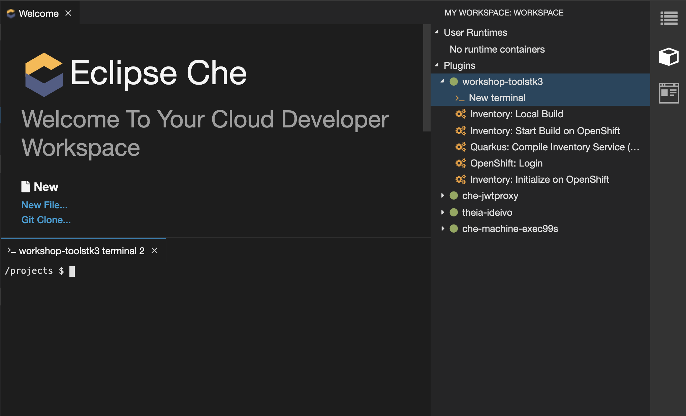
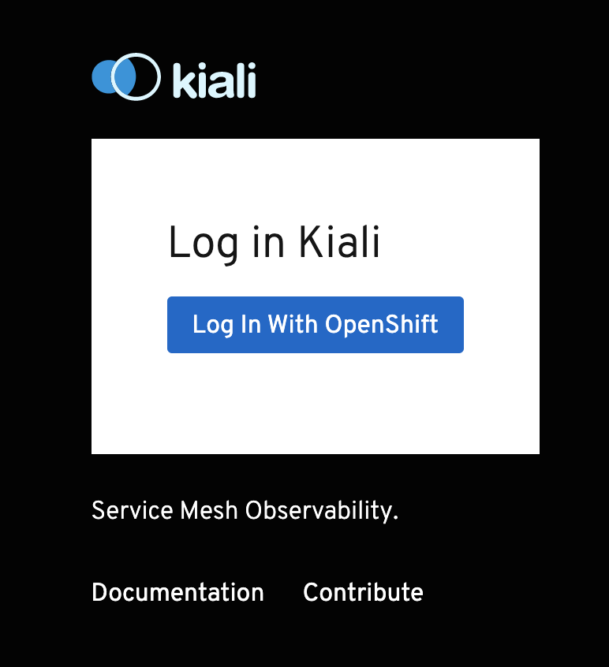
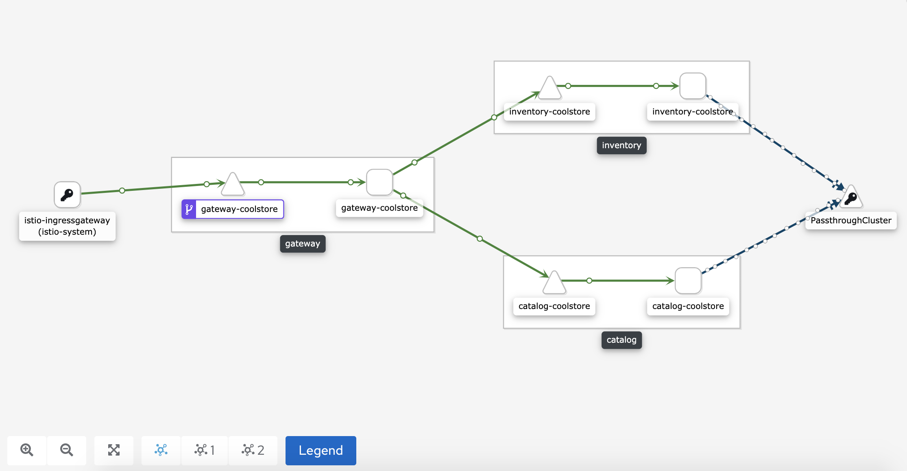
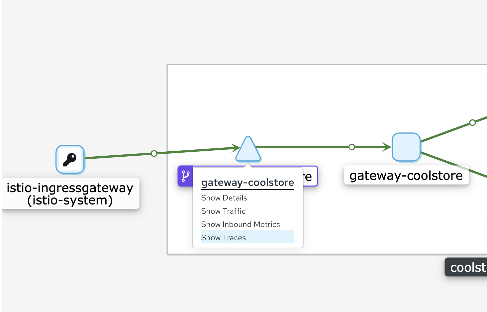

:markup-in-source: verbatim,attributes,quotes
:CHE_URL: %CHE_URL%
:KIALI_URL: %KIALI_URL%
:JAEGER_URL: %JAEGER_URL%
:USER_ID: %USER_ID%
:APPS_HOSTNAME_SUFFIX: %APPS_HOSTNAME_SUFFIX%
:OPENSHIFT_PASSWORD: %OPENSHIFT_PASSWORD%
:OPENSHIFT_CONSOLE_URL: %OPENSHIFT_CONSOLE_URL%/topology/ns/cn-project{USER_ID}

_20 MINUTE EXERCISE_

In this lab you will enable tracing and monitoring of your backend services using Service Mesh.

[sidebar]
.OpenShift Service Mesh
--
The term **Service Mesh** describes the network of microservices that make up applications in a distributed microservice architecture and the interactions between those microservices. As a service mesh grows in size and complexity, it can become harder to understand and manage.

**Red Hat OpenShift Service Mesh** is a platform that provides behavioral insight and operational control over the **Service Mesh**, providing a uniform way to connect, secure, and monitor microservice applications.

Based on the open source https://istio.io/[Istio^] project, **Red Hat OpenShift Service Mesh** adds a transparent layer on existing distributed applications without requiring any changes to the service code. You add Red Hat OpenShift Service Mesh support to services by deploying a special sidecar proxy throughout your environment that intercepts all network communication between microservices. You configure and manage the service mesh using the control plane features.

Red Hat OpenShift Service Mesh provides an easy way to create a network of deployed services that provides discovery, load balancing, service-to-service authentication, failure recovery, metrics, and monitoring. A service mesh also provides more complex operational functionality, including A/B testing, canary releases, rate limiting, access control, and end-to-end authentication.

Red Hat OpenShift Service Mesh is logically split into a data plane and a control plane:

* The **data plane** is composed of a set of intelligent proxies deployed as sidecars. These proxies intercept and control all inbound and outbound network communication between microservices in the service mesh; sidecar proxies also communicate with Mixer, the general-purpose policy and telemetry hub.

* The **control plane** is responsible for managing and configuring proxies to route traffic, and configuring Mixers to enforce policies and collect telemetry.

image::images/servicemesh-architecture.png[Service Mesh Architecture,400]

The components that make up the data plane and the control plane are:

* **Envoy proxy** - is the data plane component that intercepts all inbound and outbound traffic for all services in the service mesh. Envoy is deployed as a sidecar to the relevant service in the same pod.
* **Mixer** - is the control plane component responsible responsible for enforcing access control and usage policies (such as authorization, rate limits, quotas, authentication, request tracing) and collecting telemetry data from the Envoy proxy and other services.
* **Pilot** - is the control plane component responsible for configuring the proxies at runtime. Pilot provides service discovery for the Envoy sidecars, traffic management capabilities for intelligent routing (for example, A/B tests or canary deployments), and resiliency (timeouts, retries, and circuit breakers).
* **Citadel** - is the control plane component responsible for certificate issuance and rotation. Citadel provides strong service-to-service and end-user authentication with built-in identity and credential management. You can use Citadel to upgrade unencrypted traffic in the service mesh. Using Citadel, operators can enforce policies based on service identity rather than on network controls.
--

'''

=== Enabling Service Mesh to Inventory Service

OpenShift Service Mesh automatically injects the sidecar into the Pod by specifying **sidecar.istio.io/inject:true** annotation in the DeploymentConfig.

In your {CHE_URL}[Workspace^], open a new Terminal by `*clicking 
on the 'My Workspace' white box in the right menu, then 'Plugins' -> 'workshop-tools' -> '>_ New terminal'*`:

In the window called **'>_ workshop-tools terminal'**, `*execute the following commands*`:

[source%nowrap,shell,subs="{markup-in-source}",role=copy]
.>_ workshop-tools terminal
----
oc patch dc/inventory-coolstore --patch '{"spec": {"template": {"metadata": {"annotations": {"sidecar.istio.io/inject": "true"}}}}}' -n cn-project{USER_ID}

oc patch dc/inventory-coolstore --patch '{"spec": {"template": {"spec": {"containers": [{"name": "inventory-coolstore", "command" : ["/bin/bash"], "args": ["-c", "until $(curl -o /dev/null -s -I -f http://127.0.0.1:15000); do echo \"Waiting for Istio Sidecar...\"; sleep 1; done; sleep 10; /usr/local/s2i/run"]}]}}}}' -n cn-project{USER_ID}

oc rollout latest dc/inventory-coolstore -n cn-project{USER_ID}

----
<1> Define the annotation to automatically inject an Istio sidecar
<2> Wait for the Envoy Proxy to be up and running before starting the application
<3> Trigger the deployment

To confirm that the application is successfully deployed, `*run this following command*`:

[source%nowrap,shell,subs="{markup-in-source}",role=copy]
.>_ workshop-tools terminal
----
oc get pods -ldeploymentconfig=inventory-coolstore -n cn-project{USER_ID}
----

You should get an output as following:

[source%nowrap,shell,subs="{markup-in-source}"]
.>_ workshop-tools terminal
----
NAME                        READY     STATUS    RESTARTS   AGE
inventory-coolstore-4-dhfrm   2/2       Running   0          12s
----

The status should be **Running** and there should be **2/2** pods in the **Ready** column. 

'''

=== Enabling Service Mesh to Catalog and Gateway Service

Now, we understand how to enable Service Mesh for one service, let's enable for Catalog and Gateway Services via a simple command.

In your {CHE_URL}[Workspace^], `*click on 'Terminal' -> 'Run Task...' ->  'Service Mesh - Deploy'*`

image::images/che-runtask.png[Che - RunTask, 500]

image::images/che-servicemesh-deploy.png[Che - Service Mesh Deploy, 500]

To verify the deployment `*run this following command*`:

[source,shell,subs="{markup-in-source}",role=copy]
.>_ workshop-tools terminal
----
oc get pods -ldeploymentconfig=catalog-coolstore -n cn-project{USER_ID}

oc get pods -ldeploymentconfig=gateway-coolstore -n cn-project{USER_ID}

----

You should get an output as following:

[source,bash,subs="{markup-in-source}"]
.>_ workshop-tools terminal
----
NAME                        READY     STATUS    RESTARTS   AGE
catalog-coolstore-4-xnwfp   2/2       Running   0          39s

NAME                        READY     STATUS    RESTARTS   AGE
gateway-coolstore-4-h5g7t   2/2       Running   0          73s
----

The status should be **Running** and there should be **2/2** pods in the **Ready** column.

'''

=== Controlling Ingress Traffic

In a OpenShift environment, the OpenShift Route is used to specify services that should be exposed outside the cluster. 
In an OpenShift Service Mesh, a better approach is to use a different configuration model, namely **Istio Gateway**. 

* A **Gateway** describes a load balancer operating at the edge of the mesh receiving incoming or outgoing HTTP/TCP connections. The specification describes a set of ports that should be exposed, the type of protocol to use, SNI configuration for the load balancer, etc.
* A **VirtualService** defines a set of traffic routing rules to apply when a host is addressed. Each routing rule defines matching criteria for traffic of a specific protocol. If the traffic is matched, then it is sent to a named destination service (or subset/version of it) defined in the registry.

In the window called **'>_ workshop-tools terminal'**, `*execute the following commands*` 
to create an **Istio Gateway** and a **VirtualService** for the **Gateway Service**:

[source,shell,subs="{markup-in-source}",role=copy]
.>_ workshop-tools terminal
----
oc create -n cn-project{USER_ID} -f /projects/workshop/labs/gateway-vertx/openshift/istio-gateway.yml

sed s/PROJECT/cn-project{USER_ID}/g /projects/workshop/labs/gateway-vertx/openshift/virtualservice.yml | oc create -n cn-project{USER_ID} -f -

----

To confirm that the **Istio Gateway** is properly configured, 
`*click on http://istio-ingressgateway-istio-system.{APPS_HOSTNAME_SUFFIX}/cn-project{USER_ID}/api/products[http://istio-ingressgateway-istio-system.{APPS_HOSTNAME_SUFFIX}/cn-project{USER_ID}/api/products^]*`

You should have the following result:

[source,json,subs="{markup-in-source}"]
----
[ {
  "itemId" : "329299",
  "name" : "Red Fedora",
  "desc" : "Official Red Hat Fedora",
  "price" : 34.99,
  "availability" : {
    "quantity" : 35
  }
},
...
]
----

'''

=== Updating the WebUI to use the Istio Gateway

`*Issue the following command*` to configure the **WebUI Service** to use the **Istio Gateway** instead of the **OpenShift Route**:

[source,shell,subs="{markup-in-source}",role=copy]
.>_ workshop-tools terminal
----
oc set env dc/web-coolstore -n cn-project{USER_ID} COOLSTORE_GW_ENDPOINT=http://istio-ingressgateway-istio-system.{APPS_HOSTNAME_SUFFIX}/cn-project{USER_ID}

oc rollout latest dc/web-coolstore -n cn-project{USER_ID}

----

'''

=== Testing the application

Point your browser at the Web UI route url. You should be able to see the CoolStore with all products and their inventory status.

IMPORTANT: Refresh your browser several times to generate traffic.

'''

=== What is Kiali?
[sidebar]
--
image::images/kiali-logo.png[Kiali,400]

A Microservice Architecture breaks up the monolith into many smaller pieces that are composed together. 
Patterns to secure the communication between services like fault tolerance (via timeout, retry, circuit breaking, etc.) 
have come up as well as distributed tracing to be able to see where calls are going.

A service mesh can now provide these services on a platform level and frees the application writers from those tasks. 
Routing decisions are done at the mesh level.

https://www.kiali.io[Kiali^] works with Istio, in OpenShift or Kubernetes, to visualize the service mesh topology, to 
provide visibility into features like circuit breakers, request rates and more. It offers insights about the mesh components at different levels, 
from abstract Applications to Services and Workloads.
--

'''

=== Observability with Kiali

Kiali provides an interactive graph view of your namespace in real time, being able to display the interactions at several levels (applications, versions, workloads), with contextual information and charts on the selected graph node or edge.

`*Click on the below button called 'Developer Observability'*`

[link={KIALI_URL}]
[window=_blank, align="center"]
image::images/developer-observability-button.png[Developer Observability - Button, 300]

Then, `*log in with OpenShift as user{USER_ID}/{OPENSHIFT_PASSWORD}'*`

From the **'Graph' view**, `*enter the following configuration*`:

.Graph Settings
[%header,cols=2*]
|===
|Parameter
|Value

|Namespace 
|cn-project{USER_ID}

|Type Graph
|Versioned app graph

|Display
|'Traffic Animation' checked

|===

The outcome is a graph with all the services, connected by the requests going through them. 
You can see how the services interact with each other. 

'''

=== Tracing with Kiali and Jaeger

[sidebar]
--
image::images/jaeger-logo.png[Jaeger,400]

Jaeger, inspired by Dapper and OpenZipkin, is a distributed tracing system released as open source by Uber Technologies. 
It is used for monitoring and troubleshooting microservices-based distributed systems, including:

* Distributed context propagation
* Distributed transaction monitoring
* Root cause analysis
* Service dependency analysis
* Performance / latency optimization

https://www.kiali.io/[Kiali^] includes https://www.jaegertracing.io/[Jaeger Tracing^] to provide distributed tracing out of the box.
--

In the {KIALI_URL}[Kiali Console^], from **Graph view**, 
`*right-click on the gateway-service node and select 'Show Traces'*`.

You should be redirected to the {JAEGER_URL}[Jaeger Console^].
`*Log in as user{USER_ID}/{OPENSHIFT_PASSWORD}'*`

image::images/kiali-traces-view.png[Kiali- Traces View,700]

Let’s `*click on one of trace title bar*`.

image::images/kiali-trace-detail-view.png[Kiali- Trace Detail View,700]

'''

That's all for this lab! You are ready to move on to the next lab.
